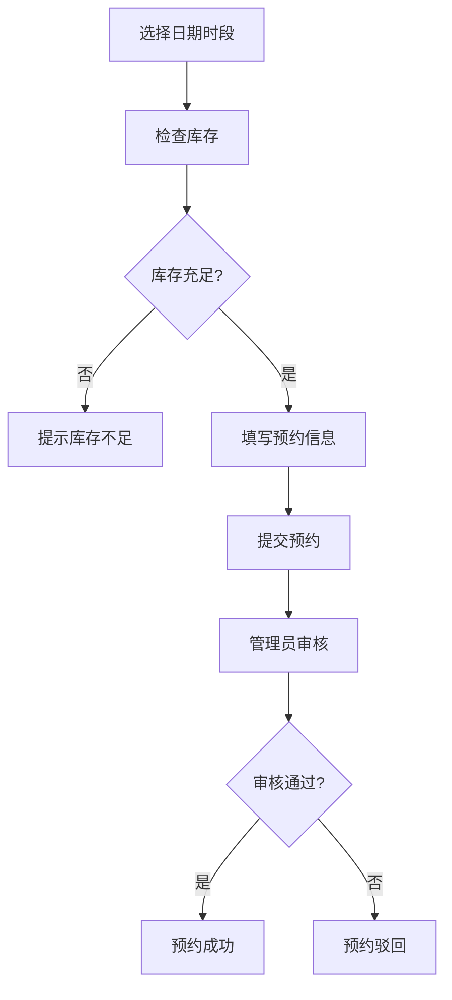
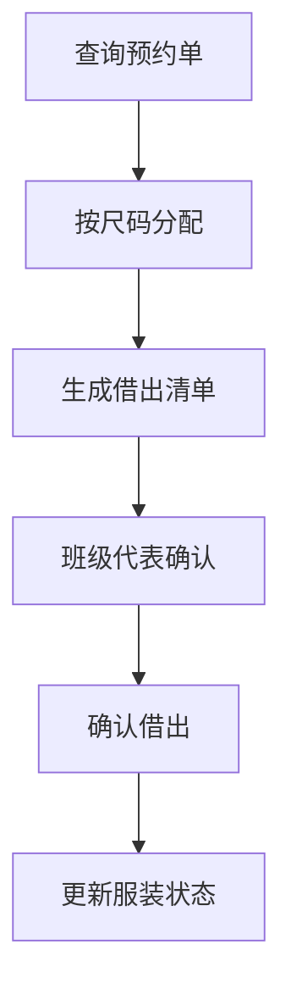
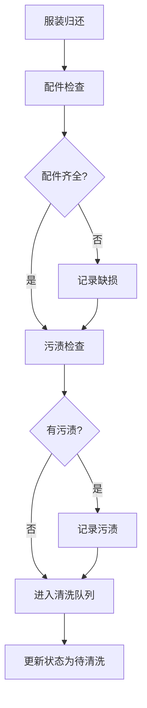

## 1. 产品概述

毕业照服装预约管理系统，解决班级轮流拍照时学士服、领结等配件借重或漏还的问题。系统管理服装档案、班级预约、借出归还、清洗检查等全流程，确保服装合理分配、按时归还、及时清洗。

## 2. 核心功能

### 2.1 用户角色
| 角色 | 注册方式 | 核心权限 |
|------|---------|----------|
| 管理员 | 系统预置 | 服装档案管理、预约审核、借出/归还操作、统计报表、系统设置 |
| 班级代表 | 系统注册 | 提交预约申请、查看预约状态、确认领取/归还 |

### 2.2 功能模块
1. **服装档案管理**：服装录入、编辑、删除、查询，支持照片上传
2. **班级预约管理**：预约申请、审核、取消、时段冲突检测
3. **借出管理**：按尺码自动分配、打印借出单、状态变更
4. **归还管理**：配件检查（帽子、流苏、领结、披肩）、污渍检查、缺损记录
5. **清洗管理**：清洗排队、状态更新、清洗完成标记
6. **统计报表**：各尺码需求统计、逾期未还统计、缺配件记录、清洗排队数量
7. **库存预警**：时段库存不足拦截、未清洗服装不可预约

### 2.3 页面详情
| 页面名称 | 模块名称 | 功能描述 |
|---------|---------|----------|
| 仪表盘 | 数据概览 | 显示今日预约、在借数量、清洗排队、库存预警等关键指标 |
| 服装档案 | 服装列表 | 展示所有服装，支持筛选、搜索、批量操作 |
| 服装档案 | 服装表单 | 新增/编辑服装信息（类型、尺码、颜色、配件、状态、清洗状态、照片） |
| 预约管理 | 预约列表 | 查看所有预约，支持按日期、时段、班级、状态筛选 |
| 预约管理 | 预约表单 | 提交预约（日期、时段、人数、负责老师、领取地点） |
| 借出管理 | 借出列表 | 查看借出记录，支持按服装、班级、日期筛选 |
| 借出管理 | 借出操作 | 按尺码分配数量，生成借出单，确认借出 |
| 归还管理 | 归还列表 | 查看待归还和已归还记录 |
| 归还管理 | 归还检查 | 检查配件完整性和污渍情况，记录缺损 |
| 清洗管理 | 清洗队列 | 查看待清洗、清洗中、已完成的服装 |
| 统计报表 | 数据统计 | 尺码需求、逾期未还、缺配件、清洗数量的图表和表格 |

## 3. 核心流程

### 3.1 预约流程
班级代表选择日期和时段 → 系统检查该时段库存 → 库存充足则提交预约 → 管理员审核 → 审核通过生成预约单

### 3.2 借出流程
预约日到达 → 管理员查询预约单 → 按尺码自动分配服装 → 班级代表清点确认 → 确认借出 → 服装状态变更为"在借"

### 3.3 归还流程
班级代表归还服装 → 管理员逐项检查配件 → 检查是否有污渍 → 缺损/污渍记录 → 服装进入清洗队列 → 更新状态

## 4. 用户界面设计

### 4.1 设计风格
- **主色调**：深蓝 #1E3A8A（专业、稳重）
- **辅助色**：金色 #D4AF37（呼应毕业主题的荣誉与成就）
- **中性色**：石板灰系列（文本、背景、边框）
- **按钮风格**：圆角8px，悬停有微妙阴影和颜色变化
- **字体**：标题用"Noto Serif SC"宋体（正式感），正文用"Noto Sans SC"黑体（可读性）
- **布局风格**：卡片式布局，侧边导航 + 顶部操作栏 + 主内容区
- **图标风格**：使用Lucide React图标库，保持简洁线性风格

### 4.2 页面设计概述
| 页面名称 | 模块名称 | UI元素 |
|---------|---------|--------|
| 仪表盘 | 数据概览 | 统计卡片网格、趋势图表、快捷操作按钮 |
| 服装档案 | 服装列表 | 搜索筛选栏、数据表格、批量操作工具栏 |
| 预约管理 | 预约日历 | 日历视图、时段色块、弹窗详情 |
| 借出/归还 | 操作表单 | 分步引导、状态指示器、确认对话框 |
| 统计报表 | 数据可视化 | 柱状图（尺码需求）、饼图（状态分布）、数据表格 |

### 4.3 响应式设计
- 桌面端（1280px+）：三栏布局，侧边导航+主内容+信息面板
- 平板端（768px-1279px）：两栏布局，可折叠侧边导航+主内容
- 移动端（<768px）：单栏布局，底部导航标签，横向滚动表格

### 4.4 动效设计
- 页面加载：元素从下往上渐入，错开延迟
- 状态变更：数字跳动动画、颜色过渡
- 表单交互：输入框聚焦高亮、验证错误抖动提示
- 操作反馈：成功/失败的Toast通知，带进度条
