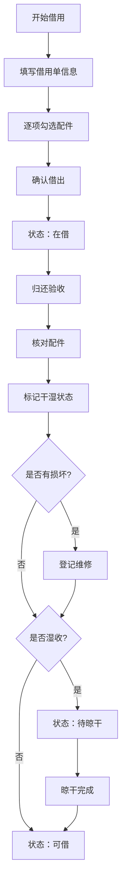

## 1. 产品概述

物业仓库折叠雨棚借用管理系统，用于管理小区物业雨棚的借出、归还、状态跟踪和统计分析。解决雨棚配件缺失、归还超时、湿损难追踪等问题，提高仓库管理效率。

## 2. 核心功能

### 2.1 用户角色

| 角色 | 注册方式 | 核心权限 |
|------|----------|----------|
| 仓库管理员 | 系统预置 | 借用登记、归还验收、维修管理、数据统计 |

### 2.2 功能模块

1. **今日借用主页**：展示当日借出的雨棚列表，快速了解借用人、活动、归还时间
2. **借用登记**：创建借用单，记录活动信息、联系人、押金，逐项勾选配件
3. **归还验收**：逐项核对配件完整性，标记湿干状态，登记维修问题
4. **维修管理**：查看待维修雨棚及问题（破洞、弯杆、缺地钉等）
5. **统计分析**：活动超时归还排行、配件损耗统计

### 2.3 页面详情

| 页面名称 | 模块名称 | 功能描述 |
|----------|----------|----------|
| 今日借用主页 | 顶部导航栏 | 系统标题、页面切换标签 |
| 今日借用主页 | 数据概览卡片 | 在借数量、待归还、待晾干、维修中数量 |
| 今日借用主页 | 借用列表 | 借用人、活动、楼栋、借用时间、状态标签 |
| 借用登记 | 借用单表单 | 活动名称、楼栋点位、联系人、押金、归还时间 |
| 借用登记 | 配件勾选 | 篷布、立柱、横杆、地钉、收纳袋逐项确认 |
| 归还验收 | 配件核对 | 逐项勾选归还配件，标记缺失/损坏 |
| 归还验收 | 干湿状态 | 标记是否湿收，湿收进入待晾干状态 |
| 归还验收 | 维修登记 | 登记破洞、弯杆、缺地钉等问题 |
| 维修管理 | 维修列表 | 雨棚编号、问题类型、登记时间、处理状态 |
| 统计分析 | 超时排行 | 活动名称、超时次数、平均超时时长 |
| 统计分析 | 配件损耗 | 各类型配件损耗数量统计 |

## 3. 核心流程

雨棚借出流程：管理员填写借用单信息 → 逐项检查并勾选配件 → 确认借出 → 雨棚状态变为"在借"

雨棚归还流程：找到对应借用单 → 逐项核对归还配件 → 标记干湿状态 → 如有损坏登记维修 → 确认归还 → 状态变更为"可借/待晾干/维修中"

## 4. 用户界面设计

### 4.1 设计风格

- 主色调：深蓝绿色（#0F766E），体现专业、可靠的物业管理调性
- 辅助色：琥珀色（#F59E0B）用于警告、提醒状态
- 成功色：翠绿色（#10B981）标记可借状态
- 危险色：橙红色（#EF4444）标记维修、超时状态
- 按钮风格：圆角 8px，实心主色按钮 + 描边次要按钮
- 字体：思源黑体 / Noto Sans SC，清晰易读
- 布局：卡片式布局，左侧导航 + 右侧内容区
- 图标：Lucide React 线性图标

### 4.2 页面设计概览

| 页面名称 | 模块名称 | UI 元素 |
|----------|----------|----------|
| 今日借用主页 | 数据概览 | 四张彩色统计卡片，带图标和数字 |
| 今日借用主页 | 借用列表 | 表格行展示，状态标签彩色区分 |
| 借用登记 | 表单区 | 分组表单，输入框带标签，必填标记 |
| 借用登记 | 配件区 | 五组大尺寸复选框，带配件图标和名称 |
| 归还验收 | 核对区 | 借出/归还对比勾选，缺失标红 |
| 维修管理 | 问题标签 | 彩色标签区分破洞/弯杆/缺件 |
| 统计分析 | 柱状图 | 活动超时排行可视化 |

### 4.3 响应式

桌面端优先设计，最小支持 1280px 宽度。主要信息表格横向滚动适配小屏幕。

## 5. 状态定义

雨棚状态流转：
- **可借**：配件完整，干燥，可正常借出
- **在借**：已借出，使用中
- **待晾干**：归还时湿收，禁止借出
- **维修中**：存在配件损坏或缺失
- **停用**：严重损坏，待报废处理
