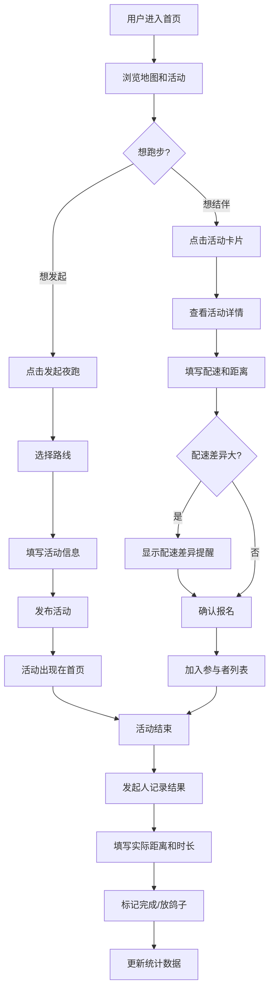

## 1. 产品概述

社区夜跑结伴地图——为晚上想跑步又不想一个人出门的人打造的结伴平台。用户可以发起和报名夜跑活动，在地图上查看社区路线，跑后记录成绩，并获得安全提醒。

- 解决夜跑孤独感和安全隐患问题，让社区跑者轻松找到配速相近的伙伴
- 目标用户：社区内喜欢夜跑的居民、想开始跑步但不敢独自出门的新手

## 2. 核心功能

### 2.1 用户角色

| 角色 | 注册方式 | 核心权限 |
|------|----------|----------|
| 跑者 | 昵称注册 | 发起/报名活动、查看地图、记录跑后数据、查看统计 |
| 访客 | 无需注册 | 浏览地图和活动列表（不可报名） |

### 2.2 功能模块

1. **首页地图页**：社区路线地图、即将开始的活动列表、安全提醒横幅
2. **发起夜跑页**：填写路线、起点、配速、距离、时间、是否接受新手、注意事项
3. **活动详情页**：活动信息、报名结伴、配速差异提醒、参与者列表
4. **跑后记录页**：实际距离、时长、完成人、放鸽子记录
5. **统计页**：本月公里数、常约路线、稳定参加的人

### 2.3 页面详情

| 页面名称 | 模块名称 | 功能描述 |
|----------|----------|----------|
| 首页地图页 | 路线地图 | 展示操场圈、河边路、商业街等社区跑步路线，标注路线长度和灯光情况 |
| 首页地图页 | 活动列表 | 即将开始的夜跑活动卡片，按开始时间排序，显示配速、距离、已报名人数 |
| 首页地图页 | 安全横幅 | 根据当前时间和天气显示安全提醒（太晚/下雨/路线灯少） |
| 发起夜跑页 | 路线选择 | 从预设路线中选择或自定义路线 |
| 发起夜跑页 | 活动表单 | 填写起点、预计配速、距离、开始时间、是否接受新手、注意事项 |
| 活动详情页 | 活动信息 | 展示活动详情、路线预览、发起人信息 |
| 活动详情页 | 报名结伴 | 填写自己的配速和想跑距离，提交报名 |
| 活动详情页 | 配速提醒 | 配速差异超过30秒/公里时弹出提醒"可能跟不上" |
| 活动详情页 | 参与者列表 | 显示已报名跑者的配速和目标距离 |
| 跑后记录页 | 数据记录 | 记录实际距离、时长、完成状态 |
| 跑后记录页 | 完成状态 | 标记谁完成、谁临时放鸽子 |
| 统计页 | 月度统计 | 本月总公里数、跑步次数、平均配速 |
| 统计页 | 路线排行 | 最常约的路线排名 |
| 统计页 | 伙伴排行 | 稳定参加的人排名 |

## 3. 核心流程

**发起夜跑流程**：用户进入首页 → 点击"发起夜跑" → 选择路线 → 填写活动信息 → 提交发布 → 活动出现在首页地图和列表中

**报名结伴流程**：用户浏览活动列表 → 点击感兴趣的活动 → 查看详情 → 填写配速和距离 → 系统检测配速差异 → 提示（如差异过大） → 确认报名 → 出现在参与者列表

**跑后记录流程**：活动结束 → 发起人点击"记录结果" → 填写实际数据 → 标记完成/放鸽子 → 保存记录 → 更新统计数据

## 4. 用户界面设计

### 4.1 设计风格

- **主色调**：深蓝黑底色（#0B1120）+ 霓虹绿高亮（#00FF88）+ 琥珀橙辅助（#FF8C42）
- **风格**：暗夜霓虹风格，模拟夜跑时城市灯光和荧光跑衣的视觉感受
- **按钮**：圆角药丸形，霓虹发光边框，悬停时光晕增强
- **字体**：标题使用 "Rajdhani"（运动科技感），正文使用 "Noto Sans SC"（中文友好）
- **布局**：地图沉浸式占满背景，活动信息浮层叠加在地图上
- **图标**：Lucide 图标库，配合霓虹发光效果

### 4.2 页面设计概览

| 页面名称 | 模块名称 | UI 元素 |
|----------|----------|---------|
| 首页地图页 | 路线地图 | 全屏深色地图背景，路线用霓虹绿描边，路线名标签悬浮，起点/终点标记带发光圆点 |
| 首页地图页 | 活动列表 | 底部半透明毛玻璃抽屉，活动卡片横向滑动，每张卡片显示配速/距离/倒计时/已报名头像组 |
| 首页地图页 | 安全横幅 | 顶部渐变警告条，带闪烁图标，自动检测天气和时间 |
| 首页地图页 | 发起按钮 | 右下角悬浮大按钮，霓虹绿发光，脉冲动画吸引点击 |
| 发起夜跑页 | 路线选择 | 卡片网格展示预设路线，选中时边框发光，自定义路线输入框 |
| 发起夜跑页 | 活动表单 | 暗色表单，输入框带底部发光线，滑块选择配速，开关切换接受新手 |
| 活动详情页 | 活动信息 | 顶部路线缩略图，信息卡片展示配速/距离/时间，发起人头像和昵称 |
| 活动详情页 | 配速提醒 | 橙色警告弹窗，显示配速差值和文字提醒 |
| 活动详情页 | 参与者列表 | 横向头像排列，配速标签，动画入场 |
| 跑后记录页 | 数据记录 | 大数字显示距离和时长，环形进度条，完成/放鸽子切换按钮 |
| 统计页 | 月度统计 | 顶部大数字卡片（公里/次数/配速），折线图趋势 |
| 统计页 | 路线排行 | 竖向排行榜，霓虹条形图 |
| 统计页 | 伙伴排行 | 头像+昵称列表，出席次数徽章 |

### 4.3 响应式设计

- 桌面优先设计，地图充分利用宽屏空间
- 移动端适配：地图全屏，活动列表改为底部上拉抽屉
- 触摸优化：卡片点击区域 ≥ 44px，滑动手势支持

### 4.4 动效设计

- 页面加载：路线描边动画（霓虹光从起点到终点描绘）
- 活动卡片：入场时从底部滑入，带轻微弹性
- 报名成功：头像飞入参与者列表的粒子效果
- 安全提醒：顶部横幅呼吸闪烁
- 发起按钮：持续脉冲发光动画
