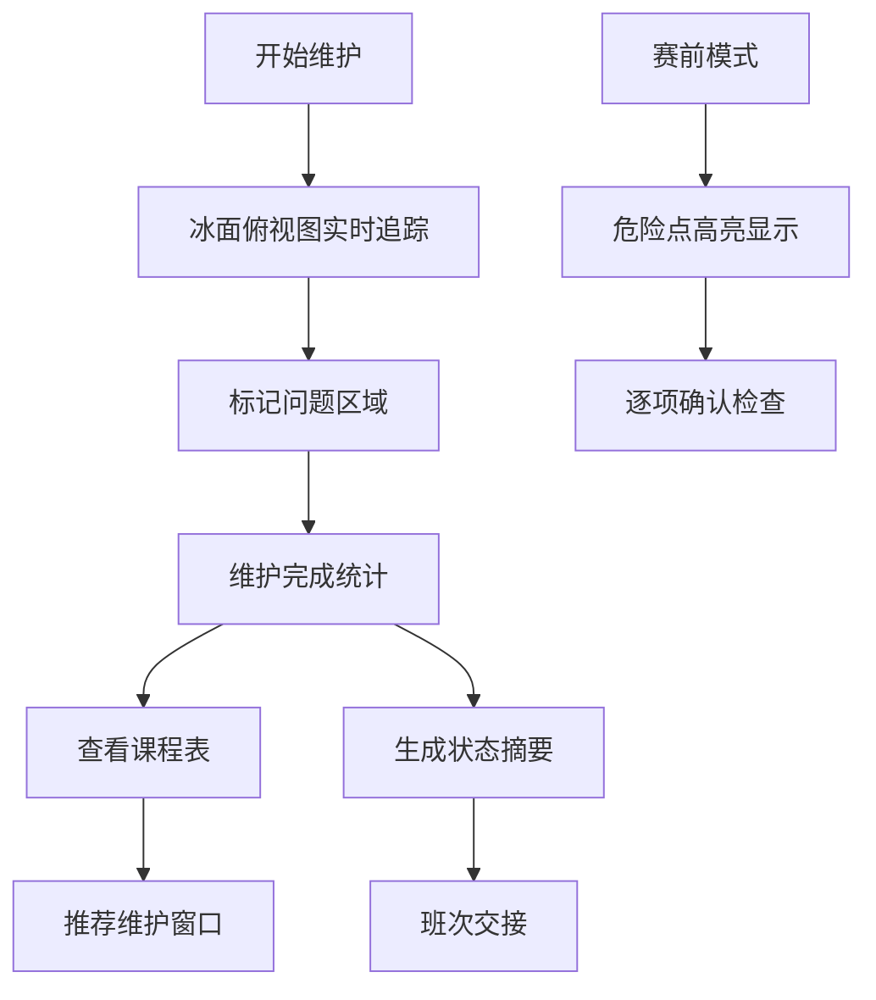

## 1. 产品概述

冰面维护路线工具是一款面向室内冰场运维团队的专业作业管理系统，帮助磨冰车驾驶员和值班经理高效规划冰面维护路线、标记问题区域、推荐维护窗口，并在赛前快速定位危险点。

- 核心价值：减少漏磨区域导致的起槽风险，优化维护时间窗口，提升冰面安全性
- 目标用户：磨冰车驾驶员、冰场运维主管、值班经理
- 使用场景：日常冰面维护、赛前安全检查、班次工作交接

## 2. 核心功能

### 2.1 用户角色

| 角色 | 核心权限 |
|------|----------|
| 磨冰车驾驶员 | 查看维护路线、标记问题区域、确认维护完成 |
| 值班经理 | 查看课程表、管理维护窗口、生成交接报告、启用赛前模式 |
| 运维主管 | 全部权限，可配置冰场参数和路线模板 |

### 2.2 功能模块

1. **冰面俯视图**：交互式冰场平面视图，展示磨冰车行驶轨迹、补水区域、刮刀高度、完成时间
2. **问题标记系统**：标记起槽、积水、门口碎冰、临时封区四类问题
3. **课程表与维护窗口**：展示当日课程安排，智能推荐下一次维护时间窗口
4. **赛前模式**：突出显示未处理危险点，按优先级排序，提供快速导航
5. **状态摘要与交接**：生成冰面状态报告，支持班次交接记录

### 2.3 页面详情

| 页面名称 | 模块名称 | 功能描述 |
|---------|----------|----------|
| 主仪表盘 | 冰面俯视图 | 可交互SVG冰场平面图，展示磨冰车轨迹、补水区域、刮刀高度热力图、已完成区域 |
| 主仪表盘 | 问题标记面板 | 四类问题标记工具，支持点击冰面添加、编辑、删除标记，显示问题列表 |
| 主仪表盘 | 维护路线控制 | 开始/暂停/结束维护，实时显示已磨面积、预计剩余时间、当前刮刀高度 |
| 课程表页面 | 课程时间表 | 当日/次日课程安排时间轴，显示训练队、散客时段、包场信息 |
| 课程表页面 | 维护窗口推荐 | 基于课程表自动计算可用维护窗口，按时长排序推荐 |
| 赛前模式 | 危险点地图 | 高亮所有未处理危险点，按严重程度分级着色，支持一键导航 |
| 赛前模式 | 检查清单 | 赛前必查项清单，逐项确认，未完成项突出警示 |
| 交接报告 | 状态摘要 | 冰面整体健康评分、问题统计、已完成维护记录 |
| 交接报告 | 班次交接 | 交接班记录模板，自动填充当前状态，支持手写备注 |

## 3. 核心流程

磨冰车驾驶员开始维护作业 → 系统在俯视图上实时绘制行驶轨迹 → 驾驶员发现问题时点击标记 → 维护完成后系统计算覆盖率 → 值班经理查看课程表获取推荐维护窗口 → 赛前切换至赛前模式检视危险点 → 班次结束生成交接报告

## 4. 用户界面设计

### 4.1 设计风格

- 主色调：冰蓝色系（#0EA5E9 主色、#0284C7 深色、#E0F2FE 浅色），呼应冰场冷冽氛围
- 辅助色：警示红（#EF4444）、注意橙（#F59E0B）、成功绿（#10B981）
- 背景色：深蓝灰（#0F172A）为主背景，营造专业监控台氛围
- 字体：JetBrains Mono 等宽字体用于数据展示，Inter 用于正文
- 按钮风格：圆角矩形，微立体阴影，点击有按压反馈
- 布局风格：仪表盘式布局，左侧导航 + 中央主视图 + 右侧信息面板
- 图标风格：线性图标，统一 2px 描边，冰蓝色调

### 4.2 页面设计概览

| 页面名称 | 模块名称 | UI元素 |
|---------|----------|--------|
| 主仪表盘 | 冰面俯视图 | SVG冰场轮廓、轨迹动画、热力渐变、问题标记点、图例说明 |
| 主仪表盘 | 控制面板 | 播放/暂停按钮、刮刀高度滑块、计时器、进度环形图 |
| 课程表页面 | 时间轴 | 24小时时间轴、色块表示时段类型、悬停详情卡片 |
| 赛前模式 | 危险点地图 | 脉冲动画标记、优先级边框、闪烁警示效果 |
| 交接报告 | 摘要卡片 | 数据大字号展示、冰面健康评分仪表盘、统计图表 |

### 4.3 响应式

- 桌面端为主设计（1440px+），三栏布局
- 平板端折叠右侧面板为可展开抽屉
- 移动端简化视图，优先展示冰面俯视图和核心控制
- 触屏优化：标记点增大点击区域，支持双指缩放冰面

### 4.4 交互动效

- 磨冰车轨迹采用逐段绘制动画，模拟真实行驶
- 问题标记点有脉冲呼吸效果，危险级别越高频率越快
- 页面切换采用淡入淡出 + 轻微位移
- 数据更新时有数字滚动动画
- 悬停卡片有上浮 + 阴影加深效果
