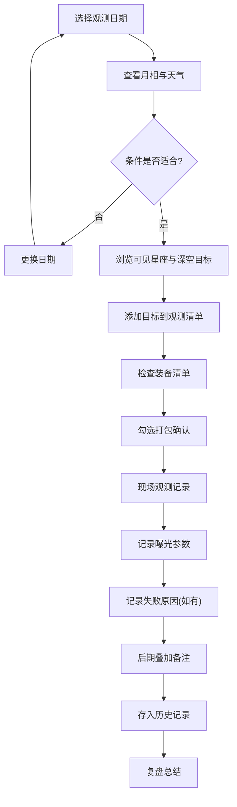

## 1. 产品概述
星野夜观测计划工具是一款面向天文爱好者的夜间观测规划与记录应用。解决用户观测前忘记查月相、天气、目标天体，以及观测后无法系统复盘的问题。帮助用户高效规划每次郊外观星行程，积累有价值的观测经验。

## 2. 核心功能

### 2.1 用户角色
| 角色 | 注册方式 | 核心权限 |
|------|---------|---------|
| 天文爱好者 | 无需注册，本地存储 | 规划观测计划、管理清单、记录复盘 |

### 2.2 功能模块
1. **观测计划页**：日期选择、月相信息、天气窗口、可见星座、深空目标推荐
2. **观测清单页**：已选目标管理、装备清单提醒（望远镜/相机/赤道仪/电池/红光灯等）
3. **观测记录页**：实际观测记录、曝光参数、失败原因、照片叠加备注
4. **历史复盘页**：历史观测记录浏览、经验总结查询

### 2.3 页面详情
| 页面名称 | 模块名称 | 功能描述 |
|---------|---------|---------|
| 观测计划 | 日期选择器 | 选择观测日期，支持未来7天快速选择 |
| 观测计划 | 月相卡片 | 展示月升月落时间、月龄、月相图标、光照百分比 |
| 观测计划 | 天气窗口 | 24小时云量折线图、温度、风速、湿度、可见度评分 |
| 观测计划 | 可见星座 | 当晚可见星座列表，含升起时间、最佳观测时段 |
| 观测计划 | 深空目标 | 星系/星云/星团推荐，含难度、大小、建议设备、加入清单按钮 |
| 观测清单 | 目标列表 | 已加入的观测目标，支持删除、调整顺序、备注 |
| 观测清单 | 装备清单 | 分类装备勾选列表（光学/摄影/辅助/电源），支持自定义添加 |
| 观测清单 | 打包检查 | 出门前装备勾选确认，未勾选项目高亮提醒 |
| 观测记录 | 目标记录卡 | 每个目标的实际观测情况：是否看到、视宁度评分 |
| 观测记录 | 曝光参数 | ISO、快门、光圈、张数、暗场/平场/偏置场记录 |
| 观测记录 | 失败原因 | 下拉选择+备注：天气/设备/目标过低/光污染/其他 |
| 观测记录 | 叠加备注 | 后期叠加软件、总曝光时间、处理心得 |
| 历史复盘 | 记录列表 | 按日期倒序的历史观测卡片，展示核心指标 |
| 历史复盘 | 统计面板 | 总观测次数、累计曝光时长、成功率、常用目标类型 |

## 3. 核心流程
用户选择观测日期 → 查看月相和天气窗口评估条件 → 浏览可见星座和深空目标 → 将感兴趣的目标加入观测清单 → 检查装备清单并确认打包 → 到达现场进行观测并记录参数 → 观测后补充失败原因和叠加备注 → 历史中查看复盘总结

## 4. 用户界面设计

### 4.1 设计风格
- **主色调**：深空蓝 `#0a1628`（背景），星空紫 `#4f46e5`（主色），月光金 `#fbbf24`（强调）
- **辅助色**：星云粉 `#ec4899`，极光绿 `#10b981`，警示红 `#ef4444`
- **按钮风格**：圆角 8px，带微妙内发光，hover 有光晕扩散效果
- **字体**：标题使用 Playfair Display（优雅衬线），正文使用 Inter（清晰易读）
- **布局风格**：卡片式布局，深空渐变背景+星点粒子动画，玻璃拟态卡片
- **图标风格**：Lucide 图标，统一 24px，配合主题色

### 4.2 页面设计概览
| 页面名称 | 模块名称 | UI元素 |
|---------|---------|-------|
| 观测计划 | Hero区 | 渐变标题+当前日期+快速日期选择器胶囊 |
| 观测计划 | 月相卡片 | 圆形月相图（CSS绘制）+ 时间轴月出/月落标记 |
| 观测计划 | 天气窗口 | 折线图（区域渐变填充）+ 时段评分色块 |
| 观测计划 | 星座网格 | 圆角卡片，悬停浮起，含星座连线缩略图 |
| 观测计划 | 目标列表 | 左侧缩略图+右侧信息+添加按钮 |
| 观测清单 | 目标卡片 | 拖拽排序+难度标记+备注输入 |
| 观测清单 | 装备分类 | 折叠面板，分类图标+进度条 |
| 观测清单 | 确认按钮 | 大型渐变色按钮，带脉动动画 |
| 观测记录 | 记录表单 | 评分星标+参数网格+标签选择 |
| 历史复盘 | 时间线 | 纵向时间轴，左右交替卡片 |

### 4.3 响应式
- Desktop-first（≥1024px）：4列栅格，侧栏导航
- 平板（768-1024px）：2列栅格，顶部导航
- 移动（<768px）：单列布局，底部Tab导航，触控优化加大点击区域
