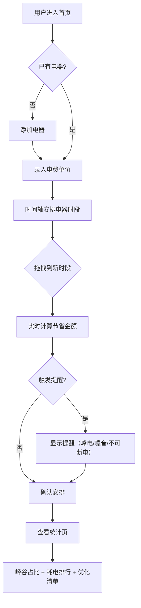

## 1. 产品概述

家庭用电峰谷账本 —— 帮助家庭用户识别哪些电器适合挪到谷电时段使用，通过可视化时间轴和智能提醒，让每一度电都花在更便宜的时段。目标用户为关注电费开支的家庭用户，核心价值是将抽象的峰谷电价转化为直观的省钱行动。

## 2. 核心功能

### 2.1 用户角色
| 角色 | 注册方式 | 核心权限 |
|------|----------|----------|
| 家庭用户 | 无需注册（本地存储） | 管理电器、录入电费、查看时间轴与统计 |

### 2.2 功能模块
1. **首页（用电时间轴）**：24小时时间轴展示电器分布，拖拽电器到不同时段，实时估算节省金额，智能提醒
2. **电器管理页**：添加/编辑/删除家用电器，填写功率、使用时长、能否预约、是否必须白天用
3. **电费录入页**：录入每月电费单，填写峰/谷/平电单价和各时段用电量
4. **统计页**：峰谷占比饼图、最耗电电器排名、可优化清单

### 2.3 页面详情
| 页面名称 | 模块名称 | 功能描述 |
|----------|----------|----------|
| 首页 | 24小时时间轴 | 横向时间轴（0-24时），峰/谷/平电时段以不同底色区分，电器卡片可拖拽到对应时段 |
| 首页 | 节省估算面板 | 拖拽后实时计算：当前安排电费 vs 优化后电费，显示可节省金额 |
| 首页 | 智能提醒区 | 检测高功率电器在峰电、夜间噪音风险、冰箱等不可断电电器误操作等 |
| 电器管理 | 电器列表 | 展示所有电器卡片，支持增删改，显示名称、功率、日使用时长、预约标识、白天必需标识 |
| 电器管理 | 电器表单 | 弹窗表单：名称、功率(W)、日均使用时长(h)、能否预约启动(开关)、是否必须白天用(开关) |
| 电费录入 | 电费单列表 | 按月展示已录入电费单，支持增删改 |
| 电费录入 | 电费单表单 | 弹窗表单：月份、峰电单价(元/kWh)、谷电单价(元/kWh)、平电单价(元/kWh)、峰电用量(kWh)、谷电用量(kWh)、平电用量(kWh) |
| 统计页 | 峰谷占比图 | 环形图展示本月峰/谷/平用电量占比 |
| 统计页 | 耗电排行 | 柱状图展示电器按月耗电量从高到低排名 |
| 统计页 | 可优化清单 | 列表展示：电器名、当前时段、建议时段、预计月省金额 |

## 3. 核心流程

用户首次使用：添加电器 → 录入电费单价 → 在时间轴上安排电器用电时段 → 查看优化建议和节省估算。后续使用：调整电器时段 → 查看月度统计 → 按提醒优化用电习惯。

## 4. 界面设计

### 4.1 设计风格
- **主色调**：深蓝黑底色（#0f172a）+ 琥珀金强调色（#f59e0b），营造"能源仪表盘"的工业感
- **辅助色**：峰电用珊瑚红（#ef4444）、谷电用翠绿（#22c55e）、平电用天蓝（#3b82f6）
- **按钮风格**：圆角胶囊按钮，微发光边框效果
- **字体**：标题用 DM Sans（粗体、科技感），正文用 Noto Sans SC（中文友好）
- **布局风格**：卡片式布局，玻璃拟态（glassmorphism）卡片，侧边导航
- **图标风格**：线性图标，与电器类型对应的 emoji 点缀

### 4.2 页面设计概览
| 页面名称 | 模块名称 | UI 元素 |
|----------|----------|---------|
| 首页 | 时间轴 | 横向24格网格，峰/谷/平底色渐变，电器小卡片可拖拽，hover 显示功率和费用 |
| 首页 | 节省面板 | 右侧固定卡片，数字翻牌动画，节省金额高亮绿色 |
| 首页 | 提醒区 | 顶部横幅，红/黄/蓝三级提醒，可关闭 |
| 电器管理 | 电器列表 | 网格卡片，功率大字+名称，预约/白天标签角标 |
| 电器管理 | 表单弹窗 | 居中弹窗，滑块输入功率，开关控件 |
| 电费录入 | 电费单列表 | 时间线式列表，月份节点+金额 |
| 电费录入 | 表单弹窗 | 居中弹窗，三列输入（峰/谷/平） |
| 统计页 | 峰谷占比 | 居中环形图，中间显示总电量 |
| 统计页 | 耗电排行 | 横向柱状图，渐变色条 |
| 统计页 | 优化清单 | 卡片列表，箭头图标从"当前"指向"建议" |

### 4.3 响应式
- 桌面优先设计，1920px 为基准
- 平板端时间轴改为可横滑
- 移动端导航改为底部 Tab

### 4.4 3D 场景
- 不涉及 3D 场景
