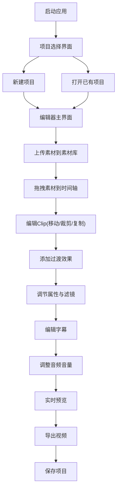

## 1. 产品概述

专业级网页版非线性视频编辑工具，基于WebCodecs和Canvas实现实时预览与合成，支持多轨道编辑、过渡效果、调色滤镜、字幕音频处理等完整剪辑工作流，数据存储于IndexedDB实现项目持久化。

- 解决用户无需安装桌面软件即可进行专业视频剪辑的需求
- 面向内容创作者、自媒体运营者、教育工作者等需要快速剪辑视频的用户

## 2. 核心功能

### 2.2 功能模块

1. **素材库面板**：多格式文件上传、缩略图预览、拖拽导入时间轴
2. **预览窗口**：实时合成预览、播放控制、JKL快捷键、帧步进
3. **时间轴编辑器**：多轨道支持、Clip拖拽编辑、过渡效果、关键帧动画
4. **属性面板**：变换属性、速度控制、调色滤镜、音量调节
5. **字幕编辑**：文字字幕、SRT导入、样式设置
6. **导出模块**：多清晰度导出、进度显示、MP4输出
7. **项目管理**：IndexedDB存储、多项目切换、撤销重做

### 2.3 页面详情

| 页面名称 | 模块名称 | 功能描述 |
|---------|---------|---------|
| 编辑器主界面 | 素材库面板 | 本地文件上传(MP4/WebM/MOV/图片/音频)、缩略图列表、文件名/时长/大小显示、拖拽到时间轴 |
| 编辑器主界面 | 预览窗口 | Canvas实时合成、播放/暂停、进度条拖拽、时码显示、上一帧/下一帧、JKL快捷键控制 |
| 编辑器主界面 | 时间轴 | 视频轨(3条)、音频轨(3条)、字幕轨(1条)、Clip拖拽移动/裁剪、Alt拖拽复制、轨道头部控制 |
| 编辑器主界面 | 过渡效果 | Clip间加过渡、淡入淡出、交叉溶解、推拉、滑动、时长调节 |
| 编辑器主界面 | 属性面板 | 缩放/旋转/位置/透明度、速度0.25-4倍、反向播放、亮度/对比度/饱和度、滤镜(黑白/怀旧/模糊) |
| 编辑器主界面 | 字幕编辑 | 添加文字字幕、字体/大小/颜色/描边/阴影设置、时间轴拖动、SRT文件导入 |
| 编辑器主界面 | 音频处理 | 音量曲线关键帧、拖拽调节音量包络、静音控制 |
| 编辑器主界面 | 导出功能 | 清晰度选择(720p/1080p/4K)、MediaRecorder/ffmpeg.wasm编码、进度条显示 |
| 项目选择界面 | 项目管理 | 项目列表、缩略图预览、新建/打开/删除项目、IndexedDB持久化 |
| 全局 | 撤销重做 | 30步操作历史记录、Ctrl+Z/Ctrl+Y快捷键 |

## 3. 核心流程

用户打开应用 → 选择新建或打开已有项目 → 上传素材到素材库 → 拖拽素材到时间轴各轨道 → 调整Clip位置和时长 → 添加过渡效果 → 调节属性参数和滤镜 → 编辑字幕 → 调整音频音量 → 实时预览效果 → 导出最终视频 → 保存项目

## 4. 用户界面设计

### 4.1 设计风格
- **主色调**：深蓝紫色系(#1a1a2e)作为背景，科技感青色(#00d4ff)作为强调色
- **辅助色**：橙色(#ff6b35)用于播放控制和导出按钮，红色(#ff4757)用于删除操作
- **按钮风格**：圆角8px，微妙阴影，hover状态有亮度变化，active有按压效果
- **字体**：JetBrains Mono作为等宽字体(时码显示)，Inter作为界面字体
- **布局风格**：三栏布局(左素材库/中预览/右属性)，底部时间轴占全屏宽度
- **视觉层次**：深色主题降低视觉疲劳，高对比度确保长时间编辑舒适

### 4.2 页面设计概述

| 页面名称 | 模块名称 | UI元素 |
|---------|---------|--------|
| 编辑器主界面 | 素材库面板 | 垂直面板、顶部上传按钮、网格/列表切换、缩略图卡片、拖拽指示器 |
| 编辑器主界面 | 预览窗口 | 16:9固定比例Canvas、黑色背景、半透明控制栏、时码显示、播放按钮居中 |
| 编辑器主界面 | 时间轴 | 深灰色轨道背景、彩色Clip条(视频蓝/音频绿/字幕紫)、时间刻度标尺、滚动条 |
| 编辑器主界面 | 属性面板 | 分组折叠面板、滑块控件、数值输入、颜色选择器、下拉菜单 |
| 编辑器主界面 | 顶部工具栏 | 项目名称、撤销/重做按钮、保存按钮、导出按钮 |
| 项目选择界面 | 项目列表 | 卡片网格布局、项目缩略图、项目名称、修改时间、新建按钮悬浮 |

### 4.3 响应式
- Desktop-first设计，适配1920x1080及以上分辨率
- 时间轴区域可滚动缩放，支持鼠标滚轮缩放时间刻度
- 各面板可拖拽调整宽度，适应不同屏幕尺寸

### 4.4 交互细节
- Clip拖拽时显示半透明预览
- 轨道间拖拽有吸附对齐效果
- 滑块调节实时预览效果
- 关键帧添加有动画反馈
- 导出过程有进度条动画
