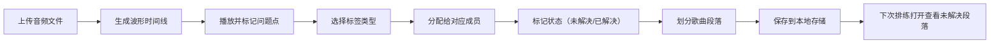

## 1. 产品概述

乐队排练音频标注工具，帮助乐队成员在排练录音上打标签、记录问题、分配任务，提升排练效率。解决排练后没人记得具体问题时间点的痛点，让每一次排练都有迹可循。

- 目标用户：乐队成员（吉他手、贝斯手、鼓手、主唱等）
- 核心价值：将排练录音可视化，精准定位问题，分配责任人，追踪解决进度

## 2. 核心功能

### 2.1 用户角色
| 角色 | 登录方式 | 核心权限 |
|------|----------|----------|
| 乐队成员 | 无需登录（本地存储） | 上传音频、打标签、分配问题、标记状态 |

### 2.2 功能模块
1. **歌曲列表页**：歌曲管理、未解决问题概览、新建/导入歌曲
2. **标注工作台**：波形显示、播放控制、时间线标签、段落划分
3. **标签管理**：问题类型标签、成员分配、状态标记
4. **段落编辑**：前奏/主歌/副歌/Bridge 段落划分和命名

### 2.3 页面详情
| 页面名称 | 模块名称 | 功能描述 |
|----------|----------|----------|
| 歌曲列表页 | 歌曲卡片列表 | 显示歌曲名、时长、未解决问题数、最后排练时间 |
| 歌曲列表页 | 上传/新建入口 | 支持本地音频文件上传，自动生成波形 |
| 标注工作台 | 波形时间轴 | 显示音频波形，支持缩放、拖拽、点击跳转 |
| 标注工作台 | 播放控制 | 播放/暂停、进度条、快进快退、倍速 |
| 标注工作台 | 标签标记 | 在时间点添加问题标签：走音、节奏抢拍、和声没进、solo可保留 |
| 标注工作台 | 段落划分 | 可视化划分前奏、主歌、副歌、Bridge 等段落 |
| 标注工作台 | 问题列表 | 显示所有标签，支持按类型/成员/状态筛选 |
| 标注工作台 | 成员分配 | 将问题分配给对应成员（鼓、贝斯、吉他、主唱等） |
| 标注工作台 | 状态追踪 | 未解决/已解决/待验证 状态流转 |

## 3. 核心流程

### 3.1 主流程描述
用户上传排练录音 → 系统生成波形图 → 成员边听边在问题时间点打标签 → 划分歌曲段落 → 为每个问题分配责任人 → 标记状态 → 下次排练打开歌曲直接看到未解决段落

### 3.2 流程图

## 4. 用户界面设计

### 4.1 设计风格
- **主色调**：深靛蓝 + 霓虹橙（音乐/舞台感）
- **背景**：深色模式，深灰底色，减少视觉疲劳（长时间听排练）
- **按钮风格**：圆角矩形，微立体，hover 有发光效果
- **字体**：标题用现代无衬线字体，正文清晰易读
- **图标风格**：线性图标，简洁有力

### 4.2 页面设计概览
| 页面名称 | 模块名称 | UI 元素 |
|----------|----------|---------|
| 歌曲列表页 | 顶部导航 | Logo、新建歌曲按钮、成员筛选 |
| 歌曲列表页 | 歌曲卡片 | 专辑封面占位、歌曲名、时长、未解决标签徽章、最后编辑时间 |
| 标注工作台 | 顶部栏 | 返回按钮、歌曲名、段落切换下拉、导出按钮 |
| 标注工作台 | 波形区域 | 波形图、段落色块、标签标记点、播放头 |
| 标注工作台 | 播放控制栏 | 播放/暂停按钮、时间显示、进度条、倍速选择 |
| 标注工作台 | 标签工具条 | 四种标签类型按钮、添加标签按钮 |
| 标注工作台 | 侧边面板 | 标签列表、筛选器、状态切换、成员分配 |

### 4.3 响应式
- 以桌面端为主，iPad 端适配
- 波形区域自适应宽度
- 侧边栏可折叠以节省空间

### 4.4 交互细节
- 波形图悬停显示时间刻度
- 点击标签点可跳转并高亮显示问题详情
- 段落划分支持拖拽调整边界
- 问题状态切换有平滑过渡动画
- 未解决问题以红色脉冲动画提醒
