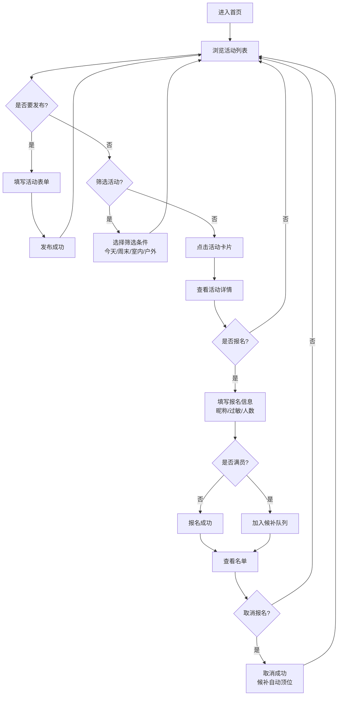

## 1. 产品概述

玩伴约局板是一个面向小区家长的儿童社交活动发布平台。
- **核心问题**：小区孩子找玩伴依赖家长临时呼唤，效率低且信息不透明
- **目标用户**：有0-12岁孩子的小区家长
- **产品价值**：结构化发布玩伴活动，便捷报名管理，保障信息安全，活动数据统计

## 2. 核心功能

### 2.1 用户角色

| 角色 | 核心权限 |
|------|----------|
| 家长用户 | 浏览活动、发布活动、报名参加、取消报名、查看管理统计 |

### 2.2 功能模块

1. **首页（活动广场）**：活动卡片列表、筛选切换（今天/周末/室内/户外、搜索
2. **发布活动页**：填写活动信息表单、发布提交
3. **活动详情页**：活动详情展示、报名表单、候补队列、取消报名
4. **管理统计页**：热门地点统计、年龄段分布、取消率分析、我的活动

### 2.3 页面详情

| 页面名称 | 模块名称 | 功能描述 |
|---------|---------|---------|
| 首页 | 筛选标签栏 | 按今天/周末/室内/户外快速切换筛选 |
| 首页 | 活动卡片列表 | 卡片展示活动关键信息：封面、标题、时间、地点、人数、状态 |
| 首页 | 发布入口 | 悬浮发布按钮快速跳转发布表单 |
| 发布活动页 | 活动信息表单 | 年龄段、地点、时间、活动内容、最大人数、家长陪同、注意事项 |
| 发布活动页 | 表单验证 | 必填项校验、时间合理性检查 |
| 活动详情页 | 基本信息区 | 完整活动信息展示 |
| 活动详情页 | 报名模块 | 昵称输入、过敏信息填写、到场人数、家长电话（保密） |
| 活动详情页 | 报名名单 | 已报名列表(仅昵称)、候补队列展示 |
| 活动详情页 | 取消报名 | 取消后候补自动顶位 |
| 管理统计页 | 热门地点排行 | 按活动次数排序的地点TOP榜单 |
| 管理统计页 | 年龄段分布 | 饼图/柱状图展示各年龄段活动数 |
| 管理统计页 | 取消活动分析 | 取消率较高的活动列表 |
| 管理统计页 | 我的发布/报名 | 我发布的和我报名的活动列表 |

## 3. 核心流程

### 主要用户流程：

家长在首页浏览活动卡片，通过筛选标签快速找到合适活动。点击卡片进入详情，填写孩子昵称、过敏信息、到场人数后报名。满员后自动进入候补队列。若有人取消，候补第一位自动转正。家长也可以点击发布按钮，填写完整活动信息发布新活动。在管理区查看数据统计和自己的活动记录。

## 4. 用户界面设计

### 4.1 设计风格

- **主色调**：温暖橙 #FF8C42（活力、童趣）
- **辅助色**：薄荷绿 #4ECDC4（清新、安全）
- **中性色**：暖米色背景 #FFF8F0，深灰文字 #2D3436
- **卡片风格**：大圆角(16px)、柔和阴影、微悬浮动效
- **字体**：圆润现代无衬线字体，标题加粗醒目
- **图标风格**：童趣扁平风，使用 lucide-react 图标库
- **整体氛围**：温馨、友好、充满活力、安全感

### 4.2 页面设计概览

| 页面名称 | 模块名称 | UI元素 |
|---------|---------|---------|
| 首页 | 顶部导航 | 温暖渐变背景、Logo、标题"玩伴约局板" |
| 首页 | 筛选标签栏 | 药丸形标签、选中高亮、滑动动画 |
| 首页 | 活动卡片 | 大圆角卡片、渐变标签、人数进度条、状态徽章 |
| 首页 | 悬浮按钮 | 圆形渐变按钮、+图标、阴影悬浮效果 |
| 发布活动页 | 表单页 | 分组表单、图标输入框、分段选择器 |
| 活动详情页 | 详情头部 | 大图区域、渐变遮罩、返回按钮 |
| 活动详情页 | 报名模块 | 昵称输入、过敏多选、人数步进器 |
| 活动详情页 | 名单区 | 头像+昵称列表、候补序号标签 |
| 管理统计页 | 统计卡片 | 彩色数字卡片、图标装饰 |
| 管理统计页 | 图表区 | 简洁柱状图/饼图可视化 |

### 4.3 响应式设计

- 桌面端优先，移动端自适应
- 移动端卡片单列布局，触控目标 ≥ 44px
- 平板端 2 列卡片网格
- 桌面端 3-4 列自适应网格
