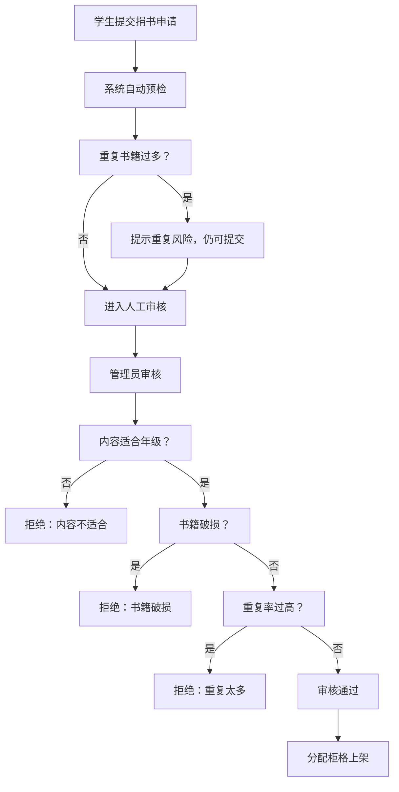

## 1. 产品概述

图书漂流柜管理系统是一款面向校园场景的图书共享管理平台，通过按柜格精细化管理漂流图书，实现学生自助借还、捐书审核、班主任与管理员数据统计的全流程数字化。

- 主要目标：解决传统书单管理模式下图书位置不明确、借还流程不规范、书籍质量难以把控的问题
- 目标用户：学生（借书/还书/捐书）、班主任（查看本班借阅情况）、管理员（审核捐书/统计分析）

## 2. 核心功能

### 2.1 用户角色

| 角色 | 登录方式 | 核心权限 |
|------|----------|----------|
| 学生 | 班级选择 + 姓名 | 扫码借书、归还图书、提交捐书申请 |
| 班主任 | 账号登录 | 查看本班未归还图书名单、提醒归还 |
| 管理员 | 账号登录 | 捐书审核、柜格管理、数据统计、破损下架 |

### 2.2 功能模块

1. **柜格总览页**：柜格网格展示、容量状态、柜格详情抽屉
2. **借书流程**：扫码选择书籍、填写班级信息、设置预计归还日
3. **还书流程**：选择原柜归还或换柜归还、确认归还
4. **捐书流程**：填写书籍信息、提交审核、等待审核结果
5. **班主任视图**：本班未归还名单、逾期提醒
6. **管理员视图**：热门书籍统计、冷门占格分析、破损下架管理、各年级借阅类别统计

### 2.3 页面详情

| 页面名称 | 模块名称 | 功能描述 |
|----------|----------|----------|
| 柜格总览页 | 柜格网格 | 展示所有柜格，每个柜格显示剩余容量、书籍封面缩略图、年级标签 |
| 柜格总览页 | 柜格详情抽屉 | 点击柜格展开，显示该柜格所有书籍的完整信息（书名、作者、适合年级、捐赠者、封面、状态） |
| 借书页面 | 书籍选择 | 展示可借书籍列表，支持扫码或点击选择 |
| 借书页面 | 信息填写 | 选择班级、输入姓名、设置预计归还日期 |
| 还书页面 | 归还方式选择 | 选择"原柜归还"或"换柜归还" |
| 还书页面 | 柜格选择 | 换柜归还时选择目标柜格（需有剩余容量） |
| 捐书页面 | 信息填写 | 输入书名、作者、ISBN、适合年级、上传封面、选择捐赠班级/姓名 |
| 捐书页面 | 提交审核 | 系统自动预检（重复度、年级适合度），提交后等待管理员审核 |
| 班主任视图 | 未归还名单 | 表格展示本班所有未归还图书，含学生姓名、书名、借阅日、预计归还日、逾期状态 |
| 管理员视图 | 数据仪表盘 | 热门书籍TOP10、冷门占格书、破损下架列表、各年级借阅类别分布图 |
| 管理员视图 | 捐书审核 | 待审核书籍列表，操作：通过/拒绝（选择原因：破损/重复/内容不适合） |

## 3. 核心流程

### 3.1 借书流程
学生进入柜格总览 → 浏览柜格找到心仪书籍 → 点击"借走这本书" → 选择班级并输入姓名 → 选择预计归还日期 → 确认借出 → 系统记录借阅信息并更新柜格状态

### 3.2 还书流程
学生点击"归还图书" → 搜索或选择自己借阅的书 → 选择归还方式（原柜/换柜）→ 若换柜则选择有空位的柜格 → 确认归还 → 系统更新书籍位置和状态

### 3.3 捐书审核流程
学生填写捐书信息 → 系统预检（重复检查、年级适合度提醒）→ 提交审核 → 管理员收到待审核通知 → 管理员审核（检查破损情况、内容适合度、重复情况）→ 审核通过则自动分配柜格上架，拒绝则通知捐赠者

## 4. 用户界面设计

### 4.1 设计风格
- **主色调**：温暖的书香橙 (#E87A3F) 搭配 森林绿 (#2D5A3D)，体现知识与自然的结合
- **辅助色**：米白背景 (#FDF8F3)、墨黑文字 (#1A1A1A)、温柔的状态色
- **按钮风格**：圆角矩形 (border-radius: 12px)，主按钮有微立体阴影效果
- **字体**：
  - 标题："Noto Serif SC" 宋体风格，传递书香气质
  - 正文："PingFang SC" 苹方，清晰易读
- **布局风格**：卡片式布局，柜格用拟物化设计（带木纹质感边框）
- **图标风格**：线性图标 + 彩色书籍 Emoji，活泼不失稳重

### 4.2 页面设计概览

| 页面名称 | 模块名称 | UI 元素 |
|----------|----------|---------|
| 柜格总览页 | 柜格网格 | 木纹边框卡片、容量进度条、书籍封面缩略图叠加、年级彩色标签、悬停放大动画 |
| 柜格总览页 | 柜格详情抽屉 | 右侧滑入、书籍列表卡片、捐赠者信息、借走按钮 |
| 借书页面 | 信息填写 | 班级选择器（下拉）、姓名输入框、日期选择器（日历组件）、确认按钮带加载动画 |
| 还书页面 | 归还方式选择 | 卡片式单选按钮（原柜/换柜）、柜格选择网格、确认步骤条 |
| 捐书页面 | 信息填写 | 封面上传区（拖拽上传）、表单分组、预检提示条 |
| 班主任视图 | 未归还名单 | 表格斑马纹、逾期红色高亮、一键复制提醒文案 |
| 管理员视图 | 数据仪表盘 | 统计卡片网格、柱状图（热门书）、饼图（年级类别）、列表分组 |

### 4.3 响应式
- 桌面端优先设计（≥1280px），柜格以 6 列网格展示
- 平板端（768px-1279px）：柜格改为 4 列，侧边抽屉改为底部弹出
- 移动端（<768px）：柜格 2 列展示，所有交互元素放大至触控友好尺寸

## 5. 交互与动效
- 柜格卡片悬停：轻微上浮 + 阴影加深（translateY(-4px), box-shadow 增强）
- 抽屉/模态框：滑入动画（300ms cubic-bezier(0.4, 0, 0.2, 1)）
- 按钮点击：缩放反馈（scale(0.96)，100ms）
- 数据加载：骨架屏 + 淡入效果
- 状态变更：Toast 通知从顶部滑入，3 秒后自动消失
