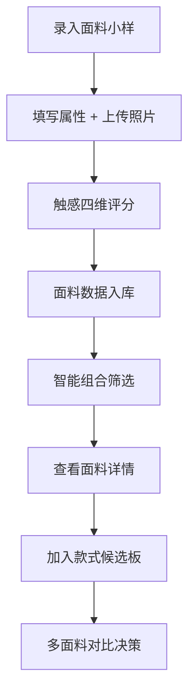

## 1. 产品概述
面料触感索引库是一款专为服装设计师打造的面料小样管理工具，解决打样阶段面料照片无法传达手感的痛点，实现面料质感的数字化记录与智能检索。

- 核心价值：将面料的触感、特性、视觉特征结构化存储，通过智能筛选快速匹配合适面料
- 目标用户：服装设计师、打版师、面料采购员

## 2. 核心功能

### 2.1 用户角色
| 角色 | 注册方式 | 核心权限 |
|------|----------|----------|
| 设计师 | 无需注册，本地使用 | 面料小样的增删改查、评分、筛选、候选板管理 |

### 2.2 功能模块
1. **小样管理页**：面料列表展示、新增/编辑/删除小样
2. **小样详情页**：完整属性展示、触感评分、照片对比
3. **智能筛选器**：组合条件筛选、自然语言风格预设筛选
4. **候选板管理**：按款式分组管理候选面料、对比查看

### 2.3 页面详情
| 页面名称 | 模块名称 | 功能描述 |
|----------|----------|----------|
| 小样管理页 | 顶部导航 | Logo、新增按钮、候选板入口、搜索框 |
| 小样管理页 | 智能筛选面板 | 预设筛选方案、自定义条件组合、滑杆范围筛选 |
| 小样管理页 | 小样卡片网格 | 面料缩略图、关键属性标签、加入候选板按钮 |
| 小样详情页 | 基本信息区 | 成分、克重、弹力、垂感、厚薄、透光、适合季节 |
| 小样详情页 | 触感评分区 | 柔软、挺括、粗糙、凉感四个维度的滑杆打分 |
| 小样详情页 | 照片对比区 | 揉皱前后照片切换、放大查看 |
| 小样详情页 | 操作区 | 编辑、删除、加入候选板 |
| 候选板管理页 | 款式列表 | 款式卡片、包含面料数量、操作按钮 |
| 候选板管理页 | 款式详情 | 该款式下的候选面料对比、排序、移除 |

## 3. 核心流程

### 3.1 新增面料流程
设计师点击新增 → 填写基本属性（成分、克重等）→ 上传揉皱前后照片 → 对四个触感维度滑杆打分 → 保存 → 自动入库

### 3.2 筛选查找流程
设计师进入首页 → 选择预设方案（如"适合夏季衬衫但不透"）→ 或自定义组合条件 → 实时过滤小样列表 → 点击查看详情 → 加入候选板

### 3.3 候选板使用流程
设计师创建新款款式 → 浏览筛选面料 → 将合适面料加入该款式候选板 → 打开款式候选板 → 对比多款面料 → 确定最终用料

## 4. 界面设计

### 4.1 设计风格
- **主色调**：暖象牙白 `#F8F4ED` 背景，深焦糖 `#8B5A3C` 主色，墨绿 `#3D5A45` 点缀
- **字体**：标题使用 Playfair Display（优雅衬线），正文使用 Lora（易读衬线）
- **布局**：卡片式网格布局，每张卡片模拟面料小样的质感呈现
- **交互细节**：卡片悬停有微妙的阴影变化，滑杆有渐变色填充，照片切换有淡入淡出过渡
- **视觉氛围**：面料工作室的专业感、质感、精致感，避免科技感过重

### 4.2 页面设计概览
| 页面名称 | 模块名称 | 关键 UI 元素 |
|----------|----------|--------------|
| 小样管理页 | 筛选面板 | 标签式预设方案、范围滑杆、多条件组合开关 |
| 小样管理页 | 小样卡片 | 方形缩略图、属性标签阵列、悬浮操作按钮 |
| 小样详情页 | 触感评分 | 四个垂直滑杆，每个滑杆有颜色渐变和实时数值 |
| 小样详情页 | 照片对比 | 左右分栏对比或标签切换，支持点击放大 |
| 候选板管理页 | 款式卡片 | 面料缩略图堆叠预览、名称、数量标签 |

### 4.3 响应式设计
- 桌面端：3-4列卡片网格，侧边筛选面板固定
- 平板端：2列网格，筛选面板可折叠
- 移动端：单列布局，筛选面板改为顶部下拉展开

### 4.4 预设筛选方案（自然语言风格）
- "适合夏季衬衫但不透"：季节=夏季，轻薄，透光=低
- "有垂感又不贴身"：垂感=高，弹力=中低
- "挺括西装料"：挺括=高，克重=高，厚薄=中厚
- "柔软贴身内衣"：柔软=高，弹力=高，凉感=中高
- "秋冬大衣料"：季节=秋冬，克重=高，厚薄=厚
- "粗糙肌理感"：粗糙=高，挺括=中
