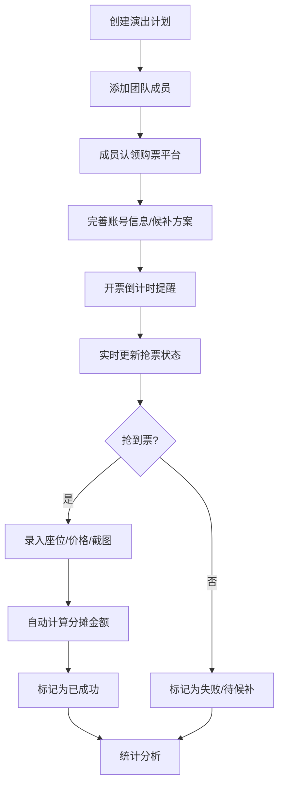

## 1. 产品概述
演唱会抢票分工协作平台，帮助朋友团队高效协同抢票，解决分工不清、信息不同步、账目混乱的痛点。
- 核心价值：让抢票过程透明化、分工明确化、账目清晰化
- 目标用户：结伴抢演唱会门票的朋友群体

## 2. 核心功能

### 2.1 用户角色
| 角色 | 注册方式 | 核心权限 |
|------|----------|----------|
| 创建者 | 无需注册，本地创建 | 创建演出计划、管理成员、编辑所有信息 |
| 成员 | 本地添加 | 认领平台、更新状态、录入抢票结果 |

### 2.2 功能模块
1. **首页仪表盘**：倒计时看板、状态卡片、快速操作入口
2. **演出计划页**：创建/编辑演出信息、预算档位、座位区域
3. **分工管理页**：成员管理、平台认领、账号状态、候补方案
4. **抢票录入页**：座位录入、价格记录、付款截图上传、分摊计算
5. **统计分析页**：成功率统计、超预算分析、平台热力榜

### 2.3 页面详情
| 页面名称 | 模块名称 | 功能描述 |
|---------|----------|----------|
| 首页 | 倒计时看板 | 展示距离开票的实时倒计时，区分"开票准备""正在抢""已成功""待转票"四种状态 |
| 首页 | 状态卡片 | 四张醒目卡片分别显示各状态的数量和详情，点击可跳转 |
| 首页 | 快速操作 | 新建计划、录入抢票结果、查看统计的快捷入口 |
| 演出计划 | 计划列表 | 卡片式展示所有演出计划，按开票时间排序 |
| 演出计划 | 计划表单 | 艺人名称、城市、日期、开票时间、预算档位（多档）、想坐区域（多选） |
| 分工管理 | 成员列表 | 头像、昵称、认领平台、账号状态、可买张数 |
| 分工管理 | 平台认领 | 成员可认领大麦/猫眼/票星球/纷玩岛等平台，标记账号是否实名认证、是否有特权码 |
| 分工管理 | 候补方案 | 记录备选平台、备选价位、备选场次 |
| 抢票录入 | 结果表单 | 选择场次、录入座位号、价格、上传付款截图、选择付款人、设置分摊方式 |
| 抢票录入 | 分摊计算 | 自动计算每人应付金额，支持等额分摊、按人头分摊、自定义 |
| 统计分析 | 成功率看板 | 总抢票次数、成功次数、成功率趋势图 |
| 统计分析 | 预算分析 | 超预算金额统计、各场次预算执行情况 |
| 统计分析 | 平台分析 | 各平台抢票成功率排行榜，直观显示哪个平台最易抢到 |

## 3. 核心流程

### 3.1 抢票协作流程
用户创建演出计划 → 添加成员 → 成员认领平台并完善账号信息 → 开票前倒计时提醒 → 成员实时更新抢票状态 → 抢到票后录入结果 → 系统自动计算分摊 → 查看统计分析

## 4. 用户界面设计

### 4.1 设计风格
- **主色调**：霓虹粉 `#FF2E9D` + 电光紫 `#9D4EDD` + 深空蓝 `#0D0221`
- **辅助色**：荧光绿 `#39FF14`（成功）、警示橙 `#FF6B35`（倒计时）、冷静蓝 `#4CC9F0`（信息）
- **设计语言**：赛博朋克演唱会风格，深色背景配霓虹发光效果
- **字体**：展示字体使用 `Orbitron`（科技感），正文字体使用 `Noto Sans SC`
- **按钮风格**：圆角胶囊形，带霓虹发光边框和 hover 脉冲动画
- **卡片风格**：半透明玻璃态 `backdrop-filter: blur(12px)`，渐变边框
- **整体氛围**：热烈、动感、充满期待感，符合演唱会抢票的激动心情

### 4.2 页面设计概述
| 页面名称 | 模块名称 | UI 元素 |
|---------|----------|---------|
| 首页 | 倒计时看板 | 超大字号倒计时，数字翻转动画，背景渐变流动 |
| 首页 | 状态卡片 | 四张彩色发光卡片，网格布局 2x2，悬停放大效果 |
| 首页 | 快速操作 | 底部浮动操作栏，三个圆角按钮带图标 |
| 演出计划 | 计划列表 | 垂直瀑布流卡片，每张卡片显示艺人头像、城市标签、倒计时徽章 |
| 演出计划 | 计划表单 | 模态弹窗表单，分区填写，预算档位支持动态添加 |
| 分工管理 | 成员卡片 | 头像圆形发光边框，平台图标徽章，状态标签 |
| 分工管理 | 平台认领 | 平台 logo 网格选择，点击选中动画 |
| 抢票录入 | 结果表单 | 分步表单，座位号输入带键盘，截图上传支持拖拽 |
| 抢票录入 | 分摊计算 | 金额数字滚动动画，成员勾选框，实时计算 |
| 统计分析 | 数据看板 | 大数字 KPI 卡片，折线图趋势，柱状图平台对比 |
| 统计分析 | 排行榜 | 平台卡片按成功率排序，第一名皇冠徽章 |

### 4.3 响应式
- **桌面优先**：1440px 基准设计，最大宽度 1920px
- **平板适配**：≥768px，两栏布局变一栏，卡片尺寸调整
- **手机适配**：≥375px，单列布局，底部导航栏，触控区域 ≥44px
- **触控优化**：所有可点击元素增加反馈涟漪效果

### 4.4 动画与交互
- **页面进入**：元素从下往上错落滑入，`stagger` 延迟 100ms
- **倒计时**：数字翻转动画，最后 10 分钟变红并闪烁
- **状态切换**：卡片发光脉冲动画，成功状态有烟花粒子效果
- **表单提交**：按钮加载动画，成功后绿色打勾扩散
- **数据更新**：数字滚动递增动画，图表描边动画
