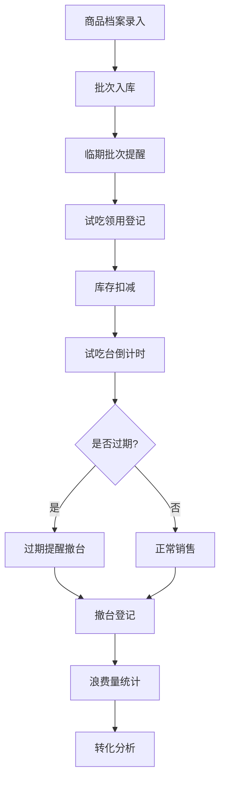

## 1. 产品概述

零食店试吃管理系统，用于管理门店试吃样品的全生命周期。解决试吃盘补货、摆台人员、保鲜时间等信息全靠口头传递的问题，实现试吃样品从领用、摆台到撤台的数字化管理，并统计试吃转化效果。

- **目标用户**：零食店店员、店长
- **核心价值**：试吃流程标准化、保质期可追溯、数据驱动决策

## 2. 核心功能

### 2.1 用户角色

| 角色 | 登录方式 | 核心权限 |
|------|----------|----------|
| 店员 | PIN码登录 | 领用试吃、登记撤台、查看提醒 |
| 店长 | PIN码登录 | 商品档案管理、查看统计报表、所有店员权限 |

### 2.2 功能模块

1. **仪表盘首页**：今日试吃概览、过期提醒、临期批次提醒
2. **商品档案管理**：商品信息增删改查、批次管理、库存管理
3. **试吃领用登记**：选择商品批次、填写领用人/位置/份量/时间
4. **试吃台监控**：当前摆台状态、倒计时提醒、撤台操作
5. **统计分析**：试吃消耗、转化订单、浪费量、最佳摆台商品

### 2.3 页面详情

| 页面名称 | 模块名称 | 功能描述 |
|-----------|-------------|---------------------|
| 仪表盘 | 数据概览卡片 | 今日领用数、在展台数、已撤台数、浪费量 |
| 仪表盘 | 过期提醒列表 | 超/临期试吃台高亮显示，一键撤台 |
| 仪表盘 | 临期批次提醒 | 临近保质期的批次优先推荐试吃 |
| 商品档案 | 商品列表 | 搜索、筛选、分页展示商品 |
| 商品档案 | 商品表单 | 名称、批次、口味、保质期、开封时长、库存、照片 |
| 试吃领用 | 领用表单 | 商品选择、领用人、试吃台位置、份量、开始时间 |
| 试吃台监控 | 摆台列表 | 卡片式展示所有在展试吃品，倒计时显示 |
| 统计分析 | 消耗统计 | 按日/周/月统计试吃消耗量 |
| 统计分析 | 转化分析 | 试吃带来的订单数、转化率 |
| 统计分析 | 浪费分析 | 未售罄撤台的浪费量排行 |
| 统计分析 | 最佳商品 | 转化率最高的试吃商品排行 |

## 3. 核心流程

### 3.1 试吃领用流程

店员在系统中选择商品（系统自动推荐临期批次），填写领用人、试吃台位置、份量等信息，提交后库存扣减，试吃台开始倒计时。

### 3.2 撤台流程

系统倒计时结束前提醒店员撤台，店员确认撤台并登记剩余份量（或全部售罄），系统计算浪费量并更新统计数据。

### 3.3 流程图

## 4. 用户界面设计

### 4.1 设计风格

- **主色调**：暖橙色 `#FF6B35`（代表零食的活力与食欲）
- **辅助色**：深绿色 `#2E7D32`（新鲜、安全的感觉）
- **警告色**：红色 `#E53935`（过期提醒）
- **中性色**：暖米色背景、深棕文字
- **风格定位**：温暖、友好、专业，卡片式布局，圆角设计
- **字体**：使用现代无衬线字体，标题醒目，正文清晰易读
- **图标风格**：线性图标，统一线条粗细

### 4.2 页面设计概述

| 页面名称 | 模块名称 | UI元素 |
|-----------|-------------|-------------|
| 仪表盘 | 数据概览 | 四色统计卡片，数字大字体，渐变背景 |
| 仪表盘 | 提醒列表 | 带图标的列表项，过期项红色高亮，脉冲动画 |
| 商品档案 | 列表 | 卡片网格布局，商品图片圆角展示 |
| 商品档案 | 表单 | 分组输入框，照片上传预览 |
| 试吃领用 | 表单 | 下拉选择、时间选择器、份量滑块 |
| 试吃监控 | 卡片 | 大字号倒计时，进度条，状态标签 |
| 统计分析 | 图表 | 柱状图/折线图，数据可视化 |

### 4.3 响应式

- 桌面端优先设计，适配 1280px 及以上
- 平板端自适应，卡片网格自动调整列数
- 移动端单列布局，底部导航栏

### 4.4 动效设计

- 页面切换：淡入淡出过渡
- 倒计时：数字跳动动画
- 过期提醒：红色脉冲呼吸效果
- 卡片悬停：轻微上浮 + 阴影加深
- 数据加载：骨架屏脉冲动画
