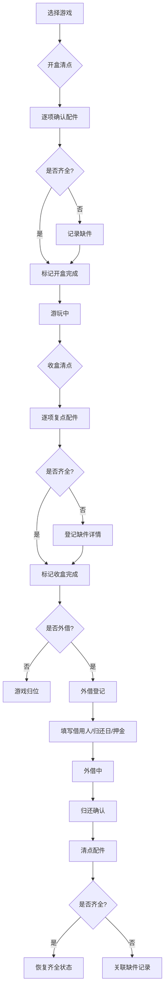

## 1. 产品概述

桌游收盒管家——专为桌游聚会设计的配件清点与外借管理工具。解决"大家都说齐了，下次才发现少了一个骰子"的痛点，提供开盒/收盒两段式清点、缺件追踪、外借管理三大核心能力。

- 目标用户：桌游爱好者、桌游吧经营者、聚会组织者
- 核心价值：零缺件焦虑，聚会开收盒秒级确认，外借不丢失

## 2. 核心功能

### 2.1 用户角色

| 角色 | 注册方式 | 核心权限 |
|------|----------|----------|
| 管理员 | 首次自动创建 | 录入游戏、清点、外借管理、归还确认 |
| 玩家 | 无需注册 | 查看游戏列表、清点记录 |

### 2.2 功能模块

1. **首页仪表盘**：缺件游戏、逾期外借、最近最常被玩的三款游戏
2. **游戏库**：所有已录入桌游的列表与搜索，支持按状态筛选
3. **游戏详情**：基础信息、配件明细、清点历史、外借记录
4. **开盒清点**：开局前逐项确认配件是否齐全
5. **收盒清点**：结束复点，标记缺件并记录可能去向
6. **外借管理**：外借登记、归还确认、押金追踪

### 2.3 页面详情

| 页面名称 | 模块名称 | 功能描述 |
|----------|----------|----------|
| 首页仪表盘 | 缺件告警卡片 | 展示所有有缺件的游戏，点击可跳转详情 |
| 首页仪表盘 | 逾期外借卡片 | 展示超期未还的外借记录，含归还日和押金 |
| 首页仪表盘 | 热门游戏卡片 | 最近最常被玩的三款游戏，显示游玩次数 |
| 游戏库 | 搜索与筛选 | 按名称搜索，按状态（齐全/缺件/外借）筛选 |
| 游戏库 | 游戏卡片列表 | 每款游戏展示封面、名称、人数、时长、状态标签 |
| 游戏详情 | 基础信息区 | 游戏名称、基础人数、时长、扩展包列表 |
| 游戏详情 | 配件明细表 | 配件名称、数量、类别（牌堆/棋子/骰子/说明书/计分板/其他） |
| 游戏详情 | 操作按钮区 | 开盒清点、收盒清点、外借登记 |
| 游戏详情 | 清点历史 | 历次清点记录，含时间、结果、缺件详情 |
| 开盒清点 | 清点清单 | 按类别列出所有配件，逐项确认数量 |
| 开盒清点 | 快捷操作 | 全部确认、按类别批量确认 |
| 收盒清点 | 复点清单 | 与开盒相同的清单，逐项核对数量 |
| 收盒清点 | 缺件登记 | 标记缺少数量、记录可能所在位置和持有人 |
| 外借管理 | 外借登记表 | 选择游戏、填写借用人、归还日期、押金金额 |
| 外借管理 | 归还确认 | 确认归还并清点配件，如缺件则关联记录 |

## 3. 核心流程

**开盒→游玩→收盒流程**：用户从游戏库选择一款游戏，点击"开盒清点"进入清点页面，逐项确认配件齐全后标记"开盒完成"；游戏结束后点击"收盒清点"，对照同一清单复点，如发现缺件则记录缺少数量、所在桌位、可能持有人，收盒完成。

**外借→归还流程**：选择游戏后点击"外借登记"，填写借用人、归还日、押金，游戏状态转为"外借"；归还时确认归还并清点，如齐全则恢复"齐全"状态，如缺件则关联缺件记录。

## 4. 用户界面设计

### 4.1 设计风格

- **主色调**：深棕/琥珀色系（桌游木质感），配以暖金色强调色
- **辅助色**：深绿（齐全状态）、橙红（缺件告警）、靛蓝（外借状态）
- **按钮风格**：圆角微凸起，木质纹理感，hover 时轻微浮起
- **字体**：标题使用衬线字体（Noto Serif SC），正文使用无衬线（Noto Sans SC）
- **布局风格**：卡片式布局，左侧导航栏，桌面端优先
- **图标**：骰子、棋盘、卡牌等桌游元素图标，使用 Lucide 图标库
- **质感**：微木纹背景纹理，卡片带轻微纸张质感阴影

### 4.2 页面设计概览

| 页面名称 | 模块名称 | UI 元素 |
|----------|----------|---------|
| 首页仪表盘 | 缺件告警 | 橙红边框卡片，缺件数量角标，游戏缩略图+名称 |
| 首页仪表盘 | 逾期外借 | 靛蓝边框卡片，倒计时标签，借用人头像占位 |
| 首页仪表盘 | 热门游戏 | 暖金边框卡片，游玩次数徽章，迷你趋势图 |
| 游戏库 | 搜索筛选栏 | 顶部固定，搜索框+状态筛选胶囊按钮 |
| 游戏库 | 游戏卡片 | 封面图、名称、人数/时长标签、状态色点 |
| 游戏详情 | 配件明细表 | 分类折叠面板，每项含+/-计数器 |
| 开盒清点 | 清点清单 | 左侧配件名+右侧勾选框，分类标题行 |
| 收盒清点 | 缺件登记 | 行内展开式表单：缺少数量+桌位+持有人输入 |
| 外借管理 | 登记表单 | 模态弹窗，日期选择器+金额输入+文本框 |

### 4.3 响应式设计

- 桌面端优先（1280px+），侧边导航+主内容区
- 平板端（768-1279px），顶部导航+卡片自适应
- 移动端（<768px），底部导航+全宽卡片，清点页面支持大按钮触控操作

### 4.4 3D 场景

不适用
