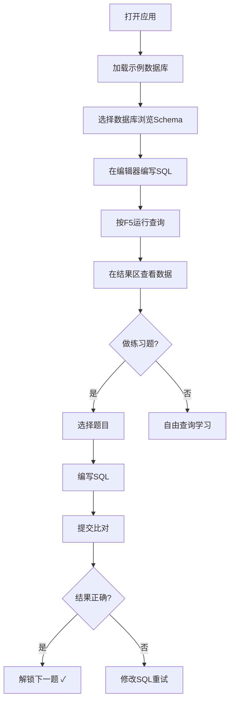

## 1. 产品概述

一个功能完整的网页版SQL练习平台，内置浏览器端SQL引擎，提供交互式学习体验。
- 解决SQL学习者缺乏即时练习环境的问题，支持从基础到高级的SQL技能训练
- 目标用户：SQL初学者、数据分析师、准备技术面试的开发者

## 2. 核心功能

### 2.1 用户角色
无需注册登录，所有数据本地存储

### 2.2 功能模块
1. **数据库Schema浏览区**：左侧树形结构展示数据库、表、字段详情
2. **SQL编辑器**：中间主区域，支持语法高亮、智能补全、多语句执行
3. **查询结果区**：下方表格展示，支持排序、筛选、分页、复制
4. **练习题区**：右侧20道由易到难的SQL练习题，自动判题
5. **工具栏**：运行、格式化、撤销、重做、保存、历史查询
6. **执行计划**：SQL解析树状展示
7. **设置区**：主题切换、数据导入导出

### 2.3 页面详情
| 页面名称 | 模块名称 | 功能描述 |
|-----------|-------------|---------------------|
| 主页面 | Schema浏览区 | 三套示例数据库（北风订单、员工管理、在线书店），每库10+张表，展示字段类型、主键、外键、索引 |
| 主页面 | SQL编辑器 | Monaco编辑器，SQL方言高亮，关键字提示，表名字段上下文补全 |
| 主页面 | 查询结果区 | 表格展示，列宽可拖，双击复制，NULL斜体灰字，无限滚动，列头排序，筛选过滤 |
| 主页面 | 练习题区 | 20道题目（单表、多表、分组、子查询、窗口函数、CTE），自动比对结果集 |
| 主页面 | 工具栏 | F5运行，格式化，撤销/重做，保存查询，历史列表，执行计划查看 |
| 主页面 | 设置区 | 深色/浅色主题切换，IndexedDB进度存储，localStorage导入导出 |

## 3. 核心流程

## 4. 界面设计

### 4.1 设计风格
- **主色调**：深蓝色系（#1e3a5f）代表专业、可信
- **辅助色**：青色（#06b6d4）用于高亮和交互元素
- **成功色**：绿色（#10b981）表示通过
- **错误色**：红色（#ef4444）表示错误
- **按钮风格**：圆角8px，微妙阴影，hover微放大
- **字体**：JetBrains Mono（代码）、Inter（界面）
- **布局**：三栏式布局，可拖拽分割线
- **图标**：简洁线性图标，配合emoji增强识别度

### 4.2 页面设计概览
| 页面名称 | 模块名称 | UI元素 |
|-----------|-------------|-------------|
| 主页面 | Schema区 | 树形缩进，文件夹图标，主键🔑外键🔗索引⚡标识 |
| 主页面 | 编辑器 | 行号，语法高亮，自动补全弹窗，错误下划线 |
| 主页面 | 结果区 | 斑马纹表格，可拖拽列边界，筛选图标悬浮显示 |
| 主页面 | 题目区 | 进度条，题号标签，通过打勾，描述卡片 |
| 主页面 | 工具栏 | 图标按钮，快捷键提示，分隔线分组 |

### 4.3 响应式
- 桌面端：三栏布局
- 平板：可折叠侧边栏
- 移动端：垂直堆叠布局（优先保证编辑器和结果区）

### 4.4 动画与交互
- 侧边栏展开/折叠：平滑过渡动画
- 查询运行：加载骨架屏
- 题目通过：绿色对勾弹跳动画
- 单元格复制：成功提示消息
- 主题切换：全页面颜色渐变过渡
