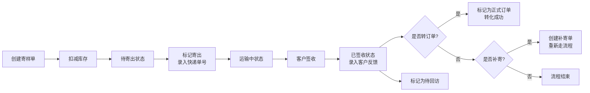
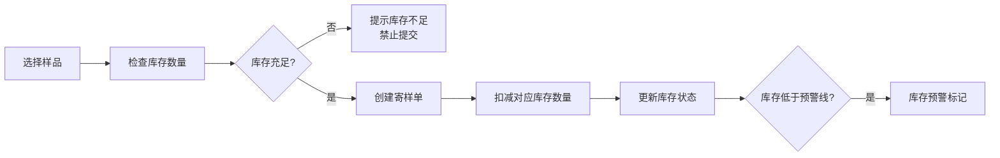

## 1. 产品概述

样品寄送追踪台是企业内部销售团队的样品寄送管理工具，解决销售人员在聊天记录中翻找快递单号的痛点，实现样品寄送全流程数字化管理。

- **主要目的**：集中管理样品寄样单，实时追踪物流状态，联动库存扣减，分析寄样转化效果
- **目标用户**：销售团队、样品管理员、运营分析人员
- **产品价值**：提升寄样效率30%，避免库存混乱，通过数据分析优化寄样策略

## 2. 核心功能

### 2.1 用户角色

| 角色 | 注册方式 | 核心权限 |
|------|----------|----------|
| 销售员工 | 企业账号登录 | 创建寄样单、更新物流状态、记录客户反馈 |
| 管理员 | 企业账号登录 | 全部功能 + 库存管理、数据统计、人员管理 |

### 2.2 功能模块

1. **首页（看板）**：按状态分组展示寄样单（待寄出、运输中、已签收、要回访）
2. **创建寄样单**：录入客户、样品、物流、寄出信息
3. **样品库存管理**：库存列表、入库、扣减联动
4. **统计分析**：寄样排名、转化率、超时包裹分析
5. **寄样单详情**：查看完整信息、更新状态、记录反馈

### 2.3 页面详情

| 页面名称 | 模块名称 | 功能描述 |
|----------|----------|----------|
| 首页看板 | 顶部导航栏 | 页面切换、快捷操作入口、搜索功能 |
| 首页看板 | 状态统计卡片 | 展示各状态数量，点击筛选对应列表 |
| 首页看板 | 待寄出列表 | 显示未寄出的寄样单，支持标记寄出 |
| 首页看板 | 运输中列表 | 显示运输中的包裹，显示预计到达日期 |
| 首页看板 | 已签收列表 | 显示已签收包裹，支持录入客户反馈 |
| 首页看板 | 要回访列表 | 显示需要跟进回访的寄样单 |
| 创建寄样单 | 基础信息表单 | 客户名称、联系人、联系电话录入 |
| 创建寄样单 | 样品信息表单 | 样品名称、数量、批次选择（联动库存） |
| 创建寄样单 | 物流信息表单 | 快递公司、快递单号、寄出日期、预计到达 |
| 创建寄样单 | 寄出信息 | 寄送人选择、备注信息 |
| 库存管理 | 库存列表 | 展示所有样品库存、可用数量、预警阈值 |
| 库存管理 | 入库操作 | 新增样品、调整库存数量 |
| 统计分析 | 寄样排行 | 按样品统计寄出数量，柱状图展示TOP10 |
| 统计分析 | 转化分析 | 签收转订单转化率、补寄率趋势图 |
| 统计分析 | 超时预警 | 超时未签收包裹列表、快递公司超时率 |
| 寄样单详情 | 信息总览 | 完整展示寄样单全部信息 |
| 寄样单详情 | 状态流转 | 标记寄出、标记签收、标记回访 |
| 寄样单详情 | 客户反馈 | 记录反馈内容、是否补寄、是否转订单 |

## 3. 核心流程

### 3.1 寄样主流程

### 3.2 库存联动流程

## 4. 用户界面设计

### 4.1 设计风格

- **主色调**：深蓝色 `#1e3a5f`（专业、可信赖）
- **辅助色**：
  - 待寄出：灰色 `#6b7280`
  - 运输中：橙色 `#f59e0b`
  - 已签收：绿色 `#10b981`
  - 要回访：紫色 `#8b5cf6`
  - 预警/超时：红色 `#ef4444`
- **按钮风格**：圆角8px，高度40px，悬停有微妙阴影变化
- **字体**：Noto Sans SC（中文显示优化），标题18-24px，正文14px
- **布局风格**：卡片式布局，顶部导航 + 左侧状态筛选 + 右侧内容区
- **图标风格**：线性图标，统一20px尺寸，颜色跟随状态

### 4.2 页面设计概述

| 页面名称 | 模块名称 | UI元素 |
|----------|----------|--------|
| 首页看板 | 顶部导航 | Logo、菜单项（首页/创建/库存/统计）、搜索框、用户头像 |
| 首页看板 | 状态卡片 | 4张彩色卡片，数字+状态名，悬停上浮效果 |
| 首页看板 | 列表区域 | 标签页切换，卡片列表，每行显示核心信息+操作按钮 |
| 创建寄样单 | 表单页面 | 分区表单，左对齐标签，输入框有focus状态，必填星标 |
| 统计分析 | 图表区域 | 柱状图+折线图组合，数据卡片，筛选时间范围 |
| 库存管理 | 表格页面 | 数据表格，行悬停高亮，操作列按钮组 |

### 4.3 响应式设计

- **桌面优先**：1440px宽度基准，支持1280px-1920px自适应
- **平板适配**：1024px时简化侧边栏，卡片变为2列布局
- **移动端**：768px以下变为单列布局，底部导航栏替代顶部导航

### 4.4 交互与动效

- 页面加载：内容区域淡入，卡片依次出现（stagger动画）
- 状态切换：标签页切换有平滑过渡
- 表单提交：按钮加载状态，成功提示滑入
- 悬停效果：卡片轻微上浮+阴影加深
