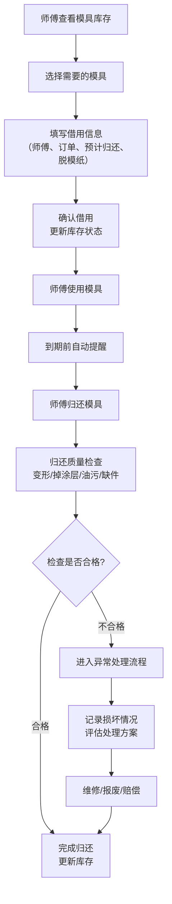

## 1. 产品概述
烘焙小店模具借还管理系统，解决吐司盒、磅蛋糕模、慕斯圈等模具被不同师傅随意拿走导致临做单才发现缺尺寸的问题，实现模具全生命周期管理。
- 面向烘焙店店长、烘焙师傅，提供模具档案、借用归还、异常处理、数据分析一站式管理
- 提升模具利用率，减少因缺模具导致的订单延误，降低模具损耗

## 2. 核心功能

### 2.1 用户角色
| 角色 | 注册方式 | 核心权限 |
|------|----------|----------|
| 店长 | 系统初始化 | 模具档案管理、查看所有借还记录、异常处理、数据看板、系统配置 |
| 烘焙师傅 | 店长添加 | 查看模具库存、申请借用、归还模具、查看个人借还记录 |

### 2.2 功能模块
1. **数据看板**：可用模具概览、预约冲突提醒、逾期未还预警、常用尺寸统计、建议采购数量
2. **模具档案**：模具类型、尺寸、材质、数量、适用产品、购买日期、照片管理
3. **借用管理**：借用申请、记录师傅/订单/预计归还时间、脱模纸需求、状态追踪
4. **归还管理**：归还检查（变形、掉涂层、残留油污、缺件）、状态更新
5. **异常管理**：高温损坏记录、长期未还自动预警、异常处理流程

### 2.3 页面详情
| 页面名称 | 模块名称 | 功能描述 |
|---------|---------|----------|
| 数据看板 | 概览卡片 | 显示可用模具总数、借用中数量、异常数量、逾期数量 |
| 数据看板 | 预约冲突 | 展示同一时间段内同一模具的借用冲突 |
| 数据看板 | 逾期预警 | 列表展示逾期未还的模具及借用师傅 |
| 数据看板 | 统计分析 | 常用尺寸柱状图、建议采购数量列表 |
| 模具档案 | 模具列表 | 按类型/尺寸/材质筛选的模具列表，支持增删改查 |
| 模具档案 | 模具详情 | 显示模具完整信息、借用历史、照片 |
| 模具档案 | 新增/编辑 | 表单录入模具信息，支持照片上传 |
| 借用管理 | 借用列表 | 当前借用中的模具列表，支持按师傅/状态筛选 |
| 借用管理 | 新建借用 | 选择模具、师傅、订单、预计归还时间、脱模纸需求 |
| 归还管理 | 归还列表 | 待归还模具列表 |
| 归还管理 | 归还检查 | 检查变形、掉涂层、残留油污、缺件，填写备注 |
| 异常管理 | 异常列表 | 高温损坏、长期未还的异常模具列表 |
| 异常管理 | 异常处理 | 记录处理方式、处理人、处理结果 |

## 3. 核心流程
师傅查看可用模具 → 提交借用申请 → 店长确认或直接借用 → 登记借用信息（师傅、订单、预计归还、脱模纸需求）→ 师傅使用模具 → 到期前提醒 → 师傅归还模具 → 质量检查（变形/掉涂层/油污/缺件）→ 若有异常则进入异常流程 → 无异常则完成归还更新库存

## 4. 用户界面设计

### 4.1 设计风格
- 主色调：温暖的焦糖色 (#D2691E)，契合烘焙主题
- 辅助色：奶油白 (#FFF8DC)、巧克力棕 (#8B4513)、抹茶绿 (#90EE90)（状态正常）、番茄红 (#FF6347)（状态异常）
- 按钮风格：圆角8px，微立体阴影，悬停有轻微上浮效果
- 字体：标题使用 "Noto Serif SC" 衬线字体，正文使用 "Noto Sans SC" 无衬线字体
- 布局风格：卡片式布局，顶部导航 + 左侧菜单 + 主内容区
- 图标/emoji：使用烘焙相关图标（蛋糕、模具、面包等），状态使用颜色标签区分

### 4.2 页面设计概述
| 页面名称 | 模块名称 | UI元素 |
|---------|---------|--------|
| 数据看板 | 概览卡片 | 4张统计卡片，数字醒目，图标动画，背景渐变 |
| 数据看板 | 图表区域 | 柱状图展示常用尺寸，表格展示建议采购 |
| 数据看板 | 预警区域 | 红色卡片突出逾期和冲突，可点击跳转处理 |
| 模具档案 | 模具列表 | 卡片网格布局，显示模具照片、类型、尺寸、状态标签 |
| 模具档案 | 表单弹窗 | 分步表单，照片预览，实时校验 |
| 借用管理 | 借用列表 | 时间线布局，显示借用状态进度 |
| 归还管理 | 检查表单 | 选项卡式检查项，每项独立评分+备注 |

### 4.3 响应性
- 桌面端（≥1280px）：三栏布局，左侧菜单、主内容区、右侧信息面板
- 平板端（768px-1279px）：两栏布局，左侧菜单可折叠
- 移动端（<768px）：单栏布局，底部导航，卡片自适应宽度
- 触摸优化：按钮最小尺寸48x48px，列表项支持左滑操作

### 4.4 交互细节
- 页面加载：骨架屏占位，内容渐入动画
- 状态切换：平滑过渡动画，状态标签颜色变化
- 表单提交：按钮加载状态，成功/失败提示
- 数据看板：数字滚动动画，图表悬停显示详情
- 卡片悬停：轻微上浮+阴影加深效果
