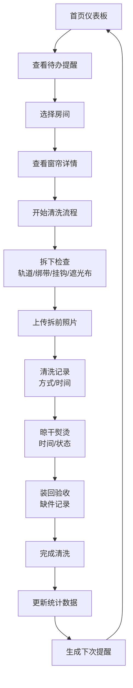

## 1. 产品概述

窗帘清洗拆挂清单管理应用，帮助用户系统化管理家庭窗帘的清洗维护流程，记录详细信息、跟踪清洗进度、智能提醒维护事项、统计清洗数据，避免缺件漏项和遗忘。

- 解决问题：窗帘清洗时容易遗漏配件、忘记清洗方式、缺乏维护记录、缺件无法追溯等问题
- 目标用户：家庭用户、家政服务人员、民宿管理者
- 产品价值：建立窗帘全生命周期维护档案，提升家居管理效率

## 2. 核心功能

### 2.1 用户角色
| 角色 | 注册方式 | 核心权限 |
|------|----------|----------|
| 家庭用户 | 无需注册，本地存储 | 完整的窗帘管理、清洗记录、提醒和统计功能 |

### 2.2 功能模块
1. **首页仪表板**：清洗概览、待办提醒、快捷操作、统计卡片
2. **房间管理**：房间列表、窗帘详情、窗帘增删改查
3. **清洗流程**：拆下检查、清洗记录、晾干熨烫、装回验收
4. **智能提醒**：超时未洗提醒、霉点记录、轨道问题跟踪
5. **数据统计**：清洗周期分析、配件缺口统计、耗时统计

### 2.3 页面详情
| 页面名称 | 模块名称 | 功能描述 |
|----------|----------|----------|
| 首页仪表板 | 概览卡片 | 显示待清洗房间数、缺失配件总数、本月清洗次数、平均耗时 |
| 首页仪表板 | 提醒列表 | 展示超时未洗、霉点、轨道卡顿等问题提醒 |
| 首页仪表板 | 快捷操作 | 快速新增清洗任务、添加房间、查看历史记录 |
| 房间管理 | 房间列表 | 卡片式展示各房间，显示窗帘数量、上次清洗日期、状态标签 |
| 房间管理 | 窗帘详情 | 展示窗帘类型、尺寸、挂钩数量、清洗方式、历史记录、照片 |
| 房间管理 | 窗帘编辑 | 新增/编辑窗帘基本信息，支持上传拆前照片 |
| 清洗流程 | 拆下检查 | 记录轨道、绑带、挂钩、遮光布完整性检查 |
| 清洗流程 | 清洗记录 | 记录清洗方式、清洗剂、开始/结束时间 |
| 清洗流程 | 晾干熨烫 | 记录晾干时间、熨烫情况、状态跟踪 |
| 清洗流程 | 装回验收 | 记录装回时间、缺件情况、验收确认 |
| 智能提醒 | 提醒配置 | 设置清洗周期提醒阈值、霉点跟踪、轨道问题记录 |
| 数据统计 | 清洗统计 | 各房间清洗频率、下次清洗时间预测 |
| 数据统计 | 配件统计 | 缺失配件清单、需采购数量统计 |
| 数据统计 | 耗时统计 | 本次清洗各环节耗时、总耗时、历史对比 |

## 3. 核心流程

用户从首页进入，查看待清洗提醒，选择房间开始清洗流程，依次完成拆下检查、清洗记录、晾干熨烫、装回验收四个环节，系统自动记录时间并生成统计数据。

## 4. 用户界面设计

### 4.1 设计风格
- **主色调**：雾霾蓝 `#4A6FA5`（宁静、整洁），搭配暖米色 `#F5F0E8`（温馨、家居）
- **辅助色**：鼠尾草绿 `#9CAF88`（清新、自然），珊瑚橙 `#E8998D`（提醒、警示）
- **字体**：标题使用 "Noto Serif SC"（雅致宋体），正文使用 "Noto Sans SC"（现代无衬线）
- **布局风格**：卡片式布局，柔和圆角，精致阴影，层次分明
- **图标风格**：线性简约图标，搭配家居感emoji点缀
- **整体调性**：温馨、整洁、有条理的家居管理风格

### 4.2 页面设计概述
| 页面名称 | 模块名称 | UI元素 |
|----------|----------|--------|
| 首页仪表板 | 概览卡片 | 渐变背景卡片，数据大字展示，微动画悬浮效果 |
| 首页仪表板 | 提醒列表 | 左图标右内容，不同类型提醒使用不同颜色标签 |
| 房间管理 | 房间卡片 | 网格布局，房间名称大标题，窗帘信息小字，状态角标 |
| 房间管理 | 窗帘详情 | 左右分栏，左侧照片轮播，右侧信息表单 |
| 清洗流程 | 步骤导航 | 顶部进度条，步骤节点带对勾动画 |
| 清洗流程 | 检查表 | 复选框列表，勾选后轻微缩放动画 |
| 数据统计 | 图表区域 | 彩色条形图、环形图，悬停显示详情 |

### 4.3 响应式设计
- **桌面端优先**：1200px 以上完整布局，多栏展示
- **平板适配**：768-1199px 自适应两栏布局
- **移动端**：768px 以下单列布局，底部导航，触摸优化
- **全局**：流畅过渡动画，触摸反馈，表单元素触控优化

## 5. 交互与动画
- 页面加载：卡片渐入+位移动画，错落延迟
- 步骤切换：平滑滑动过渡，进度条动画
- 表单提交：加载状态旋转，成功勾选动画
- 提醒项：轻微呼吸动效吸引注意
- 悬停效果：卡片上浮，阴影加深
