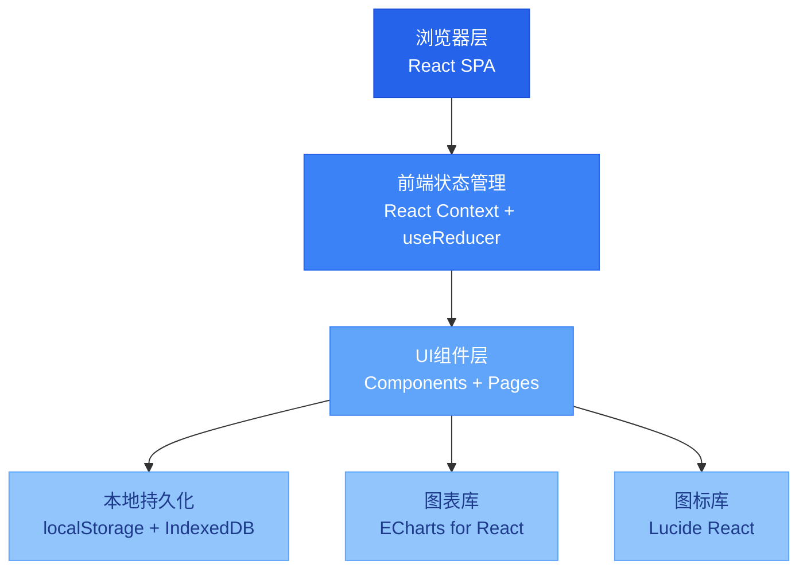
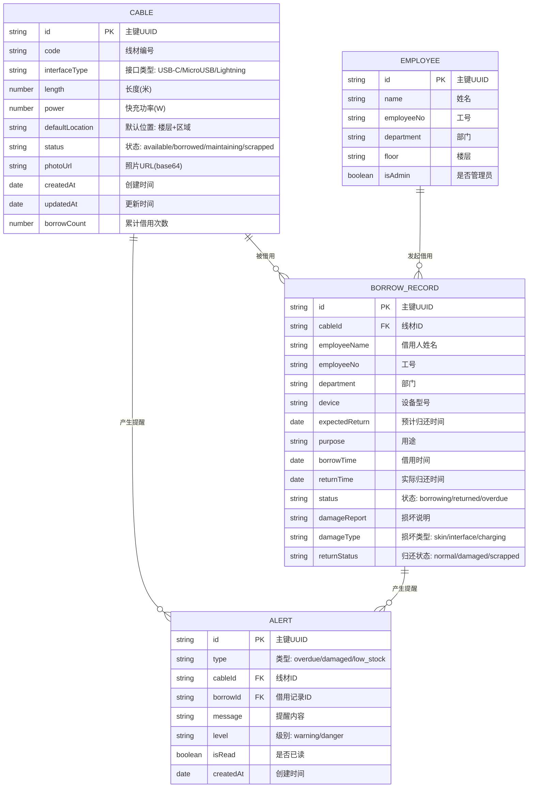

## 1. 架构设计



## 2. 技术说明

### 2.1 前端技术栈
- **框架**: React 18.2.0 + TypeScript 5.0
- **构建工具**: Vite 5.0
- **样式方案**: Tailwind CSS 3.4 + CSS Variables
- **路由**: React Router DOM 6.20
- **状态管理**: React Context + useReducer（轻量场景，无需Redux）
- **图表库**: ECharts 5.4 + echarts-for-react
- **图标库**: Lucide React 0.294
- **表单处理**: React Hook Form 7.48
- **日期处理**: date-fns 2.30
- **图片上传**: 原生File API + Canvas压缩

### 2.2 数据持久化方案
- **Primary**: localStorage（存储业务数据，JSON序列化）
- **照片存储**: IndexedDB（存储base64图片，避免localStorage容量限制）
- **数据备份**: 支持导出JSON文件，支持导入恢复

### 2.3 Mock数据方案
- 预置30条线材档案数据
- 预置20条历史借用记录
- 预置10条员工/部门数据
- 预置5条损坏记录

## 3. 路由定义

| 路由路径 | 页面名称 | 权限 |
|----------|----------|------|
| `/` | 首页/仪表盘 | 所有用户 |
| `/cables` | 线材档案列表 | 所有用户 |
| `/cables/:id` | 线材详情 | 所有用户 |
| `/cables/new` | 新增线材 | 管理员 |
| `/cables/:id/edit` | 编辑线材 | 管理员 |
| `/borrow` | 可借线材列表 | 所有用户 |
| `/borrow/:id` | 借用申请 | 所有用户 |
| `/my-borrow` | 我的借用 | 所有用户 |
| `/return` | 归还列表 | 所有用户 |
| `/return/:id` | 归还登记 | 所有用户 |
| `/statistics` | 统计看板 | 管理员 |
| `/admin` | 管理员登录 | 所有用户 |

## 4. 数据模型

### 4.1 ER图



### 4.2 类型定义 (TypeScript)

```typescript
// 线材接口类型
export type InterfaceType = 'USB-C' | 'Micro-USB' | 'Lightning';

// 线材状态
export type CableStatus = 'available' | 'borrowed' | 'maintaining' | 'scrapped';

// 借用状态
export type BorrowStatus = 'borrowing' | 'returned' | 'overdue';

// 归还状态
export type ReturnStatus = 'normal' | 'damaged' | 'scrapped';

// 损坏类型
export type DamageType = 'skin' | 'interface' | 'charging';

// 提醒类型
export type AlertType = 'overdue' | 'damaged' | 'low_stock';

// 提醒级别
export type AlertLevel = 'warning' | 'danger';

// 线材
export interface Cable {
  id: string;
  code: string;
  interfaceType: InterfaceType;
  length: number;
  power: number;
  defaultLocation: string;
  status: CableStatus;
  photoUrl: string;
  createdAt: string;
  updatedAt: string;
  borrowCount: number;
}

// 借用记录
export interface BorrowRecord {
  id: string;
  cableId: string;
  employeeName: string;
  employeeNo: string;
  department: string;
  device: string;
  expectedReturn: string;
  purpose: string;
  borrowTime: string;
  returnTime?: string;
  status: BorrowStatus;
  damageReport?: string;
  damageType?: DamageType;
  returnStatus?: ReturnStatus;
}

// 员工
export interface Employee {
  id: string;
  name: string;
  employeeNo: string;
  department: string;
  floor: string;
  isAdmin: boolean;
}

// 提醒
export interface Alert {
  id: string;
  type: AlertType;
  cableId?: string;
  borrowId?: string;
  message: string;
  level: AlertLevel;
  isRead: boolean;
  createdAt: string;
}

// 统计数据
export interface Statistics {
  totalCables: number;
  availableCables: number;
  borrowedCables: number;
  overdueCount: number;
  totalBorrowCount: number;
  lossRate: number;
  floorDemand: { floor: string; count: number }[];
  interfaceDemand: { type: InterfaceType; count: number }[];
  interfaceStock: { type: InterfaceType; available: number; total: number; safeStock: number }[];
  topBorrowed: { cable: Cable; count: number }[];
  monthlyTrend: { month: string; borrowCount: number; returnCount: number }[];
  damageDistribution: { type: DamageType; count: number }[];
}
```

### 4.3 数据结构存储键名

| 存储键名 | 数据类型 | 说明 |
|----------|----------|------|
| `cables` | Cable[] | 线材档案列表 |
| `borrowRecords` | BorrowRecord[] | 借用记录列表 |
| `employees` | Employee[] | 员工列表 |
| `alerts` | Alert[] | 提醒列表 |
| `currentUser` | Employee \| null | 当前登录用户 |
| `systemConfig` | object | 系统配置（安全库存等） |

## 5. 核心模块目录结构

```
src/
├── components/          # 可复用组件
│   ├── layout/         # 布局组件
│   │   ├── Header.tsx
│   │   ├── Sidebar.tsx
│   │   └── Layout.tsx
│   ├── common/         # 通用组件
│   │   ├── Button.tsx
│   │   ├── Card.tsx
│   │   ├── Modal.tsx
│   │   ├── Table.tsx
│   │   ├── FormField.tsx
│   │   ├── StatusBadge.tsx
│   │   ├── AlertCard.tsx
│   │   └── PhotoUpload.tsx
│   └── features/       # 业务组件
│       ├── cable/
│       │   ├── CableCard.tsx
│       │   ├── CableForm.tsx
│       │   └── CableFilter.tsx
│       ├── borrow/
│       │   ├── BorrowForm.tsx
│       │   └── BorrowList.tsx
│       ├── return/
│       │   ├── ReturnForm.tsx
│       │   └── ReturnCheckList.tsx
│       └── statistics/
│           ├── StatCard.tsx
│           ├── BarChart.tsx
│           ├── PieChart.tsx
│           └── LineChart.tsx
├── pages/              # 页面级组件
│   ├── Dashboard.tsx
│   ├── CableList.tsx
│   ├── CableDetail.tsx
│   ├── CableNew.tsx
│   ├── CableEdit.tsx
│   ├── BorrowList.tsx
│   ├── BorrowApply.tsx
│   ├── MyBorrow.tsx
│   ├── ReturnList.tsx
│   ├── ReturnProcess.tsx
│   ├── Statistics.tsx
│   └── AdminLogin.tsx
├── context/            # 状态管理
│   ├── AppContext.tsx
│   └── reducers/
│       ├── cableReducer.ts
│       ├── borrowReducer.ts
│       ├── alertReducer.ts
│       └── authReducer.ts
├── hooks/              # 自定义Hooks
│   ├── useCables.ts
│   ├── useBorrow.ts
│   ├── useAlerts.ts
│   ├── useStatistics.ts
│   └── useLocalStorage.ts
├── types/              # 类型定义
│   └── index.ts
├── utils/              # 工具函数
│   ├── storage.ts
│   ├── dateUtils.ts
│   ├── mockData.ts
│   ├── idGenerator.ts
│   └── imageUtils.ts
├── App.tsx
├── main.tsx
└── index.css
```

## 6. 关键业务逻辑

### 6.1 借用逻辑
1. 校验线材状态必须为 `available`
2. 校验员工是否有未归还的线材（限制每人最多借2条）
3. 创建借用记录，状态设为 `borrowing`
4. 更新线材状态为 `borrowed`，`borrowCount + 1`
5. 设置预期归还时间提醒

### 6.2 归还逻辑
1. 三项状态检查（外皮、接口、充电）全部通过才能标记为 `normal`
2. 任意一项不通过需填写损坏说明
3. 根据损坏程度设置状态：`damaged`（可修复）或 `scrapped`（报废）
4. 更新线材状态：`normal`→`available`，`damaged`→`maintaining`，`scrapped`→`scrapped`
5. 更新借用记录状态为 `returned`
6. 触发库存检查，若某接口类型库存<安全库存，创建提醒

### 6.3 提醒生成逻辑
- **逾期提醒**：每日扫描借用记录，`expectedReturn < now - 24h` 且状态为 `borrowing`，创建 `overdue` 类型提醒
- **损坏提醒**：归还时标记损坏后立即创建 `damaged` 类型提醒
- **库存提醒**：归还后或删除线材后，检查各接口类型可用数量，`< safeStock` 时创建 `low_stock` 类型提醒

### 6.4 统计计算逻辑
- **损耗率** = （损坏 + 报废线材数）/ 总线材数 × 100%
- **楼层需求** = 按员工楼层分组统计借用次数
- **接口需求占比** = 各接口类型借用次数 / 总借用次数
- **采购建议** = 安全库存 - 当前可用库存，结果>0时建议采购
