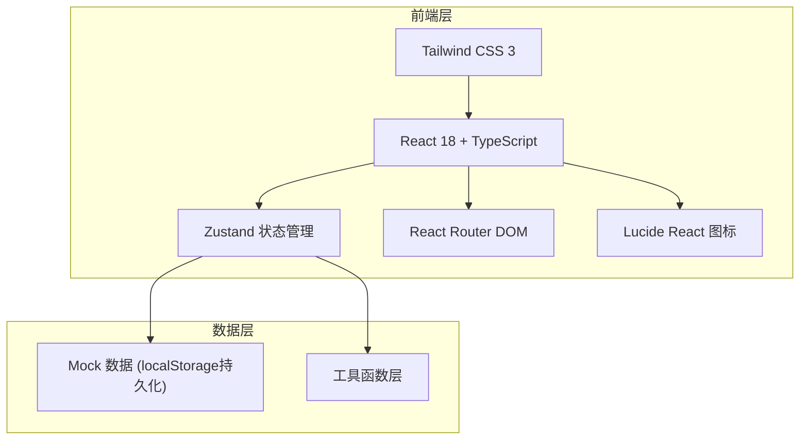
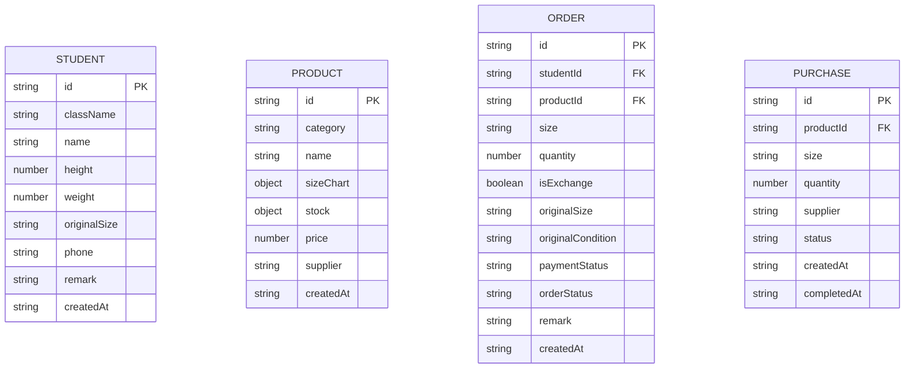

## 1. 架构设计



## 2. 技术描述

- 前端：React@18 + TypeScript + Tailwind CSS@3 + Vite
- 初始化工具：vite-init (react-ts 模板)
- 后端：无后端，使用 localStorage + Mock 数据
- 状态管理：Zustand
- 路由：React Router DOM v6
- 图标：lucide-react
- 数据持久化：localStorage

## 3. 路由定义

| 路由 | 用途 |
|------|------|
| /dashboard | 数据看板主页 |
| /students | 学生档案管理 |
| /products | 商品档案管理 |
| /orders | 补订申请管理 |
| /purchases | 采购清单管理 |

## 4. 数据模型

### 4.1 数据模型定义



### 4.2 类型定义

```typescript
// 学生档案
interface Student {
  id: string;
  className: string;
  name: string;
  height: number;
  weight: number;
  originalSize: string;
  phone: string;
  remark: string;
  createdAt: string;
}

// 商品分类
type ProductCategory = 'summer' | 'autumn' | 'sports' | 'vest' | 'pants';

// 商品档案
interface Product {
  id: string;
  category: ProductCategory;
  name: string;
  sizeChart: Record<string, { height: string; weight: string }>;
  stock: Record<string, number>;
  price: number;
  supplier: string;
  createdAt: string;
}

// 补订申请状态
type PaymentStatus = 'unpaid' | 'paid';
type OrderStatus = 'pending' | 'purchasing' | 'ready' | 'completed';
type OriginalCondition = 'good' | 'damaged' | 'lost';

// 补订申请
interface Order {
  id: string;
  studentId: string;
  productId: string;
  size: string;
  quantity: number;
  isExchange: boolean;
  originalSize?: string;
  originalCondition?: OriginalCondition;
  paymentStatus: PaymentStatus;
  orderStatus: OrderStatus;
  remark: string;
  createdAt: string;
}

// 采购状态
type PurchaseStatus = 'pending' | 'completed';

// 采购清单
interface Purchase {
  id: string;
  productId: string;
  size: string;
  quantity: number;
  supplier: string;
  status: PurchaseStatus;
  createdAt: string;
  completedAt?: string;
}
```

### 4.3 商品分类枚举数据

| 分类标识 | 显示名称 | 常用尺码 |
|----------|----------|----------|
| summer | 夏装 | S, M, L, XL, XXL |
| autumn | 秋装 | S, M, L, XL, XXL |
| sports | 运动服 | S, M, L, XL, XXL |
| vest | 马甲 | S, M, L, XL, XXL |
| pants | 校裤 | S, M, L, XL, XXL |

### 4.4 初始 Mock 数据

- 学生档案：3个班级 × 10名学生 = 30条数据
- 商品档案：5大类校服，每类5个尺码 × 基础库存
- 补订申请：约15条，覆盖各种状态
- 采购清单：约5条待采购记录

