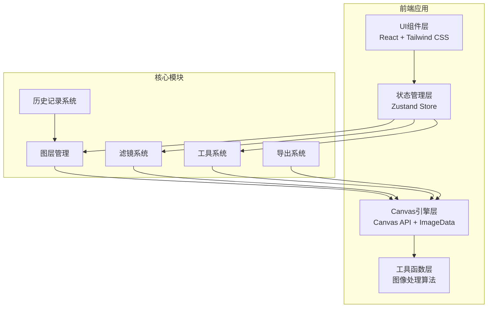

## 1. 架构设计



## 2. 技术描述

- **前端框架**: React@18 + TypeScript + Vite
- **状态管理**: Zustand
- **样式方案**: Tailwind CSS@3
- **图标库**: lucide-react
- **核心技术**: Canvas 2D API + ImageData 像素级操作
- **ZIP导出**: JSZip
- **无后端，纯前端实现，所有处理在浏览器端完成**

## 3. 数据结构定义

### 3.1 图层类型

```typescript
type LayerType = 'image' | 'text' | 'mosaic' | 'drawing' | 'cutout';

interface BaseLayer {
  id: string;
  name: string;
  type: LayerType;
  visible: boolean;
  locked: boolean;
  opacity: number; // 0-100
  blendMode: GlobalCompositeOperation;
  x: number;
  y: number;
  width: number;
  height: number;
  history: HistoryEntry[];
  historyIndex: number;
}

interface ImageLayer extends BaseLayer {
  type: 'image';
  imageData: ImageData;
  filters: FilterSettings;
}

interface TextLayer extends BaseLayer {
  type: 'text';
  content: string;
  fontSize: number;
  fontFamily: string;
  color: string;
  strokeColor: string;
  strokeWidth: number;
  shadowBlur: number;
  shadowColor: string;
  shadowOffsetX: number;
  shadowOffsetY: number;
}

interface MosaicLayer extends BaseLayer {
  type: 'mosaic';
  imageData: ImageData;
  brushSize: number;
  paths: MosaicPath[];
}

interface DrawingLayer extends BaseLayer {
  type: 'drawing';
  brushColor: string;
  brushSize: number;
  paths: DrawingPath[];
}

interface CutoutLayer extends BaseLayer {
  type: 'cutout';
  imageData: ImageData;
  maskData: Uint8ClampedArray;
}

interface HistoryEntry {
  timestamp: number;
  snapshot: Partial<BaseLayer>;
}
```

### 3.2 滤镜设置

```typescript
interface FilterSettings {
  brightness: number;      // -100 到 100
  contrast: number;        // -100 到 100
  saturation: number;      // -100 到 100
  hue: number;             // -180 到 180
  blur: number;            // 0 到 20
  sharpen: number;         // 0 到 100
  grayscale: number;       // 0 到 100
  invert: number;          // 0 到 100
  nostalgia: number;       // 0 到 100
  lomo: number;            // 0 到 100
}
```

### 3.3 工具状态

```typescript
type ToolType = 'select' | 'crop' | 'rotate' | 'flip' | 'text' | 'mosaic' | 'drawing' | 'lasso';

interface CropSettings {
  ratio: 'free' | '1:1' | '4:3' | '16:9' | '9:16' | 'custom';
  customWidth: number;
  customHeight: number;
  x: number;
  y: number;
  width: number;
  height: number;
}

interface LassoPoint {
  x: number;
  y: number;
}
```

## 4. 目录结构

```
src/
├── components/
│   ├── Canvas/
│   │   ├── MainCanvas.tsx       # 主画布组件
│   │   ├── CropOverlay.tsx      # 裁剪遮罩
│   │   ├── TextOverlay.tsx      # 文字拖拽层
│   │   └── DrawingCanvas.tsx    # 绘图画布
│   ├── Toolbar/
│   │   ├── Toolbar.tsx          # 左侧工具栏
│   │   ├── CropTool.tsx         # 裁剪工具面板
│   │   ├── TextTool.tsx         # 文字工具面板
│   │   ├── MosaicTool.tsx       # 马赛克工具面板
│   │   ├── DrawingTool.tsx      # 涂鸦工具面板
│   │   └── LassoTool.tsx        # 套索工具面板
│   ├── Filters/
│   │   ├── FilterPanel.tsx      # 滤镜面板
│   │   └── FilterSlider.tsx     # 滤镜滑块组件
│   ├── Layers/
│   │   ├── LayerList.tsx        # 图层列表
│   │   └── LayerItem.tsx        # 单个图层项
│   ├── Histogram/
│   │   └── Histogram.tsx        # 直方图组件
│   └── Export/
│       ├── ExportDialog.tsx     # 导出对话框
│       └── BatchProcess.tsx     # 批量处理组件
├── hooks/
│   ├── useCanvas.ts             # Canvas操作Hook
│   ├── useHistory.ts            # 撤销重做Hook
│   └── useFilters.ts            # 滤镜应用Hook
├── store/
│   └── editorStore.ts           # Zustand状态管理
├── utils/
│   ├── imageProcessor.ts        # 图像处理核心算法
│   ├── filterAlgorithms.ts      # 滤镜算法实现
│   ├── canvasUtils.ts           # Canvas工具函数
│   └── lassoUtils.ts            # 套索抠图算法
├── types/
│   └── index.ts                 # 类型定义
├── App.tsx
├── main.tsx
└── index.css
```

## 5. 核心算法说明

### 5.1 滤镜算法（基于ImageData）

- **亮度**: `r = r + value * 2.55`
- **对比度**: `r = (r - 128) * (value/50 + 1) + 128`
- **饱和度**: 转换到HSL空间调整S分量
- **色调**: 转换到HSL空间调整H分量
- **模糊**: 盒式模糊/高斯模糊卷积核
- **锐化**: 拉普拉斯算子卷积
- **灰度**: `gray = 0.299*r + 0.587*g + 0.114*b`
- **反色**: `r = 255 - r`
- **怀旧**: 棕褐色调 `r = r*0.393 + g*0.769 + b*0.189`
- **Lomo**: 高对比度 + 暗角效果 + 饱和度提升

### 5.2 套索磁性吸边算法

- 沿鼠标移动方向采样边缘点
- 计算梯度幅值（Sobel算子）寻找边缘
- 动态调整采样点到最近的高梯度位置
- 闭合路径后使用 even-odd 规则生成mask

### 5.3 图层混合模式

使用Canvas原生 `globalCompositeOperation` 支持：
- `source-over` 正常
- `multiply` 正片叠底
- `screen` 滤色
- `overlay` 叠加
- `darken` 变暗
- `lighten` 变亮
- `color-dodge` 颜色减淡
- `color-burn` 颜色加深

### 5.4 直方图计算

统计ImageData中各通道0-255像素值出现次数，归一化后绘制波形。

## 6. 性能优化策略

1. **分层渲染**: 每个图层独立Canvas，合并时才绘制到主画布
2. **离屏Canvas**: 滤镜计算使用OffscreenCanvas在Worker中处理（可选）
3. **脏区域渲染**: 只重绘变化区域而非整个画布
4. **节流防抖**: 滑块调节使用requestAnimationFrame节流
5. **ImageData池**: 复用ImageData对象减少内存分配
6. **Web Worker**: 批量处理时使用Worker避免UI阻塞
