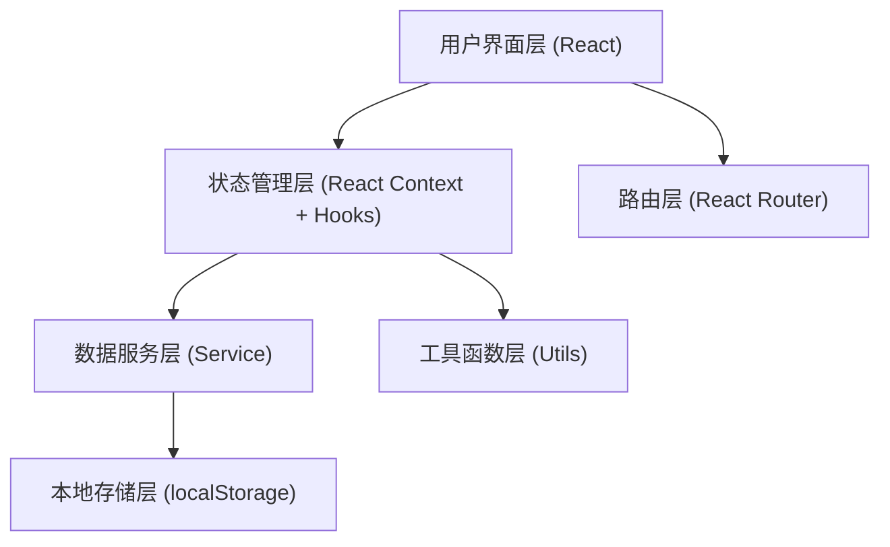
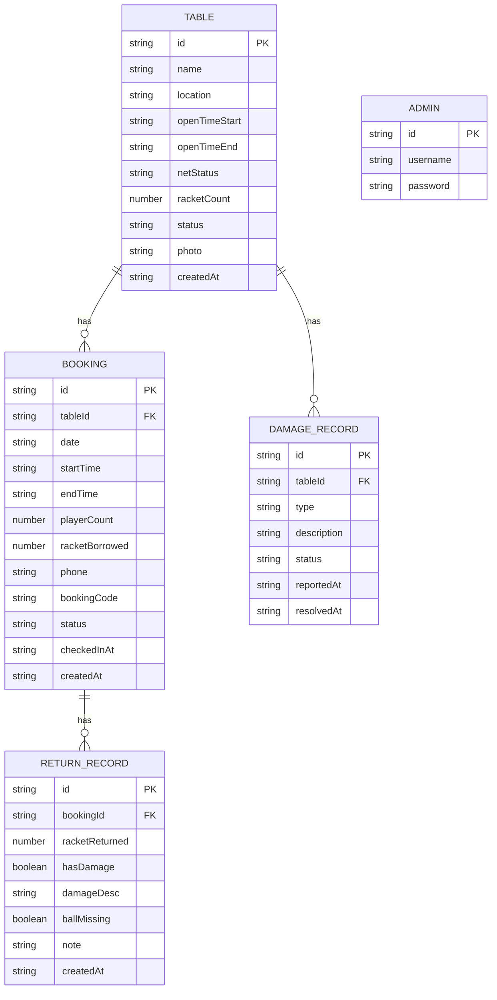

## 1. 架构设计

本系统采用纯前端架构，使用 React + localStorage 实现数据持久化，无需后端服务即可运行。



## 2. 技术描述

- **前端框架**: React@18 + TypeScript
- **构建工具**: Vite@5
- **样式方案**: TailwindCSS@3
- **路由管理**: React Router DOM@6
- **图表库**: Recharts
- **状态管理**: React Context + useReducer
- **数据持久化**: localStorage
- **UI 组件**: 自定义组件 + Headless UI
- **日期处理**: date-fns
- **图标**: Lucide React

## 3. 路由定义

| 路由 | 页面 | 说明 |
|------|------|------|
| `/` | 首页 | 球桌展示、今日排期、快捷入口 |
| `/booking` | 预约页面 | 球桌选择、时段选择、预约表单 |
| `/my-bookings` | 我的预约 | 预约记录列表 |
| `/checkin/:bookingId` | 签到页面 | 签到确认、计时 |
| `/return/:bookingId` | 归还页面 | 器材归还、损坏登记 |
| `/admin` | 管理后台登录 | 管理员登录 |
| `/admin/dashboard` | 管理仪表盘 | 今日排期、数据统计 |
| `/admin/no-shows` | 爽约名单 | 爽约用户列表 |
| `/admin/damages` | 器材损坏 | 损坏记录管理 |
| `/admin/tables` | 球桌管理 | 球桌档案、维护管理 |

## 4. 数据模型

### 4.1 数据模型定义



### 4.2 数据类型定义

```typescript
// 球桌状态
type TableStatus = 'available' | 'in-use' | 'maintenance' | 'disabled';
type NetStatus = 'good' | 'damaged' | 'missing';

// 预约状态
type BookingStatus = 'pending' | 'checked-in' | 'completed' | 'cancelled' | 'no-show';

// 球桌
interface Table {
  id: string;
  name: string;
  location: string;
  openTimeStart: string; // '08:00'
  openTimeEnd: string;   // '22:00'
  netStatus: NetStatus;
  racketCount: number;
  status: TableStatus;
  photo: string;
  createdAt: string;
}

// 预约
interface Booking {
  id: string;
  tableId: string;
  date: string;          // 'YYYY-MM-DD'
  startTime: string;     // '09:00'
  endTime: string;       // '10:30'
  playerCount: number;
  racketBorrowed: number;
  phone: string;
  bookingCode: string;   // 6位数字
  status: BookingStatus;
  checkedInAt?: string;
  createdAt: string;
}

// 归还记录
interface ReturnRecord {
  id: string;
  bookingId: string;
  racketReturned: number;
  hasDamage: boolean;
  damageDesc: string;
  ballMissing: boolean;
  note: string;
  createdAt: string;
}

// 损坏记录
interface DamageRecord {
  id: string;
  tableId: string;
  type: 'racket' | 'net' | 'table' | 'ball';
  description: string;
  status: 'pending' | 'resolved';
  reportedAt: string;
  resolvedAt?: string;
}

// 管理员
interface Admin {
  id: string;
  username: string;
  password: string;
}
```

### 4.3 初始数据

```typescript
// 初始球桌数据
const initialTables: Table[] = [
  {
    id: 'table-1',
    name: '1号球桌',
    location: '活动室东侧',
    openTimeStart: '08:00',
    openTimeEnd: '22:00',
    netStatus: 'good',
    racketCount: 8,
    status: 'available',
    photo: 'https://trae-api-cn.mchost.guru/api/ide/v1/text_to_image?prompt=ping%20pong%20table%20in%20community%20activity%20room%20bright%20clean&image_size=square_hd',
    createdAt: new Date().toISOString(),
  },
  {
    id: 'table-2',
    name: '2号球桌',
    location: '活动室西侧',
    openTimeStart: '08:00',
    openTimeEnd: '22:00',
    netStatus: 'good',
    racketCount: 6,
    status: 'available',
    photo: 'https://trae-api-cn.mchost.guru/api/ide/v1/text_to_image?prompt=ping%20pong%20table%20blue%20surface%20with%20net%20indoor%20sports&image_size=square_hd',
    createdAt: new Date().toISOString(),
  },
];

// 初始管理员
const initialAdmin: Admin = {
  id: 'admin-1',
  username: 'admin',
  password: 'admin123',
};
```

### 4.4 工具函数

```typescript
// 时间槽生成
function generateTimeSlots(start: string, end: string, intervalMinutes: number = 30): string[];

// 预约时长校验
function validateBookingDuration(
  phone: string,
  date: string,
  startTime: string,
  endTime: string
): { valid: boolean; message?: string };

// 检查时段冲突
function checkTimeConflict(
  tableId: string,
  date: string,
  startTime: string,
  endTime: string,
  excludeBookingId?: string
): boolean;

// 生成预约码
function generateBookingCode(): string;

// 计算分钟差
function calculateMinutesDiff(time1: string, time2: string): number;

// 热门时段统计
function getHotSlots(dateFrom: string, dateTo: string): { slot: string; count: number }[];
```

## 5. 目录结构

```
src/
├── types/              # 类型定义
│   └── index.ts
├── context/            # 状态管理
│   ├── AppContext.tsx
│   └── AuthContext.tsx
├── data/               # 初始数据
│   └── mockData.ts
├── services/           # 数据服务
│   ├── tableService.ts
│   ├── bookingService.ts
│   ├── returnService.ts
│   └── adminService.ts
├── utils/              # 工具函数
│   ├── timeUtils.ts
│   ├── bookingUtils.ts
│   └── storage.ts
├── components/         # 组件
│   ├── layout/         # 布局组件
│   ├── common/         # 通用组件
│   ├── booking/        # 预约相关组件
│   ├── admin/          # 管理后台组件
│   └── charts/         # 图表组件
├── pages/              # 页面
│   ├── Home.tsx
│   ├── Booking.tsx
│   ├── MyBookings.tsx
│   ├── CheckIn.tsx
│   ├── Return.tsx
│   ├── AdminLogin.tsx
│   └── admin/          # 管理后台页面
├── hooks/              # 自定义 Hooks
│   ├── useBooking.ts
│   ├── useTimer.ts
│   └── useLocalStorage.ts
├── App.tsx
├── main.tsx
└── index.css
```
