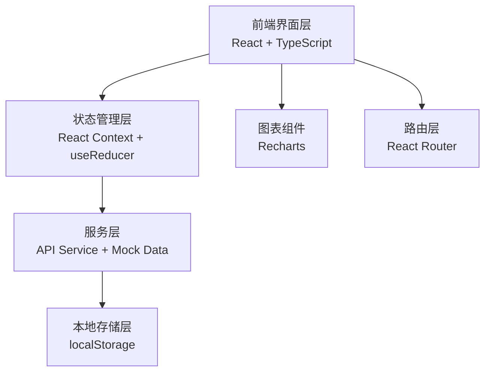
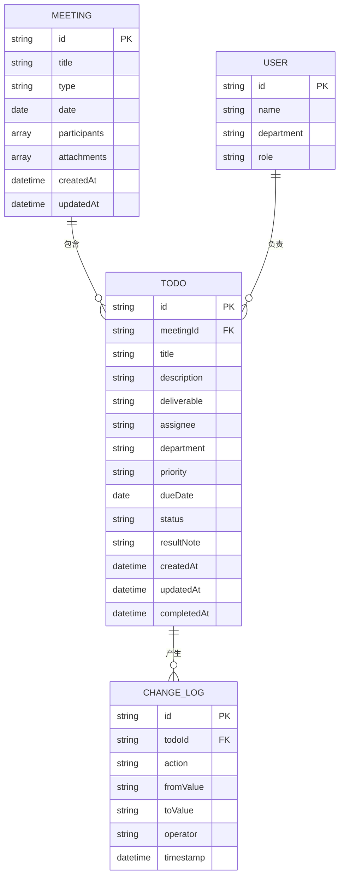

## 1. 架构设计



## 2. 技术说明

- **前端框架**: React@18 + TypeScript
- **构建工具**: Vite@5
- **样式方案**: TailwindCSS@3 + PostCSS
- **路由管理**: React Router DOM@6
- **图表库**: Recharts@2
- **图标库**: Lucide React
- **状态管理**: React Context + useReducer（轻量级全局状态）
- **数据持久化**: localStorage（前端 Mock 数据本地存储）
- **后端**: 无（纯前端应用，使用 Mock 数据）

## 3. 路由定义

| 路由 | 页面 | 用途 |
|------|------|------|
| `/` | 待办列表首页 | 按逾期/今天/本周分组展示所有待办 |
| `/meetings` | 会议管理页 | 会议记录列表、新增、编辑 |
| `/meetings/:id` | 会议详情页 | 查看单个会议详情及关联待办 |
| `/todos/:id` | 待办详情页 | 待办完整信息、变更历史、完成操作 |
| `/dashboard` | 数据看板 | 部门延期、会议类型、完成率统计 |

## 4. 数据模型

### 4.1 数据模型关系图



### 4.2 类型定义

```typescript
// 会议类型
type MeetingType = 'weekly' | 'monthly' | 'project' | 'review' | 'emergency' | 'other';

// 优先级
type Priority = 'critical' | 'high' | 'medium' | 'low';

// 待办状态
type TodoStatus = 'pending' | 'in_progress' | 'completed' | 'overdue';

// 用户角色
type UserRole = 'user' | 'admin';

// 会议记录
interface Meeting {
  id: string;
  title: string;
  type: MeetingType;
  date: string;
  participants: string[];
  attachments: { name: string; url: string; type: string }[];
  createdAt: string;
  updatedAt: string;
}

// 待办事项
interface Todo {
  id: string;
  meetingId: string;
  title: string;
  relatedTopic: string;
  deliverable: string;
  assignee: string;
  department: string;
  priority: Priority;
  dueDate: string;
  status: TodoStatus;
  resultNote?: string;
  createdAt: string;
  updatedAt: string;
  completedAt?: string;
}

// 变更日志
interface ChangeLog {
  id: string;
  todoId: string;
  action: 'create' | 'update_status' | 'update_priority' | 'update_due_date' | 'update_assignee' | 'complete';
  fromValue?: string;
  toValue?: string;
  operator: string;
  timestamp: string;
}

// 用户
interface User {
  id: string;
  name: string;
  department: string;
  role: UserRole;
}
```

## 5. 目录结构

```
src/
├── components/          # 可复用组件
│   ├── layout/         # 布局组件（导航、侧边栏等）
│   ├── todo/           # 待办相关组件（卡片、分组、表单）
│   ├── meeting/        # 会议相关组件
│   ├── dashboard/      # 看板统计组件
│   └── common/         # 通用组件（按钮、模态框、标签等）
├── pages/              # 页面级组件
│   ├── TodoList.tsx
│   ├── Meetings.tsx
│   ├── MeetingDetail.tsx
│   ├── TodoDetail.tsx
│   └── Dashboard.tsx
├── context/            # 全局状态
│   ├── TodoContext.tsx
│   └── MeetingContext.tsx
├── types/              # TypeScript 类型定义
│   └── index.ts
├── data/               # Mock 数据
│   └── mockData.ts
├── utils/              # 工具函数
│   ├── dateUtils.ts
│   └── statusUtils.ts
├── hooks/              # 自定义 Hooks
│   └── useGroupedTodos.ts
├── App.tsx
├── main.tsx
└── index.css
```

## 6. 核心业务逻辑说明

1. **待办分组逻辑**：
   - 逾期：dueDate < 今天 且 status !== 'completed'
   - 今天到期：dueDate === 今天 且 status !== 'completed'
   - 本周到期：今天 < dueDate <= 本周周日 且 status !== 'completed'

2. **状态自动更新**：
   - 每次打开应用时检查所有未完成待办的截止日期
   - 超过截止日期自动标记为 'overdue'

3. **完成操作校验**：
   - 标记完成时必须填写 resultNote（结果说明），不能为空

4. **变更记录**：
   - 每次待办状态、负责人、截止日期、优先级变更时生成 ChangeLog
   - 变更记录包含操作人、操作前后值、时间戳
