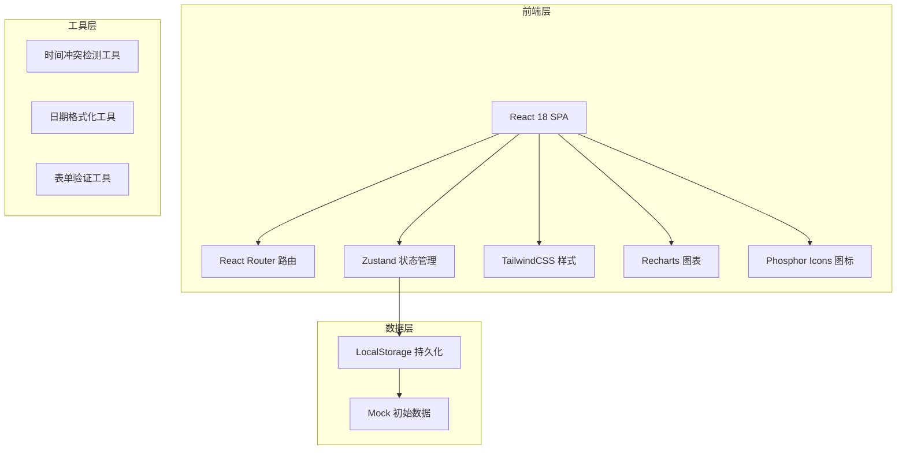
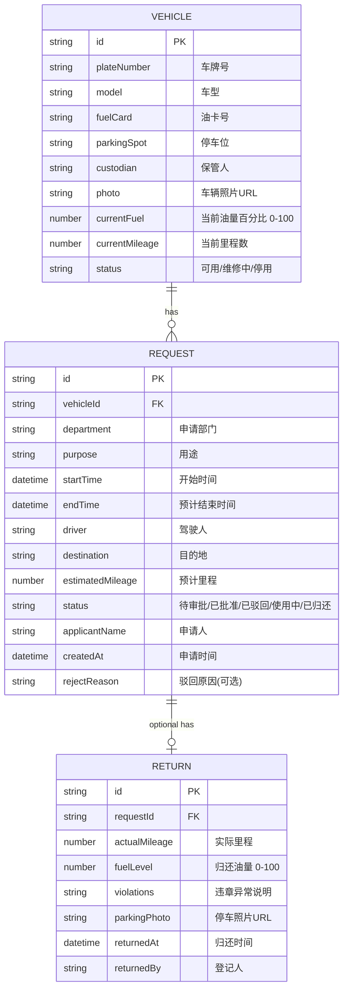

## 1. 架构设计



## 2. 技术描述

- **前端框架**：React@18 + TypeScript@5
- **构建工具**：Vite@5
- **样式方案**：TailwindCSS@3 + CSS 变量主题
- **路由管理**：React Router DOM@6
- **状态管理**：Zustand@4（轻量级，含持久化中间件）
- **图表库**：Recharts@2（柱状图、环形图）
- **图标库**：@phosphor-icons/react
- **数据存储**：浏览器 LocalStorage + Mock 初始数据（无需后端）
- **UI 组件**：自主开发轻量组件（Modal、Form、Table、Badge、Button）

## 3. 路由定义

| 路由路径 | 页面组件 | 用途 |
|----------|----------|------|
| `/` | Dashboard | 看板首页 - 今日用车、逾期预警、油量预警、统计图表 |
| `/vehicles` | VehicleList | 车辆档案 - 车辆卡片列表、新增/编辑弹窗 |
| `/requests` | RequestList | 用车申请 - 申请列表、提交申请表单、冲突检测 |
| `/returns` | ReturnList | 归还登记 - 待归还列表、归还登记表单 |

## 4. 数据模型

### 4.1 实体关系图



### 4.2 TypeScript 类型定义

```typescript
// 车辆状态
type VehicleStatus = 'available' | 'maintenance' | 'disabled'

// 申请状态
type RequestStatus = 'pending' | 'approved' | 'rejected' | 'in_use' | 'returned'

interface Vehicle {
  id: string
  plateNumber: string
  model: string
  fuelCard: string
  parkingSpot: string
  custodian: string
  photo: string
  currentFuel: number
  currentMileage: number
  status: VehicleStatus
  createdAt: string
}

interface Request {
  id: string
  vehicleId: string
  department: string
  purpose: string
  startTime: string
  endTime: string
  driver: string
  destination: string
  estimatedMileage: number
  status: RequestStatus
  applicantName: string
  createdAt: string
  rejectReason?: string
}

interface ReturnRecord {
  id: string
  requestId: string
  actualMileage: number
  fuelLevel: number
  violations: string
  parkingPhoto: string
  returnedAt: string
  returnedBy: string
}

// 时间冲突检测结果
interface ConflictResult {
  hasConflict: boolean
  conflictingRequests?: Request[]
}

// 统计数据
interface UsageStats {
  vehicleId: string
  plateNumber: string
  totalHours: number
  tripCount: number
}

interface DepartmentStats {
  department: string
  count: number
}
```

## 5. 核心工具函数

### 5.1 时间冲突检测

```typescript
function checkTimeConflict(
  vehicleId: string,
  startTime: Date,
  endTime: Date,
  excludeRequestId?: string
): ConflictResult
```

检测逻辑：筛选同一车辆的 `approved` 和 `in_use` 状态申请，排除当前编辑的申请，判断时间区间是否重叠。

### 5.2 逾期判定

```typescript
function isOverdue(request: Request): boolean
```

当前时间 > 预计结束时间 且 申请状态为 `in_use` → 判定逾期。

### 5.3 使用时长计算

```typescript
function calculateUsageDuration(startTime: string, endTime: string): number
```

返回小时数，用于统计图表。

