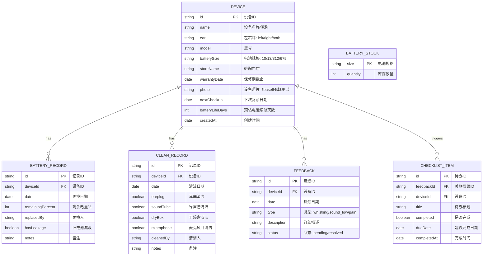

## 1. 架构设计

```mermaid
graph TD
    subgraph "前端应用层"
        A["React 应用入口"]
        B["路由管理 (react-router-dom)"]
        C["全局状态管理 (Context API)"]
        D["UI 组件层"]
        E["本地持久化 (localStorage)"]
    end
    
    subgraph "页面层"
        B --> P1["首页仪表盘 /"]
        B --> P2["设备管理 /devices"]
        B --> P3["记录管理 /records"]
        B --> P4["复查清单 /checklist"]
    end
    
    subgraph "数据层"
        E --> D1["设备数据 devices"]
        E --> D2["换电记录 batteryRecords"]
        E --> D3["清洁记录 cleanRecords"]
        E --> D4["异常反馈异常异常 feedbacks"]
        E --> D5["复查待办 checklists"]
        E --> D6["电池库存 batteryStock"]
    end
    
    subgraph "组件层"
        D --> C1["顶部导航 Navbar"]
        D --> C2["设备卡片 DeviceCard"]
        D --> C3["记录时间轴 Timeline"]
        D --> C4["统计卡片 StatCard"]
        D --> C5["表单弹窗 ModalForm"]
        D --> C6["待办清单 TodoList"]
    end
    
    C --> P1
    C --> P2
    C --> P3
    C --> P4
```



## 2. 技术描述

- **前端框架**: React@18 + TypeScript
- **构建工具**: Vite@5
- **样式方案**: TailwindCSS@3
- **路由管理**: react-router-dom@6
- **状态管理**: React Context API（轻量级全局状态）
- **数据持久化**: localStorage（本地存储，无需后端）
- **日期处理**: date-fns（日期计算与格式化）
- **图标**: lucide-react（图标库）+ emoji（直观标识）
- **初始化工具**: vite-init

## 3. 路由定义

| 路由 | 页面组件 | 用途 |
|------|----------|------|
| `/` | Dashboard | 首页仪表盘：换电提醒、库存、异常、复诊 |
| `/devices` | Devices | 设备管理：助听器设备列表、新增、编辑、删除 |
| `/devices/:id` | DeviceDetail | 单个设备详情及历史记录 |
| `/records` | Records | 记录管理：换电池和清洁记录时间轴 |
| `/checklist` | Checklist | 复查清单：异常反馈和待办检查项 |

## 4. 数据模型

### 4.1 数据模型定义（ER图）



### 4.2 TypeScript 类型定义

```typescript
// 设备
interface Device {
  id: string;
  name: string;
  ear: 'left' | 'right' | 'both';
  model: string;
  batterySize: '10' | '13' | '312' | '675';
  storeName: string;
  warrantyDate: string;
  photo?: string;
  nextCheckup?: string;
  batteryLifeDays: number;
  createdAt: string;
}

// 换电池记录
interface BatteryRecord {
  id: string;
  deviceId: string;
  date: string;
  remainingPercent: number;
  replacedBy: string;
  hasLeakage: boolean;
  notes?: string;
}

// 清洁记录
interface CleanRecord {
  id: string;
  deviceId: string;
  date: string;
  earplug: boolean;
  soundTube: boolean;
  dryBox: boolean;
  microphone: boolean;
  cleanedBy: string;
  notes?: string;
}

// 异常反馈
interface Feedback {
  id: string;
  deviceId: string;
  date: string;
  type: 'whistling' | 'sound_low' | 'pain';
  description: string;
  status: 'pending' | 'resolved';
}

// 复查待办项
interface ChecklistItem {
  id: string;
  feedbackId: string;
  deviceId: string;
  title: string;
  completed: boolean;
  dueDate: string;
  completedAt?: string;
}

// 电池库存
interface BatteryStock {
  size: string;
  quantity: number;
}
```

### 4.3 初始 Mock 数据

```typescript
const initialDevices: Device[] = [
  {
    id: 'dev-001',
    name: '爷爷左耳助听器',
    ear: 'left',
    model: 'Phonak Audeo M30',
    batterySize: '312',
    storeName: '悦耳听力验配中心（人民广场店）',
    warrantyDate: '2026-12-31',
    nextCheckup: '2026-07-15',
    batteryLifeDays: 7,
    createdAt: '2025-06-01'
  },
  {
    id: 'dev-002',
    name: '爷爷右耳助听器',
    ear: 'right',
    model: 'Phonak Audeo M30',
    batterySize: '312',
    storeName: '悦耳听力验配中心（人民广场店）',
    warrantyDate: '2026-12-31',
    nextCheckup: '2026-07-15',
    batteryLifeDays: 7,
    createdAt: '2025-06-01'
  }
];

const initialStock: BatteryStock[] = [
  { size: '10', quantity: 12 },
  { size: '13', quantity: 8 },
  { size: '312', quantity: 3 },
  { size: '675', quantity: 6 }
];
```

