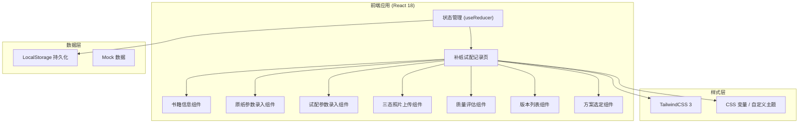
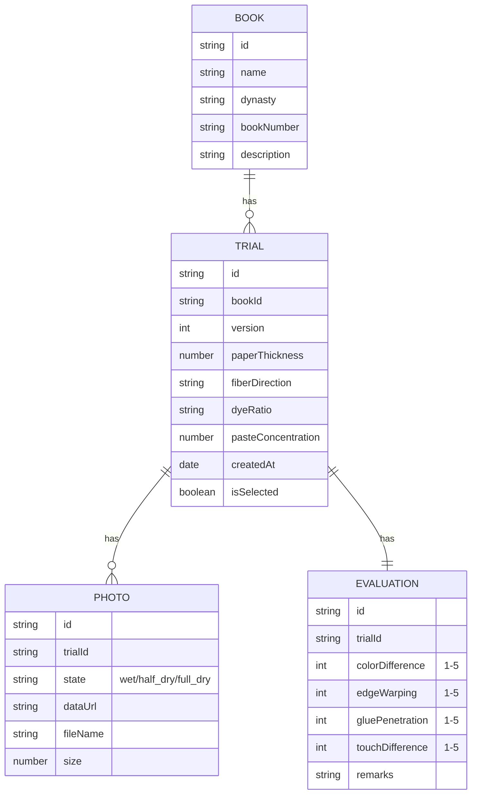

## 1. 架构设计



## 2. 技术描述

- **前端框架**: React@18 + TypeScript@5 + Vite@5
- **样式方案**: TailwindCSS@3 + PostCSS，配合CSS自定义属性实现主题系统
- **状态管理**: React useReducer + useContext，实现组件间状态共享
- **数据持久化**: LocalStorage 存储试配记录，无需后端服务
- **图标库**: Lucide React，轻量图标组件
- **图片处理**: 原生 FileReader API 实现图片预览，使用 Canvas 生成缩略图
- **初始化工具**: Vite 官方模板 `npm create vite@latest -- --template react-ts`

## 3. 路由定义

| 路由 | 页面组件 | 用途 |
|------|----------|------|
| `/` | `PaperMatchingPage` | 补纸试配记录主页面 |

## 4. 数据模型

### 4.1 数据结构定义



### 4.2 TypeScript 类型定义

```typescript
// 书籍信息
interface Book {
  id: string;
  name: string;
  dynasty: string;
  bookNumber: string;
  description?: string;
}

// 照片状态类型
type PhotoState = 'wet' | 'half_dry' | 'full_dry';

// 照片数据
interface Photo {
  id: string;
  trialId: string;
  state: PhotoState;
  dataUrl: string;
  fileName: string;
  size: number;
}

// 评估数据
interface Evaluation {
  id: string;
  trialId: string;
  colorDifference: number; // 1-5, 1最好
  edgeWarping: number;      // 1-5, 1最好
  gluePenetration: number;  // 1-5, 1最好
  touchDifference: number;  // 1-5, 1最好
  remarks?: string;
}

// 试配记录
interface Trial {
  id: string;
  bookId: string;
  version: number;
  paperThickness: number;
  fiberDirection: 'vertical' | 'horizontal' | 'diagonal';
  dyeRatio: string;
  pasteConcentration: number; // 0-100
  photos: Photo[];
  evaluation: Evaluation;
  createdAt: string;
  isSelected: boolean;
}

// 应用状态
interface AppState {
  currentBook: Book;
  trials: Trial[];
  currentTrialId: string | null;
}
```

## 5. 组件划分

| 组件名称 | 路径 | 职责 |
|----------|------|------|
| `PaperMatchingPage` | `src/pages/PaperMatchingPage.tsx` | 主页面容器，整合所有子组件 |
| `BookInfo` | `src/components/BookInfo.tsx` | 书籍信息展示与编辑 |
| `PaperParamsForm` | `src/components/PaperParamsForm.tsx` | 原纸参数录入表单 |
| `TrialParamsForm` | `src/components/TrialParamsForm.tsx` | 试配参数录入表单 |
| `PhotoUploader` | `src/components/PhotoUploader.tsx` | 三态照片上传组件 |
| `PhotoCompare` | `src/components/PhotoCompare.tsx` | 三态照片对比展示 |
| `EvaluationPanel` | `src/components/EvaluationPanel.tsx` | 质量评估面板 |
| `TrialVersionList` | `src/components/TrialVersionList.tsx` | 试配版本列表 |
| `SchemeSelector` | `src/components/SchemeSelector.tsx` | 方案选定操作区 |

## 6. 核心功能实现要点

1. **照片上传与预览**：使用 `FileReader` 读取本地图片，生成 dataURL 用于预览，压缩后存入 localStorage
2. **评分组件**：自定义星级评分组件，支持键盘操作，带无障碍属性
3. **版本对比**：点击版本卡片时，主区域联动显示该版本的所有数据
4. **方案选定**：设置 `isSelected` 标记，确保只有一个版本被选定
5. **数据持久化**：使用 `localStorage` 的 JSON 序列化存储，页面加载时自动恢复
