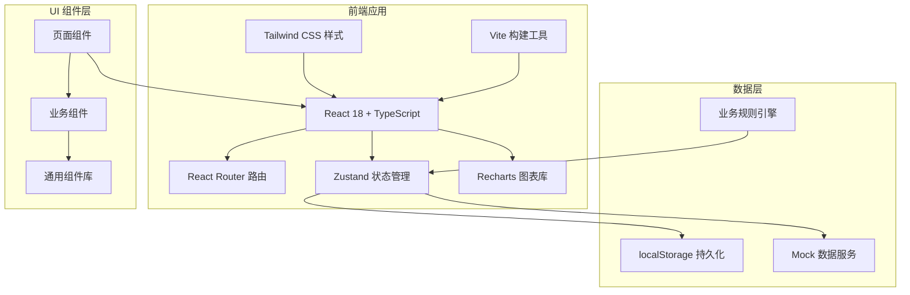
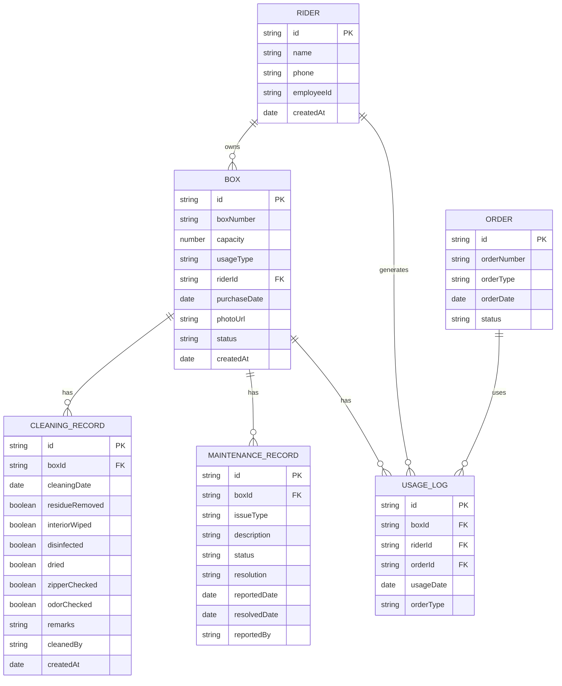

## 1. 架构设计



## 2. 技术描述
- 前端：React@18 + TypeScript@5 + Tailwind CSS@3 + Vite@5
- 路由：React Router@6
- 状态管理：Zustand@4
- 图表：Recharts@2
- 图标：Lucide React
- 数据持久化：localStorage
- Mock 数据：内置模拟数据，无后端依赖
- 日期处理：date-fns

## 3. 路由定义
| 路由 | 页面 | 用途 |
|------|------|------|
| / | Dashboard | 数据概览仪表盘 |
| /boxes | BoxList | 箱子档案列表 |
| /boxes/:id | BoxDetail | 箱子档案详情 |
| /boxes/new | BoxForm | 新增箱子档案 |
| /cleaning | CleaningList | 清洁记录列表 |
| /cleaning/:boxId | CleaningForm | 清洁登记 |
| /maintenance | MaintenanceList | 维修报废列表 |
| /maintenance/new | MaintenanceForm | 新增异常记录 |
| /statistics | Statistics | 统计分析 |
| /orders | OrderAssignment | 订单分配校验 |

## 4. 数据模型

### 4.1 数据模型定义



### 4.2 TypeScript 类型定义

```typescript
// 保温箱状态
type BoxStatus = 'active' | 'maintenance' | 'scrapped' | 'pending_cleaning';

// 用途类型
type UsageType = 'hot_food' | 'cold_drink' | 'mixed';

// 异常类型
type IssueType = 'damage' | 'odor' | 'insulation' | 'leakage';

// 维修状态
type MaintenanceStatus = 'pending' | 'in_progress' | 'repaired' | 'scrapped';

// 订单类型
type OrderType = 'hot_food' | 'cold_drink' | 'other';

interface Box {
  id: string;
  boxNumber: string;
  capacity: number;
  usageType: UsageType;
  riderId: string;
  purchaseDate: string;
  photoUrl: string;
  status: BoxStatus;
  createdAt: string;
}

interface CleaningRecord {
  id: string;
  boxId: string;
  cleaningDate: string;
  residueRemoved: boolean;
  interiorWiped: boolean;
  disinfected: boolean;
  dried: boolean;
  zipperChecked: boolean;
  odorChecked: boolean;
  remarks: string;
  cleanedBy: string;
  createdAt: string;
}

interface MaintenanceRecord {
  id: string;
  boxId: string;
  issueType: IssueType;
  description: string;
  status: MaintenanceStatus;
  resolution: string;
  reportedDate: string;
  resolvedDate: string;
  reportedBy: string;
}

interface Rider {
  id: string;
  name: string;
  phone: string;
  employeeId: string;
  createdAt: string;
}

interface UsageLog {
  id: string;
  boxId: string;
  riderId: string;
  orderId: string;
  usageDate: string;
  orderType: OrderType;
}

interface Order {
  id: string;
  orderNumber: string;
  orderType: OrderType;
  orderDate: string;
  status: string;
}
```

## 5. 目录结构

```
src/
├── components/          # 通用组件
│   ├── Layout/          # 布局组件
│   ├── ui/              # 基础UI组件
│   └── charts/          # 图表组件
├── pages/               # 页面组件
│   ├── Dashboard.tsx
│   ├── BoxList.tsx
│   ├── BoxDetail.tsx
│   ├── BoxForm.tsx
│   ├── CleaningList.tsx
│   ├── CleaningForm.tsx
│   ├── MaintenanceList.tsx
│   ├── MaintenanceForm.tsx
│   ├── Statistics.tsx
│   └── OrderAssignment.tsx
├── store/               # 状态管理
│   ├── useBoxStore.ts
│   ├── useCleaningStore.ts
│   ├── useMaintenanceStore.ts
│   └── useRiderStore.ts
├── types/               # 类型定义
│   └── index.ts
├── utils/               # 工具函数
│   ├── businessRules.ts
│   ├── storage.ts
│   └── helpers.ts
├── data/                # Mock数据
│   └── mockData.ts
├── App.tsx
├── main.tsx
└── index.css
```

## 6. 核心业务规则实现

```typescript
// 业务规则引擎 - 检查箱子是否可分配热食订单
function canAssignHotFood(boxId: string, date: string): {
  allowed: boolean;
  reason: string;
} {
  // 1. 检查今日清洁记录是否完成
  const cleaningRecord = getTodayCleaningRecord(boxId, date);
  if (!cleaningRecord || !isFullyCleaned(cleaningRecord)) {
    return { allowed: false, reason: '未完成今日清洁，禁止分配热食订单' };
  }
  
  // 2. 检查是否存在未解决的异常
  const openMaintenance = getOpenMaintenanceRecord(boxId);
  if (openMaintenance) {
    return { allowed: false, reason: `存在未解决异常: ${openMaintenance.issueType}` };
  }
  
  // 3. 检查是否为报废状态
  const box = getBoxById(boxId);
  if (box?.status === 'scrapped') {
    return { allowed: false, reason: '箱子已报废' };
  }
  
  return { allowed: true, reason: '' };
}

// 检查是否超过使用周期180天需要更换
function needsReplacement(box: Box): boolean {
  const purchaseDate = new Date(box.purchaseDate);
  const today = new Date();
  const daysUsed = Math.floor((today.getTime() - purchaseDate.getTime()) / (1000 * 60 * 60 * 24));
  return daysUsed > 180;
}

// 检查累计维修次数是否超过3次
function hasTooManyRepairs(boxId: string): boolean {
  const maintenanceRecords = getMaintenanceRecordsByBoxId(boxId);
  const repairedCount = maintenanceRecords.filter(
    r => r.status === 'repaired'
  ).length;
  return repairedCount >= 3;
}
```
