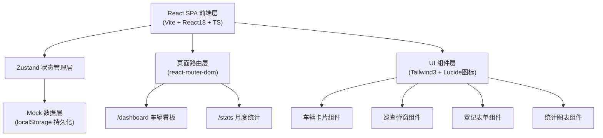
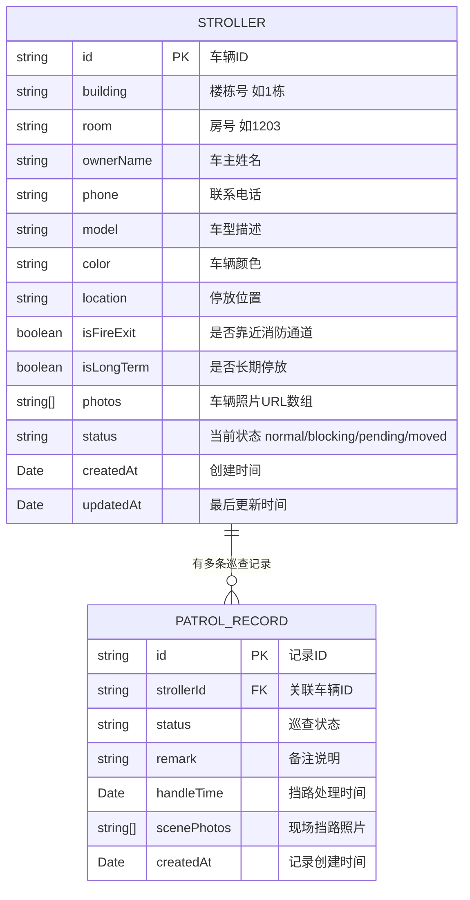

## 1. 架构设计



## 2. 技术描述

- **前端框架**：React@18 + TypeScript@5 + Vite@5
- **样式方案**：Tailwind CSS@3.4（原子化样式）
- **状态管理**：Zustand@4（轻量全局状态，内置 localStorage 中间件持久化）
- **路由方案**：react-router-dom@6（HashRouter，便于静态部署）
- **图标库**：lucide-react@latest（线性图标，按需引入）
- **初始化模板**：react-ts（react-express-ts 默认，可根据需要调整）
- **数据持久化**：浏览器 localStorage（纯前端 Demo，无需后端）
- **模拟数据**：内置 15+ 条婴儿车示例数据，覆盖各楼栋、各状态

## 3. 路由定义

| 路由 | 页面组件 | 说明 |
|------|----------|------|
| / 或 /dashboard | DashboardPage | 车辆看板主页（默认页） |
| /stats | StatsPage | 月度统计页面 |
| /car/:id | CarDetailPage | 单辆婴儿车详情与巡查记录 |

## 4. 数据模型与类型定义

### 4.1 ER 模型



### 4.2 TypeScript 类型定义

```typescript
export type StrollerStatus = 'normal' | 'blocking' | 'pending' | 'moved';

export interface Stroller {
  id: string;
  building: string;
  room: string;
  ownerName: string;
  phone: string;
  model: string;
  color: string;
  location: string;
  isFireExit: boolean;
  isLongTerm: boolean;
  photos: string[];
  status: StrollerStatus;
  createdAt: string;
  updatedAt: string;
}

export interface PatrolRecord {
  id: string;
  strollerId: string;
  status: StrollerStatus;
  remark: string;
  handleTime?: string;
  scenePhotos: string[];
  createdAt: string;
}

export interface LocationStats {
  location: string;
  blockingCount: number;
}
```

### 4.3 常量配置

```typescript
export const BUILDINGS = ['1栋', '2栋', '3栋', '5栋', '6栋', '7栋'];

export const LOCATIONS = [
  '1号门左侧',
  '1号门右侧', 
  '2号门入口',
  '消防通道A区',
  '消防通道B区',
  '电梯间旁',
  '信报箱区',
  '沙发休息区',
  '大厅中央'
];

export const FIRE_EXIT_LOCATIONS = ['消防通道A区', '消防通道B区'];

export const STATUS_OPTIONS: { value: StrollerStatus; label: string; color: string }[] = [
  { value: 'normal', label: '正常', color: 'emerald' },
  { value: 'blocking', label: '挡路', color: 'red' },
  { value: 'pending', label: '待联系', color: 'amber' },
  { value: 'moved', label: '已挪走', color: 'blue' },
];

export const LONG_TERM_THRESHOLD_DAYS = 30;
```

## 5. 目录结构

```
src/
├── components/
│   ├── StrollerCard.tsx      # 婴儿车卡片组件
│   ├── PatrolModal.tsx       # 巡查标记弹窗
│   ├── StrollerForm.tsx      # 车辆登记/编辑表单
│   ├── StrollerDetail.tsx    # 车辆详情面板
│   ├── FilterBar.tsx         # 顶部筛选栏
│   ├── Timeline.tsx          # 巡查记录时间线
│   ├── StatsChart.tsx        # 占道统计柱状图
│   └── UnclaimedList.tsx     # 长期未认领列表
├── pages/
│   ├── DashboardPage.tsx     # 看板页
│   ├── StatsPage.tsx         # 统计页
│   └── CarDetailPage.tsx     # 详情页
├── store/
│   └── useStrollerStore.ts   # Zustand 全局状态
├── types/
│   └── index.ts              # 类型定义
├── data/
│   └── mockData.ts           # 模拟初始数据
├── utils/
│   ├── helpers.ts            # 工具函数
│   └── constants.ts          # 常量配置
├── App.tsx                   # 路由根组件
├── main.tsx                  # 入口文件
└── index.css                 # Tailwind 入口 + 全局样式
```

## 6. 关键实现说明

### 6.1 Zustand Store 设计

- `strollers: Stroller[]` 车辆列表
- `patrolRecords: PatrolRecord[]` 巡查记录列表
- `filters: { building, location, status }` 当前筛选条件
- Actions:
  - `addStroller(data)` 新增车辆
  - `updateStroller(id, data)` 更新车辆
  - `deleteStroller(id)` 删除车辆
  - `addPatrolRecord(record)` 添加巡查记录（挡路时强制 scenePhotos + handleTime）
  - `setFilters(filters)` 更新筛选条件
  - `getTopBlockingLocations()` 计算占道次数排行
  - `getLongUnclaimedCars()` 获取超过30天未更新的车辆

### 6.2 消防通道优先排序逻辑

```
排序权重 = (isFireExit ? 1000 : 0) + (status === 'blocking' ? 500 : 0) - updatedAt时间戳
按权重从高到低排列，保证消防通道+挡路车辆永远在最前
```

### 6.3 挡路记录强校验

巡查弹窗选择「挡路」状态时：
- 照片上传区域强制展开，无照片时提交按钮禁用
- 处理时间选择器自动填充当前时间，允许修改但不能为空
- 提交前校验：`scenePhotos.length > 0 && handleTime 存在`

### 6.4 统计数据计算

- 占道次数排行：遍历 `patrolRecords` 过滤 `status==='blocking'`，按 `stroller.location` 聚合计数，降序取 Top10
- 长期未认领：`Date.now() - updatedAt > 30 * 24 * 3600 * 1000` 且 `status !== 'moved'`
