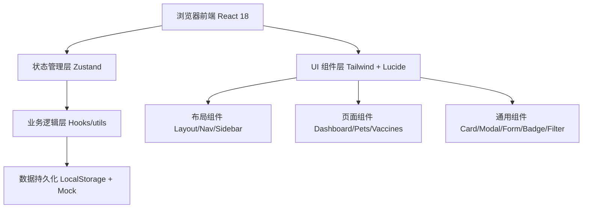
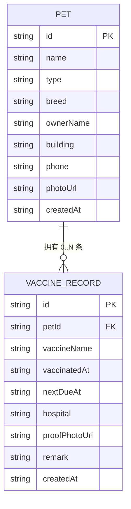

## 1. 架构设计



纯前端单页应用（SPA），无后端服务，数据通过 LocalStorage 持久化 + 预置 Mock 数据演示，便于快速部署和离线使用。

## 2. 技术描述

- **前端**：React@18 + TypeScript@5 + Vite@5
- **样式**：Tailwind CSS@3（原子化 + 自定义主题色变量）
- **状态管理**：Zustand（轻量，含 persist 中间件持久化）
- **路由**：React Router DOM@6（3 个路由：/dashboard、/pets、/vaccines）
- **图标**：Lucide React
- **日期处理**：原生 Date API + dayjs 轻量库（可选，按需引入）
- **构建**：Vite + ESLint + Prettier
- **后端**：无
- **数据库**：LocalStorage（浏览器本地）+ 预置 JSON Mock 数据

## 3. 路由定义

| 路由路径 | 页面组件 | 用途 |
|----------|----------|------|
| /dashboard 或 / | DashboardPage | 首页看板：统计、提醒、筛选、未补名单 |
| /pets | PetsPage | 宠物档案列表 + 新增/编辑弹窗 |
| /pets/:id | PetDetailPage | 单个宠物详情 + 疫苗记录时间线 |
| /vaccines | VaccinesPage | 全部疫苗记录列表 + 新增/编辑弹窗 |

## 4. API 定义（无后端，仅前端数据层接口）

```typescript
// shared/types/index.ts

export type PetType = 'dog' | 'cat' | 'other';
export type ComplianceStatus = 'compliant' | 'expiring' | 'expired' | 'unvaccinated';

export interface Pet {
  id: string;
  name: string;
  type: PetType;
  breed: string;
  ownerName: string;
  building: string;      // 楼栋号 e.g. "3栋"
  phone: string;
  photoUrl?: string;     // base64 或图片 URL
  createdAt: string;
}

export interface VaccineRecord {
  id: string;
  petId: string;
  vaccineName: string;   // 疫苗名称 e.g. "狂犬疫苗"
  vaccinatedAt: string;  // 接种日期 YYYY-MM-DD
  nextDueAt: string;     // 下次到期 YYYY-MM-DD
  hospital: string;      // 接种医院
  proofPhotoUrl?: string;// 证明照片 base64 / URL
  remark?: string;       // 备注
  createdAt: string;
}

export interface PetWithStatus extends Pet {
  status: ComplianceStatus;
  latestRecord?: VaccineRecord;
  daysUntilDue?: number; // 正数=距到期，负数=已过期天数
  hasProofPhoto: boolean;
}

// 计算合规状态的函数签名
export function computePetStatus(
  pet: Pet,
  records: VaccineRecord[],
  today?: Date
): PetWithStatus;
```

## 5. 数据模型

### 5.1 ER 关系图



### 5.2 Mock 初始数据（预置演示用）

```typescript
// src/data/mockData.ts
// 预置 10 只宠物（覆盖狗/猫）、20+ 条疫苗记录（含合规/临期/过期/未接种 4 种情况）、
// 覆盖 6 个楼栋（1栋~6栋），其中 2~3 条记录缺少证明照片用于演示未补名单。
```

## 6. 目录结构（开发时产出）

```
trae0601-2/
├── shared/
│   └── types/
│       └── index.ts              # 全局类型定义
├── src/
│   ├── main.tsx                  # 入口
│   ├── App.tsx                   # 路由配置
│   ├── index.css                 # Tailwind + 全局样式
│   ├── store/
│   │   └── usePetStore.ts        # Zustand Store（持久化）
│   ├── utils/
│   │   ├── status.ts             # 合规状态计算
│   │   └── date.ts               # 日期辅助函数
│   ├── data/
│   │   └── mockData.ts           # 预置演示数据
│   ├── components/
│   │   ├── layout/
│   │   │   ├── MainLayout.tsx    # 顶栏 + 内容区布局
│   │   │   └── Sidebar.tsx       # 侧边导航
│   │   ├── common/
│   │   │   ├── StatCard.tsx      # 统计卡片
│   │   │   ├── StatusBadge.tsx   # 状态徽标
│   │   │   ├── PetCard.tsx       # 宠物卡片
│   │   │   ├── VaccineItem.tsx   # 疫苗记录条目
│   │   │   ├── FilterBar.tsx     # 筛选工具栏
│   │   │   ├── Modal.tsx         # 通用弹窗
│   │   │   └── PhotoUpload.tsx   # 照片上传控件
│   │   └── forms/
│   │       ├── PetForm.tsx       # 宠物新增/编辑表单
│   │       └── VaccineForm.tsx   # 疫苗新增/编辑表单
│   └── pages/
│       ├── DashboardPage.tsx     # 首页看板
│       ├── PetsPage.tsx          # 宠物档案列表
│       ├── PetDetailPage.tsx     # 宠物详情 + 疫苗时间线
│       └── VaccinesPage.tsx      # 全部疫苗记录
├── index.html
├── vite.config.ts
├── tailwind.config.js
├── tsconfig.json
└── package.json
```

## 7. 关键实现约定

1. **状态判定规则（硬编码为业务规则）**：
   - 若某宠物 `vaccineRecords.length === 0` → `unvaccinated`（未接种，非合规）
   - 取最近一次 `nextDueAt` 与今日比较：
     - `nextDueAt < today` → `expired`（已过期，红色 + 呼吸动效）
     - `nextDueAt - today ≤ 30 天` → `expiring`（临期，橙色）
     - 否则 → `compliant`（已合规，绿色）
   - `hasProofPhoto` 独立字段，用于「未补证明名单」筛选

2. **照片处理**：使用 `<input type="file">` + FileReader 转 Base64 存入 LocalStorage；演示数据使用 placeholder 图（`trae-api-cn.mchost.guru` 接口生成）。

3. **数据持久化**：Zustand `persist` 中间件，key = `pet-immune-system-v1`，首次访问无数据时自动注入 mockData。

4. **本月到期统计**：筛选 `nextDueAt` 落在当前自然月内的所有记录，按去重宠物数统计。
