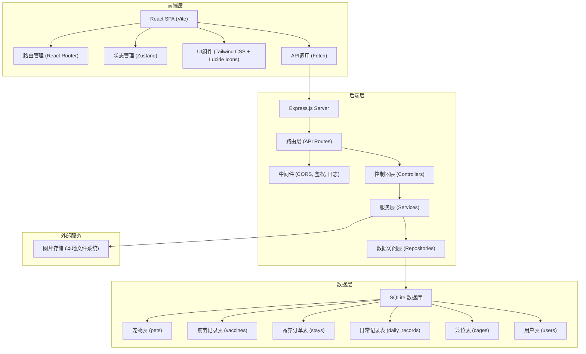
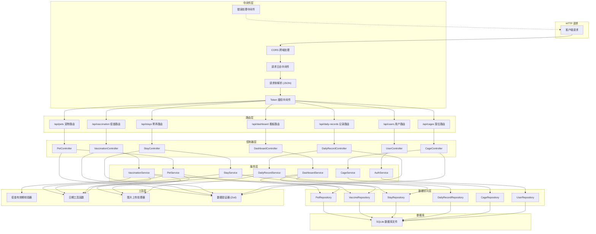
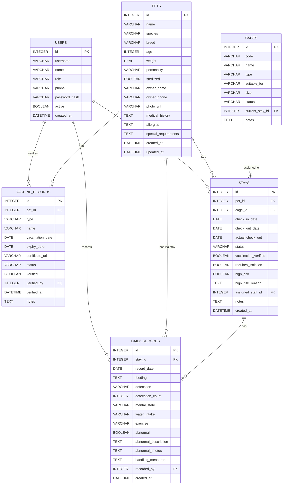

## 1. 架构设计

本系统采用前后端分离架构，前端使用React + TypeScript构建单页应用，后端使用Express + TypeScript提供RESTful API服务，数据持久化使用SQLite轻量级数据库，适合中小型寄养机构单机部署。



## 2. 技术描述

- **前端框架**：React@18 + TypeScript@5
- **构建工具**：Vite@5
- **路由管理**：react-router-dom@6
- **状态管理**：zustand@4
- **UI框架**：tailwindcss@3
- **图标库**：lucide-react@0.344
- **后端框架**：Express@4 + TypeScript@5
- **数据库**：SQLite3 + better-sqlite3
- **ORM层**：无原生ORM，使用参数化SQL查询
- **数据验证**：zod@3
- **初始化方式**：使用 `react-express-ts` 模板初始化项目

## 3. 路由定义

| 路由路径 | 页面名称 | 权限 | 说明 |
|----------|----------|------|------|
| / | 数据看板 | 全部 | 首页，展示统计数据和预警信息 |
| /pets | 宠物档案列表 | 管理员/前台 | 展示所有宠物档案，支持搜索筛选 |
| /pets/new | 新建宠物档案 | 管理员/前台 | 创建新的宠物档案 |
| /pets/:id | 宠物档案详情 | 全部 | 查看宠物详细信息、疫苗记录、病史、寄养历史 |
| /pets/:id/edit | 编辑宠物档案 | 管理员/前台 | 修改宠物基础信息 |
| /vaccination | 疫苗核验列表 | 管理员/前台 | 待核验宠物列表，核验状态筛选 |
| /vaccination/:petId | 疫苗核验详情 | 管理员/前台 | 上传材料、自动核验、人工审核 |
| /stays | 寄养订单列表 | 全部 | 在住、待入住、已完成订单 |
| /stays/new | 办理入住 | 管理员/前台 | 选择宠物、核验、选择笼位、办理入住 |
| /stays/:id | 寄养订单详情 | 全部 | 查看寄养详情、日常记录 |
| /stays/:id/checkout | 办理退房 | 管理员/前台 | 核对记录、生成报告、退房 |
| /records | 日常记录 | 全部 | 当日待记录宠物列表，快速录入 |
| /records/:stayId | 记录详情 | 全部 | 查看和录入某寄养的日常记录 |
| /settings | 系统设置 | 管理员 | 笼位管理、疫苗配置、用户管理 |

## 4. API Definitions

### 4.1 TypeScript 类型定义

```typescript
// 共享类型定义
export interface Pet {
  id: number;
  name: string;
  species: 'dog' | 'cat' | 'other';
  breed: string;
  age: number;
  weight: number;
  personality: string;
  sterilized: boolean;
  ownerName: string;
  ownerPhone: string;
  photoUrl?: string;
  medicalHistory?: string;
  allergies?: string;
  specialRequirements?: string;
  createdAt: string;
  updatedAt: string;
}

export interface VaccineRecord {
  id: number;
  petId: number;
  type: 'rabies' | 'cat-triple' | 'dog-quad' | 'deworming' | 'other';
  name: string;
  vaccinationDate: string;
  expiryDate: string;
  certificateUrl?: string;
  status: 'valid' | 'expiring' | 'expired';
  verified: boolean;
  verifiedBy?: number;
  verifiedAt?: string;
  notes?: string;
}

export interface Stay {
  id: number;
  petId: number;
  cageId?: number;
  checkInDate: string;
  checkOutDate?: string;
  actualCheckOut?: string;
  status: 'pending' | 'confirmed' | 'checked-in' | 'checked-out' | 'cancelled';
  vaccinationVerified: boolean;
  requiresIsolation: boolean;
  highRisk: boolean;
  highRiskReason?: string;
  assignedStaffId?: number;
  notes?: string;
  createdAt: string;
}

export interface DailyRecord {
  id: number;
  stayId: number;
  recordDate: string;
  feeding: string;
  defecation: 'normal' | 'soft' | 'diarrhea' | 'constipation' | 'none';
  defecationCount: number;
  mentalState: 'excellent' | 'good' | 'fair' | 'poor';
  waterIntake?: string;
  exercise?: string;
  abnormal: boolean;
  abnormalDescription?: string;
  abnormalPhotos?: string[];
  handlingMeasures?: string;
  recordedBy: number;
  createdAt: string;
}

export interface Cage {
  id: number;
  code: string;
  name: string;
  type: 'normal' | 'isolation';
  suitableFor: 'dog' | 'cat' | 'both';
  size: 'small' | 'medium' | 'large';
  status: 'available' | 'occupied' | 'maintenance';
  currentStayId?: number;
  notes?: string;
}

export interface User {
  id: number;
  username: string;
  name: string;
  role: 'admin' | 'reception' | 'caregiver';
  phone?: string;
  active: boolean;
  createdAt: string;
}

export interface VaccinationCheckResult {
  petId: number;
  overallPass: boolean;
  checks: {
    type: string;
    name: string;
    required: boolean;
    hasRecord: boolean;
    status: 'valid' | 'expiring' | 'expired' | 'missing';
    expiryDate?: string;
    daysRemaining?: number;
    message: string;
  }[];
  missingDocuments: string[];
  warnings: string[];
}
```

### 4.2 API 接口定义

| 方法 | 路径 | 说明 | 请求参数 | 返回数据 |
|------|------|------|----------|----------|
| GET | /api/pets | 获取宠物列表 | query: page, pageSize, keyword, species, status | { data: Pet[], total: number } |
| GET | /api/pets/:id | 获取宠物详情 | params: id | Pet |
| POST | /api/pets | 创建宠物档案 | body: Omit<Pet, 'id' \| 'createdAt' \| 'updatedAt'> | Pet |
| PUT | /api/pets/:id | 更新宠物档案 | params: id, body: Partial<Pet> | Pet |
| DELETE | /api/pets/:id | 删除宠物档案 | params: id | { success: boolean } |
| GET | /api/pets/:id/vaccines | 获取宠物疫苗记录 | params: id | VaccineRecord[] |
| POST | /api/pets/:id/vaccines | 添加疫苗记录 | params: id, body: Omit<VaccineRecord, 'id'> | VaccineRecord |
| GET | /api/pets/:id/stays | 获取宠物寄养历史 | params: id | Stay[] |
| GET | /api/vaccination/check/:petId | 疫苗核验 | params: petId | VaccinationCheckResult |
| POST | /api/vaccination/verify/:recordId | 人工核验疫苗 | params: recordId, body: { verified: boolean, notes?: string } | VaccineRecord |
| GET | /api/stays | 获取寄养订单列表 | query: status, page, pageSize | { data: Stay[], total: number } |
| GET | /api/stays/:id | 获取寄养订单详情 | params: id | Stay & { pet: Pet, cage?: Cage } |
| POST | /api/stays | 创建寄养订单 | body: Omit<Stay, 'id' \| 'createdAt'> | Stay |
| PUT | /api/stays/:id | 更新寄养订单 | params: id, body: Partial<Stay> | Stay |
| POST | /api/stays/:id/checkin | 办理入住 | params: id, body: { cageId: number, assignedStaffId?: number } | Stay |
| POST | /api/stays/:id/checkout | 办理退房 | params: id, body: { notes?: string } | Stay |
| GET | /api/stays/:id/records | 获取寄养日常记录 | params: id | DailyRecord[] |
| POST | /api/stays/:id/records | 添加日常记录 | params: id, body: Omit<DailyRecord, 'id'> | DailyRecord |
| GET | /api/daily-records/today | 获取今日待记录列表 | - | { stay: Stay, pet: Pet, hasRecord: boolean }[] |
| GET | /api/cages | 获取笼位列表 | query: type, status, suitableFor | Cage[] |
| GET | /api/cages/available | 获取可用笼位 | query: checkInDate, checkOutDate, suitableFor | Cage[] |
| POST | /api/cages | 创建笼位 | body: Omit<Cage, 'id'> | Cage |
| PUT | /api/cages/:id | 更新笼位 | params: id, body: Partial<Cage> | Cage |
| GET | /api/dashboard/stats | 获取看板统计数据 | - | { todayCheckIn: number, todayCheckOut: number, currentlyStaying: number, pendingMaterials: number, isolationCount: number, highRiskCount: number } |
| GET | /api/dashboard/expiring-vaccines | 获取临期疫苗列表 | query: days (default 30) | { pet: Pet, vaccine: VaccineRecord, daysRemaining: number }[] |
| GET | /api/dashboard/pending-materials | 获取待补材料列表 | - | { pet: Pet, stay?: Stay, missingItems: string[], submittedAt: string }[] |
| GET | /api/dashboard/high-risk | 获取高风险宠物 | - | { pet: Pet, stay: Stay, riskReasons: string[] }[] |
| GET | /api/users | 获取用户列表 | - | User[] |
| POST | /api/auth/login | 登录 | body: { username: string, password: string } | { user: User, token: string } |

## 5. 服务器架构图



## 6. 数据模型

### 6.1 ER 图



### 6.2 DDL 语句

```sql
-- 用户表
CREATE TABLE users (
    id INTEGER PRIMARY KEY AUTOINCREMENT,
    username VARCHAR(50) UNIQUE NOT NULL,
    name VARCHAR(100) NOT NULL,
    role VARCHAR(20) NOT NULL CHECK (role IN ('admin', 'reception', 'caregiver')),
    phone VARCHAR(20),
    password_hash VARCHAR(255) NOT NULL,
    active BOOLEAN DEFAULT 1,
    created_at DATETIME DEFAULT CURRENT_TIMESTAMP
);

-- 宠物档案表
CREATE TABLE pets (
    id INTEGER PRIMARY KEY AUTOINCREMENT,
    name VARCHAR(100) NOT NULL,
    species VARCHAR(20) NOT NULL CHECK (species IN ('dog', 'cat', 'other')),
    breed VARCHAR(100) NOT NULL,
    age INTEGER NOT NULL,
    weight REAL NOT NULL,
    personality VARCHAR(255),
    sterilized BOOLEAN DEFAULT 0,
    owner_name VARCHAR(100) NOT NULL,
    owner_phone VARCHAR(20) NOT NULL,
    photo_url VARCHAR(500),
    medical_history TEXT,
    allergies TEXT,
    special_requirements TEXT,
    created_at DATETIME DEFAULT CURRENT_TIMESTAMP,
    updated_at DATETIME DEFAULT CURRENT_TIMESTAMP
);

CREATE INDEX idx_pets_name ON pets(name);
CREATE INDEX idx_pets_owner_phone ON pets(owner_phone);
CREATE INDEX idx_pets_species ON pets(species);

-- 疫苗记录表
CREATE TABLE vaccine_records (
    id INTEGER PRIMARY KEY AUTOINCREMENT,
    pet_id INTEGER NOT NULL,
    type VARCHAR(30) NOT NULL CHECK (type IN ('rabies', 'cat-triple', 'dog-quad', 'deworming', 'other')),
    name VARCHAR(100) NOT NULL,
    vaccination_date DATE NOT NULL,
    expiry_date DATE NOT NULL,
    certificate_url VARCHAR(500),
    status VARCHAR(20) NOT NULL CHECK (status IN ('valid', 'expiring', 'expired')),
    verified BOOLEAN DEFAULT 0,
    verified_by INTEGER,
    verified_at DATETIME,
    notes TEXT,
    FOREIGN KEY (pet_id) REFERENCES pets(id) ON DELETE CASCADE,
    FOREIGN KEY (verified_by) REFERENCES users(id)
);

CREATE INDEX idx_vaccine_pet_id ON vaccine_records(pet_id);
CREATE INDEX idx_vaccine_status ON vaccine_records(status);
CREATE INDEX idx_vaccine_expiry ON vaccine_records(expiry_date);

-- 笼位表
CREATE TABLE cages (
    id INTEGER PRIMARY KEY AUTOINCREMENT,
    code VARCHAR(20) UNIQUE NOT NULL,
    name VARCHAR(50) NOT NULL,
    type VARCHAR(20) NOT NULL CHECK (type IN ('normal', 'isolation')),
    suitable_for VARCHAR(20) NOT NULL CHECK (suitable_for IN ('dog', 'cat', 'both')),
    size VARCHAR(20) NOT NULL CHECK (size IN ('small', 'medium', 'large')),
    status VARCHAR(20) NOT NULL DEFAULT 'available' CHECK (status IN ('available', 'occupied', 'maintenance')),
    current_stay_id INTEGER,
    notes TEXT,
    FOREIGN KEY (current_stay_id) REFERENCES stays(id)
);

CREATE INDEX idx_cages_status ON cages(status);
CREATE INDEX idx_cages_type ON cages(type);

-- 寄养订单表
CREATE TABLE stays (
    id INTEGER PRIMARY KEY AUTOINCREMENT,
    pet_id INTEGER NOT NULL,
    cage_id INTEGER,
    check_in_date DATE NOT NULL,
    check_out_date DATE,
    actual_check_out DATE,
    status VARCHAR(20) NOT NULL DEFAULT 'pending' CHECK (status IN ('pending', 'confirmed', 'checked-in', 'checked-out', 'cancelled')),
    vaccination_verified BOOLEAN DEFAULT 0,
    requires_isolation BOOLEAN DEFAULT 0,
    high_risk BOOLEAN DEFAULT 0,
    high_risk_reason TEXT,
    assigned_staff_id INTEGER,
    notes TEXT,
    created_at DATETIME DEFAULT CURRENT_TIMESTAMP,
    FOREIGN KEY (pet_id) REFERENCES pets(id) ON DELETE CASCADE,
    FOREIGN KEY (cage_id) REFERENCES cages(id),
    FOREIGN KEY (assigned_staff_id) REFERENCES users(id)
);

CREATE INDEX idx_stays_pet_id ON stays(pet_id);
CREATE INDEX idx_stays_status ON stays(status);
CREATE INDEX idx_stays_checkin ON stays(check_in_date);
CREATE INDEX idx_stays_high_risk ON stays(high_risk);

-- 日常记录表
CREATE TABLE daily_records (
    id INTEGER PRIMARY KEY AUTOINCREMENT,
    stay_id INTEGER NOT NULL,
    record_date DATE NOT NULL,
    feeding TEXT NOT NULL,
    defecation VARCHAR(20) NOT NULL CHECK (defecation IN ('normal', 'soft', 'diarrhea', 'constipation', 'none')),
    defecation_count INTEGER DEFAULT 0,
    mental_state VARCHAR(20) NOT NULL CHECK (mental_state IN ('excellent', 'good', 'fair', 'poor')),
    water_intake VARCHAR(255),
    exercise VARCHAR(255),
    abnormal BOOLEAN DEFAULT 0,
    abnormal_description TEXT,
    abnormal_photos TEXT,
    handling_measures TEXT,
    recorded_by INTEGER NOT NULL,
    created_at DATETIME DEFAULT CURRENT_TIMESTAMP,
    FOREIGN KEY (stay_id) REFERENCES stays(id) ON DELETE CASCADE,
    FOREIGN KEY (recorded_by) REFERENCES users(id)
);

CREATE INDEX idx_daily_records_stay_id ON daily_records(stay_id);
CREATE INDEX idx_daily_records_date ON daily_records(record_date);
CREATE INDEX idx_daily_records_abnormal ON daily_records(abnormal);

-- 初始数据
-- 默认管理员账号: admin / admin123
INSERT INTO users (username, name, role, phone, password_hash) VALUES 
('admin', '系统管理员', 'admin', '13800000000', '$2b$10$N9qo8uLOickgx2ZMRZoMyeIjZAgcfl7p92ldGxad68LJZdL17lhWy'),
('reception', '前台小王', 'reception', '13800000001', '$2b$10$N9qo8uLOickgx2ZMRZoMyeIjZAgcfl7p92ldGxad68LJZdL17lhWy'),
('caregiver', '护理员小李', 'caregiver', '13800000002', '$2b$10$N9qo8uLOickgx2ZMRZoMyeIjZAgcfl7p92ldGxad68LJZdL17lhWy');

-- 初始化笼位
INSERT INTO cages (code, name, type, suitable_for, size, status) VALUES 
('C001', '普通笼位1号', 'normal', 'dog', 'small', 'available'),
('C002', '普通笼位2号', 'normal', 'dog', 'medium', 'available'),
('C003', '普通笼位3号', 'normal', 'dog', 'large', 'available'),
('C004', '普通笼位4号', 'normal', 'cat', 'small', 'available'),
('C005', '普通笼位5号', 'normal', 'cat', 'medium', 'available'),
('C006', '普通笼位6号', 'normal', 'both', 'medium', 'available'),
('I001', '隔离笼位1号', 'isolation', 'dog', 'medium', 'available'),
('I002', '隔离笼位2号', 'isolation', 'cat', 'small', 'available'),
('I003', '隔离笼位3号', 'isolation', 'both', 'large', 'available');
```

### 6.3 疫苗有效期校验规则

```typescript
// 疫苗类型配置
const VACCINE_RULES = {
  dog: {
    required: ['rabies', 'dog-quad'],
    optional: ['deworming'],
    validityPeriods: {
      'rabies': 365,      // 狂犬疫苗有效期1年
      'dog-quad': 365,    // 犬四联有效期1年
      'deworming': 90,    // 驱虫有效期3个月
    }
  },
  cat: {
    required: ['rabies', 'cat-triple'],
    optional: ['deworming'],
    validityPeriods: {
      'rabies': 365,      // 狂犬疫苗有效期1年
      'cat-triple': 365,  // 猫三联有效期1年
      'deworming': 90,    // 驱虫有效期3个月
    }
  },
  other: {
    required: ['rabies'],
    optional: ['deworming'],
    validityPeriods: {
      'rabies': 365,
      'deworming': 90,
    }
  }
};

// 临期预警阈值
const EXPIRING_WARNING_DAYS = 30;   // 30天内到期标记为临期
const URGENT_WARNING_DAYS = 7;      // 7天内到期标记为紧急临期
```
