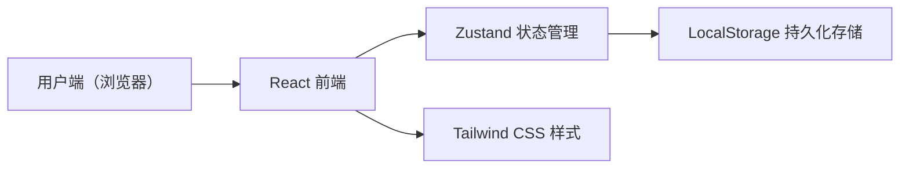
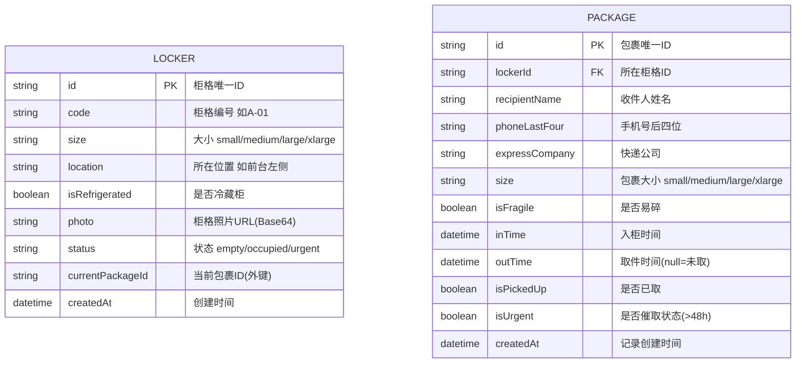

## 1. 架构设计



纯前端架构，使用 LocalStorage 模拟数据库，无需后端服务。

## 2. 技术描述
- **前端框架**：React@18 + TypeScript
- **构建工具**：Vite@5
- **路由管理**：react-router-dom@6
- **状态管理**：Zustand@4（轻量级状态管理，支持 persist 中间件持久化到 LocalStorage）
- **UI 样式**：Tailwind CSS@3
- **图标库**：lucide-react
- **初始化工具**：vite-init
- **数据存储**：浏览器 LocalStorage（模拟持久化）
- **Mock 数据**：内置初始柜格和包裹示例数据

## 3. 路由定义
| 路由 | 用途 |
|------|------|
| / | 数据看板页（首页），展示统计、催取区、冷藏提醒 |
| /lockers | 柜格档案页，管理所有柜格信息 |
| /packages | 包裹记录页，查看所有包裹的入/取记录 |

## 4. 数据模型

### 4.1 数据模型定义



### 4.2 关键类型定义

```typescript
type LockerSize = 'small' | 'medium' | 'large' | 'xlarge'
type LockerStatus = 'empty' | 'occupied' | 'urgent'

interface Locker {
  id: string
  code: string
  size: LockerSize
  location: string
  isRefrigerated: boolean
  photo: string
  status: LockerStatus
  currentPackageId: string | null
  createdAt: string
}

interface Package {
  id: string
  lockerId: string
  recipientName: string
  phoneLastFour: string
  expressCompany: string
  size: LockerSize
  isFragile: boolean
  inTime: string
  outTime: string | null
  isPickedUp: boolean
  isUrgent: boolean
  createdAt: string
}

interface DashboardStats {
  emptyLockers: number
  occupiedLockers: number
  urgentPackages: number
  todayInCount: number
  expressCounts: Record<string, number>
  refrigeratedPackages: Package[]
}
```

## 5. 状态管理设计

```typescript
// Zustand Store
interface AppState {
  lockers: Locker[]
  packages: Package[]
  
  // 柜格操作
  addLocker: (data: Omit<Locker, 'id' | 'status' | 'currentPackageId' | 'createdAt'>) => void
  updateLocker: (id: string, data: Partial<Locker>) => void
  deleteLocker: (id: string) => void
  getLocker: (id: string) => Locker | undefined
  
  // 包裹操作
  checkInPackage: (data: { lockerId: string; recipientName: string; phoneLastFour: string; expressCompany: string; size: LockerSize; isFragile: boolean }) => void
  checkOutPackage: (packageId: string) => void
  findPackagesByPhone: (phoneLastFour: string) => Package[]
  
  // 统计
  getDashboardStats: () => DashboardStats
  getUrgentPackages: () => Package[]
  getRefrigeratedPackages: () => Package[]
  
  // 辅助
  refreshUrgentStatus: () => void
}
```

## 6. 项目目录结构

```
src/
├── components/
│   ├── layout/
│   │   ├── Sidebar.tsx        # 左侧导航
│   │   ├── Header.tsx         # 顶部栏
│   │   └── PageContainer.tsx  # 页面容器
│   ├── locker/
│   │   ├── LockerCard.tsx     # 柜格卡片
│   │   ├── LockerGrid.tsx     # 柜格网格
│   │   ├── LockerForm.tsx     # 柜格表单弹窗
│   │   └── LockerDetail.tsx   # 柜格详情
│   ├── package/
│   │   ├── CheckInForm.tsx    # 入柜表单
│   │   ├── CheckOutForm.tsx   # 取件验证表单
│   │   ├── PackageCard.tsx    # 包裹卡片
│   │   └── PackageTable.tsx   # 包裹记录表格
│   └── dashboard/
│       ├── StatCard.tsx       # 统计卡片
│       ├── UrgentList.tsx     # 催取区列表
│       └── RefrigeratedAlert.tsx # 冷藏提醒
├── pages/
│   ├── Dashboard.tsx          # 看板首页
│   ├── Lockers.tsx            # 柜格档案
│   └── Packages.tsx           # 包裹记录
├── store/
│   └── useAppStore.ts         # Zustand store
├── types/
│   └── index.ts               # 类型定义
├── utils/
│   ├── constants.ts           # 常量（快递公司、大小映射等）
│   └── helpers.ts             # 工具函数（时间计算、格式化）
├── App.tsx
├── main.tsx
└── index.css
```
