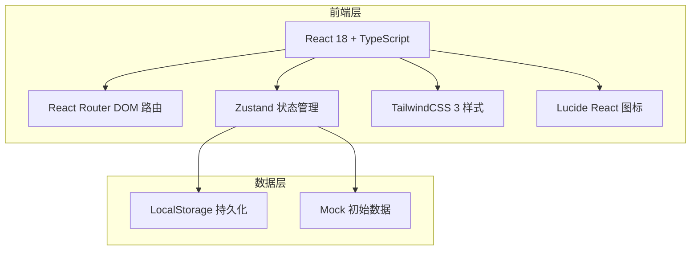
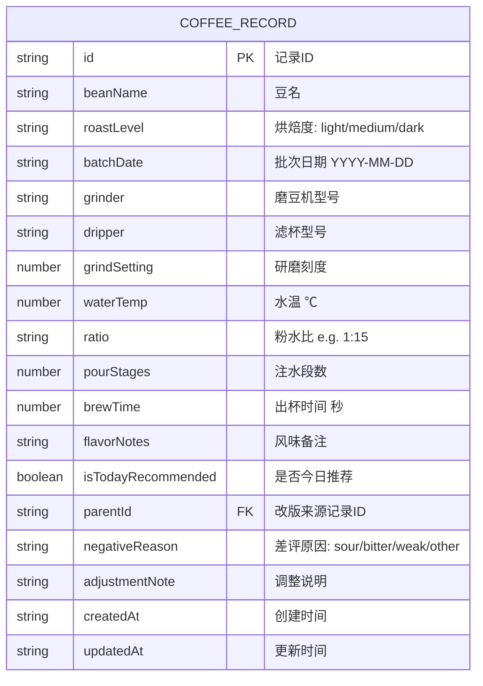

## 1. 架构设计



## 2. 技术描述
- 前端：React@18 + TypeScript + Vite
- 初始化工具：vite-init（react-ts 模板）
- 路由：react-router-dom@6
- 状态管理：zustand
- 样式：tailwindcss@3
- 图标：lucide-react
- 后端：无（纯前端本地存储）
- 数据库：LocalStorage + 内置 Mock 数据

## 3. 路由定义
| 路由 | 用途 |
|------|------|
| / | 仪表盘（今日推荐、翻车原因、校准预警） |
| /records | 参数记录表（筛选、列表、操作） |
| /records/new | 新增参数记录 |
| /records/:id/edit | 编辑参数记录 |
| /records/:id/revise | 从原参数改版（带差评原因） |

## 4. 数据模型

### 4.1 数据模型定义



### 4.2 TypeScript 类型定义

```typescript
type RoastLevel = 'light' | 'medium' | 'dark';
type NegativeReason = 'sour' | 'bitter' | 'weak' | 'other' | null;

interface CoffeeRecord {
  id: string;
  beanName: string;
  roastLevel: RoastLevel;
  batchDate: string;
  grinder: string;
  dripper: string;
  grindSetting: number;
  waterTemp: number;
  ratio: string;
  pourStages: number;
  brewTime: number;
  flavorNotes: string;
  isTodayRecommended: boolean;
  parentId: string | null;
  negativeReason: NegativeReason;
  adjustmentNote: string;
  createdAt: string;
  updatedAt: string;
}

interface FilterState {
  beanName: string;
  roastLevel: RoastLevel | 'all';
  grinder: string;
  dripper: string;
}
```

## 5. 核心状态管理（Zustand Store）

```typescript
interface CoffeeStore {
  records: CoffeeRecord[];
  filters: FilterState;
  // Actions
  addRecord: (data: Omit<CoffeeRecord, 'id' | 'createdAt' | 'updatedAt'>) => void;
  updateRecord: (id: string, data: Partial<CoffeeRecord>) => void;
  deleteRecord: (id: string) => void;
  reviseRecord: (parentId: string, data: Partial<CoffeeRecord> & { negativeReason: NegativeReason; adjustmentNote: string }) => void;
  setTodayRecommended: (id: string) => void;
  setFilters: (filters: Partial<FilterState>) => void;
  getFilteredRecords: () => CoffeeRecord[];
  getTodayRecommended: () => CoffeeRecord | null;
  getLastFailure: () => CoffeeRecord | null;
  getConsecutiveNegativeCount: (beanName: string, batchDate: string) => number;
  needsCalibration: () => { beanName: string; batchDate: string; count: number } | null;
}
```

## 6. 项目目录结构

```
src/
├── components/
│   ├── Dashboard/
│   │   ├── TodayRecommendedCard.tsx
│   │   ├── LastFailureCard.tsx
│   │   └── CalibrationAlert.tsx
│   ├── Records/
│   │   ├── FilterBar.tsx
│   │   ├── RecordsTable.tsx
│   │   └── RecordRow.tsx
│   ├── Form/
│   │   ├── RecordForm.tsx
│   │   └── ReviseForm.tsx
│   └── Layout/
│       ├── Navbar.tsx
│       └── Container.tsx
├── hooks/
│   └── useCoffeeStore.ts
├── pages/
│   ├── Dashboard.tsx
│   ├── Records.tsx
│   ├── NewRecord.tsx
│   ├── EditRecord.tsx
│   └── ReviseRecord.tsx
├── store/
│   └── coffeeStore.ts
├── types/
│   └── index.ts
├── utils/
│   ├── mockData.ts
│   └── storage.ts
├── App.tsx
├── main.tsx
└── index.css
```
