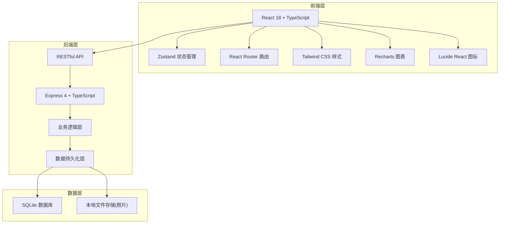
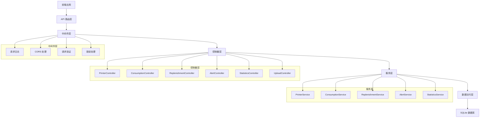

## 1. 架构设计



## 2. 技术描述

- **前端框架**：React 18 + TypeScript + Vite
- **状态管理**：Zustand - 轻量级状态管理，支持持久化
- **路由**：React Router DOM v6
- **样式方案**：Tailwind CSS 3
- **图表库**：Recharts - React 生态友好的图表组件
- **图标库**：Lucide React
- **后端框架**：Express 4 + TypeScript
- **数据库**：SQLite - 轻量级、无需额外服务，适合中小规模应用
- **文件存储**：本地文件系统存储照片，使用 UUID 命名
- **初始化工具**：vite-init
- **包管理器**：npm (macOS 环境)

## 3. 路由定义

### 前端路由

| 路由路径 | 页面名称 | 权限要求 |
|-------|---------|----------|
| / | 首页仪表盘 | 所有用户 |
| /printers | 打印点列表 | 所有用户 |
| /printers/new | 新增打印点 | 管理员 |
| /printers/:id | 打印点详情 | 所有用户 |
| /printers/:id/edit | 编辑打印点 | 管理员 |
| /consumptions | 领用记录 | 所有用户 |
| /consumptions/new | 新增领用 | 所有用户 |
| /replenishments | 补货记录 | 管理员 |
| /replenishments/new | 新增补货 | 管理员 |
| /alerts | 库存预警 | 管理员 |
| /statistics | 统计分析 | 管理员 |

### 后端 API 路由

| 方法 | 路由路径 | 功能描述 |
|-----|---------|---------|
| GET | /api/printers | 获取打印点列表 |
| GET | /api/printers/:id | 获取打印点详情 |
| POST | /api/printers | 新增打印点 |
| PUT | /api/printers/:id | 更新打印点 |
| DELETE | /api/printers/:id | 删除打印点 |
| GET | /api/consumptions | 获取领用记录列表 |
| POST | /api/consumptions | 新增领用记录 |
| GET | /api/replenishments | 获取补货记录列表 |
| POST | /api/replenishments | 新增补货记录 |
| GET | /api/alerts | 获取预警列表 |
| PUT | /api/alerts/:id/resolve | 标记预警为已处理 |
| GET | /api/statistics/consumption-rate | 获取消耗速度统计 |
| GET | /api/statistics/department-usage | 获取部门用量统计 |
| GET | /api/statistics/replenishment-forecast | 获取补货预测 |
| POST | /api/upload | 上传照片 |

## 4. API 定义

### TypeScript 类型定义

```typescript
// 打印点
interface Printer {
  id: string;
  location: string;
  printerModel: string;
  paperSpec: string;
  minStock: number;
  currentStock: number;
  manager: string;
  managerPhone: string;
  photoUrl: string;
  createdAt: string;
  updatedAt: string;
}

// 领用记录
interface Consumption {
  id: string;
  printerId: string;
  department: string;
  quantity: number;
  purpose: string;
  receiver: string;
  isAbnormal: boolean;
  createdAt: string;
}

// 补货记录
interface Replenishment {
  id: string;
  printerId: string;
  supplier: string;
  boxCount: number;
  unitPrice: number;
  totalAmount: number;
  photoUrl: string;
  createdAt: string;
}

// 预警记录
interface Alert {
  id: string;
  printerId: string;
  type: 'low_stock' | 'abnormal_consumption';
  level: 'warning' | 'danger';
  message: string;
  isResolved: boolean;
  createdAt: string;
  resolvedAt?: string;
}

// 统计数据
interface ConsumptionRate {
  printerId: string;
  printerLocation: string;
  dailyAverage: number;
  weeklyAverage: number;
  monthlyAverage: number;
}

interface DepartmentUsage {
  department: string;
  totalQuantity: number;
  percentage: number;
}

interface ReplenishmentForecast {
  printerId: string;
  printerLocation: string;
  currentStock: number;
  minStock: number;
  dailyConsumption: number;
  estimatedDaysLeft: number;
  nextReplenishmentDate: string;
  suggestedQuantity: number;
}
```

### 请求/响应示例

**GET /api/printers**
```typescript
// Response
{
  success: boolean;
  data: Printer[];
}
```

**POST /api/consumptions**
```typescript
// Request
{
  printerId: string;
  department: string;
  quantity: number;
  purpose: string;
  receiver: string;
}

// Response
{
  success: boolean;
  data: Consumption;
  message?: string;
}
```

## 5. 服务器架构图



## 6. 数据模型

### 6.1 ER 图


### 6.2 DDL 语句

```sql
-- 打印点表
CREATE TABLE printers (
    id TEXT PRIMARY KEY,
    location TEXT NOT NULL,
    printer_model TEXT NOT NULL,
    paper_spec TEXT NOT NULL,
    min_stock INTEGER NOT NULL DEFAULT 10,
    current_stock INTEGER NOT NULL DEFAULT 0,
    manager TEXT NOT NULL,
    manager_phone TEXT,
    photo_url TEXT,
    created_at DATETIME DEFAULT CURRENT_TIMESTAMP,
    updated_at DATETIME DEFAULT CURRENT_TIMESTAMP
);

-- 领用记录表
CREATE TABLE consumptions (
    id TEXT PRIMARY KEY,
    printer_id TEXT NOT NULL,
    department TEXT NOT NULL,
    quantity INTEGER NOT NULL,
    purpose TEXT NOT NULL,
    receiver TEXT NOT NULL,
    is_abnormal BOOLEAN DEFAULT FALSE,
    created_at DATETIME DEFAULT CURRENT_TIMESTAMP,
    FOREIGN KEY (printer_id) REFERENCES printers(id)
);

-- 补货记录表
CREATE TABLE replenishments (
    id TEXT PRIMARY KEY,
    printer_id TEXT NOT NULL,
    supplier TEXT NOT NULL,
    box_count INTEGER NOT NULL,
    unit_price DECIMAL(10,2) NOT NULL,
    total_amount DECIMAL(10,2) NOT NULL,
    photo_url TEXT,
    created_at DATETIME DEFAULT CURRENT_TIMESTAMP,
    FOREIGN KEY (printer_id) REFERENCES printers(id)
);

-- 预警记录表
CREATE TABLE alerts (
    id TEXT PRIMARY KEY,
    printer_id TEXT NOT NULL,
    type TEXT NOT NULL,
    level TEXT NOT NULL,
    message TEXT NOT NULL,
    is_resolved BOOLEAN DEFAULT FALSE,
    created_at DATETIME DEFAULT CURRENT_TIMESTAMP,
    resolved_at DATETIME,
    FOREIGN KEY (printer_id) REFERENCES printers(id)
);

-- 创建索引
CREATE INDEX idx_consumptions_printer_id ON consumptions(printer_id);
CREATE INDEX idx_consumptions_created_at ON consumptions(created_at);
CREATE INDEX idx_replenishments_printer_id ON replenishments(printer_id);
CREATE INDEX idx_alerts_printer_id ON alerts(printer_id);
CREATE INDEX idx_alerts_is_resolved ON alerts(is_resolved);

-- 初始化数据
INSERT INTO printers (id, location, printer_model, paper_spec, min_stock, current_stock, manager, manager_phone) VALUES
('p1', '1楼前台大厅', 'HP LaserJet Pro M404dn', 'A4/70g', 10, 25, '张三', '13800138001'),
('p2', '2楼研发部', 'Canon imageCLASS LBP312x', 'A4/80g', 15, 8, '李四', '13800138002'),
('p3', '3楼财务部', 'Epson WorkForce AL-M310DN', 'A4/70g', 10, 5, '王五', '13800138003'),
('p4', '5楼会议室', 'Brother HL-L6200DW', 'A4/70g', 20, 12, '赵六', '13800138004');

INSERT INTO consumptions (id, printer_id, department, quantity, purpose, receiver) VALUES
('c1', 'p1', '行政部', 2, '日常办公打印', '张小明'),
('c2', 'p2', '研发部', 5, '项目文档打印', '李华'),
('c3', 'p3', '财务部', 3, '财务报表打印', '王芳'),
('c4', 'p1', '销售部', 4, '客户合同打印', '刘强'),
('c5', 'p4', '行政部', 8, '会议资料打印', '赵敏');

INSERT INTO replenishments (id, printer_id, supplier, box_count, unit_price, total_amount) VALUES
('r1', 'p1', '亚太纸业', 5, 120.00, 600.00),
('r2', 'p2', '得力办公', 3, 135.00, 405.00),
('r3', 'p3', '亚太纸业', 2, 120.00, 240.00);
```
