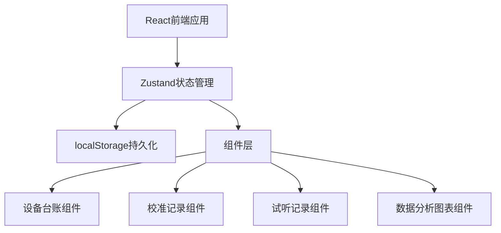
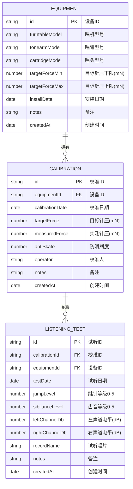

## 1. 架构设计
纯前端单页应用，使用 localStorage 进行数据持久化，内置 mock 数据供演示。



## 2. 技术描述
- **前端框架**: React 18 + TypeScript + Vite
- **样式方案**: Tailwind CSS 3
- **状态管理**: Zustand
- **图表库**: Recharts (原生React图表库，轻量级)
- **路由**: React Router DOM
- **图标库**: Lucide React
- **数据存储**: localStorage (纯前端)
- **初始化方式**: vite-init react-ts 模板

## 3. 路由定义
| 路由 | 页面用途 |
|-------|----------|
| / | 首页仪表盘：告警概览 + 快捷入口 |
| /equipment | 设备台账管理 |
| /calibration | 校准记录管理 |
| /listening | 试听记录管理 |
| /analysis | 数据分析与对比图 |

## 4. 数据模型

### 4.1 ER图


### 4.2 TypeScript 类型定义
```typescript
interface Equipment {
  id: string;
  turntableModel: string;
  tonearmModel: string;
  cartridgeModel: string;
  targetForceMin: number;
  targetForceMax: number;
  installDate: string;
  notes?: string;
  createdAt: string;
}

interface Calibration {
  id: string;
  equipmentId: string;
  calibrationDate: string;
  targetForce: number;
  measuredForce: number;
  antiSkate: number;
  operator: string;
  notes?: string;
  createdAt: string;
}

interface ListeningTest {
  id: string;
  calibrationId: string;
  equipmentId: string;
  testDate: string;
  jumpLevel: number; // 0-5
  sibilanceLevel: number; // 0-5
  leftChannelDb: number;
  rightChannelDb: number;
  recordName?: string;
  notes?: string;
  createdAt: string;
}

// 告警规则
type AlertType = 'realignment' | 'replace_stylus' | 'channel_balance';
interface Alert {
  id: string;
  equipmentId: string;
  type: AlertType;
  severity: 'warning' | 'danger';
  message: string;
  relatedRecordId?: string;
}
```

## 5. 告警规则定义
1. **重新调平 (realignment)**:
   - 针压偏差 > ±0.3mN（实测值超出目标值范围）
   - 左右声道差 > 2dB
   
2. **更换针尖 (replace_stylus)**:
   - 跳针等级 ≥ 3
   - 齿音等级 ≥ 4
   - 连续3次试听出现跳针≥2或齿音≥3

## 6. 初始Mock数据
内置3台设备、8条校准记录、15条试听记录作为演示数据