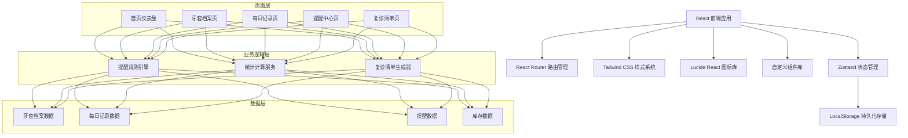
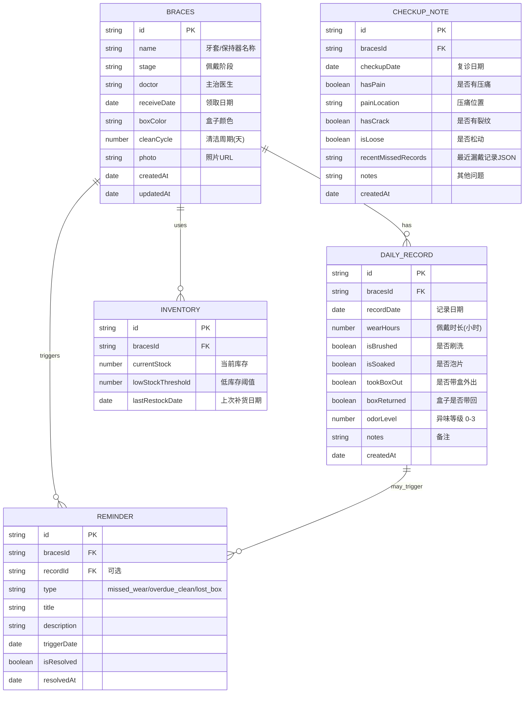

## 1. 架构设计



## 2. 技术描述

- **前端框架**：React@18 + TypeScript@5
- **构建工具**：Vite@5
- **路由管理**：react-router-dom@6
- **状态管理**：zustand@4
- **样式方案**：tailwindcss@3
- **图标库**：lucide-react@0.344
- **数据持久化**：localStorage（无需后端）
- **初始化工具**：vite-init

## 3. 路由定义

| Route | 页面组件 | 功能说明 |
|-------|----------|----------|
| `/` | Dashboard | 首页仪表盘，展示提醒、统计、快捷记录 |
| `/braces` | BracesList | 牙套档案列表页 |
| `/braces/new` | BracesForm | 新建牙套档案 |
| `/braces/:id/edit` | BracesForm | 编辑牙套档案 |
| `/records` | Records | 每日记录页，含日历选择和历史记录 |
| `/reminders` | Reminders | 提醒中心，分类展示所有提醒 |
| `/checkup` | CheckupList | 复诊清单页，含问题清单和库存管理 |

## 4. 数据模型

### 4.1 ER 图



### 4.2 TypeScript 类型定义

```typescript
// 牙套档案
interface Braces {
  id: string;
  name: string;
  stage: '第一阶段' | '第二阶段' | '保持器';
  doctor: string;
  receiveDate: string;
  boxColor: string;
  cleanCycle: number;
  photo?: string;
  createdAt: string;
  updatedAt: string;
}

// 每日记录
interface DailyRecord {
  id: string;
  bracesId: string;
  recordDate: string;
  wearHours: number;
  isBrushed: boolean;
  isSoaked: boolean;
  tookBoxOut: boolean;
  boxReturned: boolean;
  odorLevel: 0 | 1 | 2 | 3;
  notes?: string;
  createdAt: string;
}

// 提醒类型
type ReminderType = 'missed_wear' | 'overdue_clean' | 'lost_box';

interface Reminder {
  id: string;
  bracesId: string;
  recordId?: string;
  type: ReminderType;
  title: string;
  description: string;
  triggerDate: string;
  isResolved: boolean;
  resolvedAt?: string;
}

// 清洁片库存
interface Inventory {
  id: string;
  bracesId: string;
  currentStock: number;
  lowStockThreshold: number;
  lastRestockDate: string;
}

// 复诊记录
interface CheckupNote {
  id: string;
  bracesId: string;
  checkupDate: string;
  hasPain: boolean;
  painLocation?: string;
  hasCrack: boolean;
  isLoose: boolean;
  recentMissedRecords: string;
  notes?: string;
  createdAt: string;
}

// 应用状态
interface AppState {
  braces: Braces[];
  records: DailyRecord[];
  reminders: Reminder[];
  inventories: Inventory[];
  checkupNotes: CheckupNote[];
}
```

## 5. 核心业务逻辑

### 5.1 提醒规则引擎

1. **漏戴提醒**：
   - 检查当日佩戴时长 < 20小时 → 生成漏戴提醒
   - 连续2天未记录佩戴 → 生成漏戴提醒

2. **清洁超期提醒**：
   - 检查距离上次泡片天数 > 清洁周期 → 生成清洁超期提醒
   - 检查当日未刷洗且已佩戴 → 生成清洁提醒

3. **盒子丢失提醒**：
   - 记录中 tookBoxOut = true 且 boxReturned = false → 生成盒子丢失提醒

### 5.2 统计计算

- **本周达标天数**：统计本周内 wearHours ≥ 20 且 isBrushed = true 且 isSoaked = true 的天数
- **连续记录天数**：从今天倒推，连续有记录的天数
- **清洁片使用估算**：根据泡片频率估算剩余可用天数

### 5.3 复诊清单生成

自动汇总：
- 最近7天内压痛记录
- 牙套裂纹检查记录
- 松动情况记录
- 最近30天漏戴记录列表
- 清洁超期记录

## 6. 项目结构

```
src/
├── components/           # 通用组件
│   ├── Layout.tsx       # 页面布局（含底部导航）
│   ├── Card.tsx         # 卡片容器
│   ├── Button.tsx       # 按钮组件
│   ├── Toggle.tsx       # 开关组件
│   ├── Slider.tsx       # 滑块组件
│   ├── EmojiPicker.tsx  # 表情选择器
│   └── AlertBanner.tsx  # 提醒横幅
├── pages/               # 页面组件
│   ├── Dashboard.tsx    # 首页仪表盘
│   ├── BracesList.tsx   # 牙套档案列表
│   ├── BracesForm.tsx   # 牙套档案表单
│   ├── Records.tsx      # 每日记录
│   ├── Reminders.tsx    # 提醒中心
│   └── CheckupList.tsx  # 复诊清单
├── store/               # 状态管理
│   └── useStore.ts      # Zustand store
├── utils/               # 工具函数
│   ├── reminderRules.ts # 提醒规则引擎
│   ├── statistics.ts    # 统计计算
│   ├── checkup.ts       # 复诊清单生成
│   └── storage.ts       # 本地存储封装
├── types/               # 类型定义
│   └── index.ts
├── App.tsx              # 根组件
├── main.tsx             # 入口文件
└── index.css            # 全局样式
```
