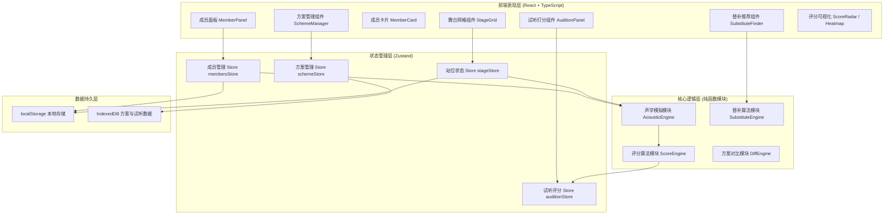
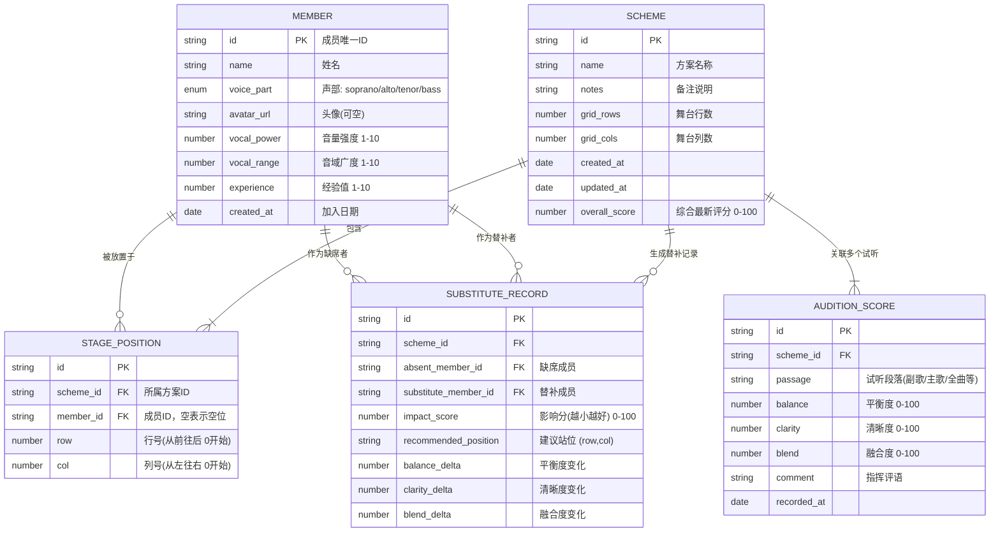

## 1. 架构设计



## 2. 技术选型说明

- **前端框架**：React 18 + TypeScript 5 —— 类型安全，组件化适合复杂交互
- **构建工具**：Vite 5 —— 开发热更新快，生产打包体积小
- **样式方案**：Tailwind CSS 3 + CSS 变量 —— 快速实现设计系统，暗色系主题切换
- **状态管理**：Zustand 4 —— 轻量无模板代码，多Store分模块管理
- **图标库**：lucide-react —— 统一线性图标，符合设计风格
- **拖拽实现**：原生 HTML5 Drag & Drop API + 自定义拖拽层 —— 不引额外依赖，轻量可控
- **图表可视化**：Canvas API 自绘热力图 + SVG 自绘雷达图 —— 不引echarts等大库，体积可控
- **持久化**：localStorage（成员/站位） + IndexedDB（方案/试听记录）—— 方案数据量大用IndexedDB
- **后端服务**：无 —— 纯前端应用，数据全部本地存储，保障合唱团隐私

## 3. 路由定义

| 路由路径 | 页面用途 |
|---------|---------|
| `/` | 主工作台（唯一页面，单页应用，所有功能在一个页面内通过面板Tab切换） |

*注：该应用为单页工具型应用，无需多路由跳转。所有功能模块在同一工作台内通过面板、Tab、弹窗形式呈现。*

## 4. 核心数据模型

### 4.1 数据模型ER图



### 4.2 TypeScript 类型定义

```typescript
// 声部枚举
type VoicePart = 'soprano' | 'alto' | 'tenor' | 'bass';

// 成员
interface Member {
  id: string;
  name: string;
  voicePart: VoicePart;
  avatarUrl?: string;
  vocalPower: number;   // 1-10 音量强度
  vocalRange: number;   // 1-10 音域广度
  experience: number;   // 1-10 经验值
  createdAt: string;
}

// 站位
interface StagePosition {
  id: string;
  schemeId: string;
  memberId: string | null;
  row: number;
  col: number;
}

// 站位方案
interface Scheme {
  id: string;
  name: string;
  notes: string;
  gridRows: number;
  gridCols: number;
  positions: StagePosition[];
  createdAt: string;
  updatedAt: string;
  overallScore: number;
}

// 试听评分
interface AuditionScore {
  id: string;
  schemeId: string;
  passage: string;
  balance: number;  // 平衡度
  clarity: number;  // 清晰度
  blend: number;    // 融合度
  comment: string;
  recordedAt: string;
}

// 替补推荐记录
interface SubstituteRecord {
  id: string;
  schemeId: string;
  absentMemberId: string;
  substituteMemberId: string;
  impactScore: number;
  recommendedRow: number;
  recommendedCol: number;
  balanceDelta: number;
  clarityDelta: number;
  blendDelta: number;
}
```

## 5. 核心算法模块说明

### 5.1 声学模拟引擎 (AcousticEngine)
```
核心思路：基于经验公式简化计算舞台各点的合成声压

输入：成员列表 + 当前站位 + 舞台配置
输出：
  - 各声部在听众位置的音量贡献
  - 各网格点声压级热力矩阵
  - 声部空间覆盖重叠度

简化模型要素：
1. 距离衰减：后排成员距离听众更远，音量 * (1 - row * 衰减系数)
2. 侧向衰减：偏离中轴线越远，融合度越低
3. 高度增益：后排略高（阶梯式舞台），补偿 * (1 + row * 补偿系数)
4. 邻接增益：同声部相邻产生共鸣加成
5. 声部遮挡：大音量成员（如男高）在前排对后排的遮挡系数
```

### 5.2 评分计算引擎 (ScoreEngine)
```
平衡度 Balance (0-100)：
  计算四声部音量贡献的标准差，越均衡分数越高
  formula: 100 - StdDev(sopranoVol, altoVol, tenorVol, bassVol) * K

清晰度 Clarity (0-100)：
  同声部集中度 + 关键领唱位置 + 声部间不混叠程度
  - 同声部成员越靠近，和声越清晰
  - 领唱（高经验成员）位于中前区加分

融合度 Blend (0-100)：
  - 声区过渡连续性（相邻格声部差异越小越好）
  - 各声部空间分布均匀度
  - 音量强弱分布梯度平滑度

综合得分：
  overall = balance * 0.4 + clarity * 0.3 + blend * 0.3
```

### 5.3 替补推荐算法 (SubstituteEngine)
```
输入：当前方案、缺席成员ID、可替补成员列表
步骤：
1. 找到缺席成员的原站位位置 P0
2. 遍历每个候选替补 M：
   a. 将M放入P0，计算新评分 → 分数差 D1
   b. 将M放入其他空位尝试，计算评分 → 取最优差值 Dmin
   c. 记录 impact = 100 - Dmin（越小越好）
3. 按 impact 升序排列所有候选
4. 返回 Top3 方案，附带三个维度的变化值
```

## 6. 文件目录结构

```
src/
├── types/              # 全局类型定义
│   └── index.ts
├── stores/             # Zustand 状态管理
│   ├── membersStore.ts
│   ├── stageStore.ts
│   ├── auditionStore.ts
│   └── schemeStore.ts
├── engine/             # 核心算法引擎
│   ├── acousticEngine.ts
│   ├── scoreEngine.ts
│   └── substituteEngine.ts
├── components/         # React 组件
│   ├── layout/
│   │   ├── TopNav.tsx
│   │   └── WorkspaceLayout.tsx
│   ├── stage/
│   │   ├── StageGrid.tsx
│   │   ├── StageCell.tsx
│   │   ├── GridSizeController.tsx
│   │   └── HeatmapOverlay.tsx
│   ├── members/
│   │   ├── MemberPanel.tsx
│   │   ├── MemberCard.tsx
│   │   ├── MemberFormModal.tsx
│   │   └── VoicePartTabs.tsx
│   ├── audition/
│   │   ├── AuditionPanel.tsx
│   │   ├── ScoreSlider.tsx
│   │   ├── ScoreRadar.tsx
│   │   └── ScoreDisplay.tsx
│   ├── scheme/
│   │   ├── SchemeManager.tsx
│   │   ├── SchemeCard.tsx
│   │   └── SchemeCompareView.tsx
│   └── substitute/
│       ├── SubstituteFinder.tsx
│       └── ImpactBar.tsx
├── utils/              # 工具函数
│   ├── storage.ts      # localStorage/IndexedDB 封装
│   ├── id.ts           # ID生成
│   └── constants.ts    # 声部颜色/配置常量
├── mock/               # Mock 演示数据
│   └── seedData.ts
├── App.tsx
├── main.tsx
└── index.css
```
