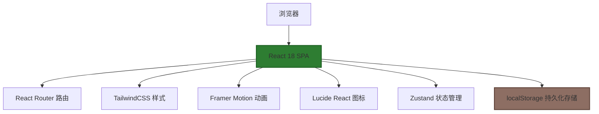
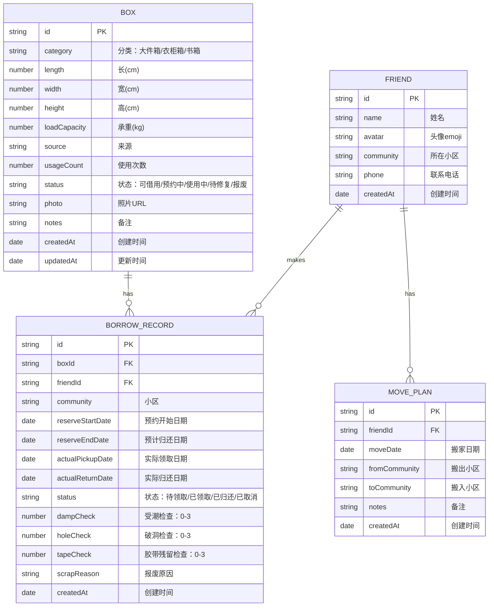

## 1. 架构设计

本系统为纯前端单页应用（SPA），数据存储在浏览器localStorage中，无需后端服务，便于在朋友间快速部署和使用。



## 2. 技术描述

- **前端框架**：React@18 + TypeScript@5
- **构建工具**：Vite@5（快速冷启动、热更新）
- **样式方案**：TailwindCSS@3（原子化CSS，快速开发）
- **状态管理**：Zustand@4（轻量级状态管理，替代Redux）
- **路由管理**：React Router DOM@6（单页路由）
- **动画库**：Framer Motion@11（流畅的页面过渡和微交互）
- **图标库**：Lucide React@0.344（现代化SVG图标）
- **后端**：无，使用localStorage进行数据持久化
- **数据库**：无，mock数据存储在localStorage中

## 3. 路由定义

| 路由 | 页面名称 | 用途 |
|------|----------|------|
| / | 看板首页 | 数据统计、预约冲突、待归还、报废箱、搬家日历 |
| /boxes | 纸箱档案 | 纸箱列表、搜索筛选、新增/编辑纸箱 |
| /boxes/:id | 纸箱详情 | 纸箱完整信息、借还历史、照片画廊 |
| /borrow | 借还管理 | 预约列表、预约领取、归还检查 |
| /friends | 朋友管理 | 朋友清单、搬家计划管理 |

## 4. 数据模型

### 4.1 数据模型定义



### 4.2 TypeScript 类型定义

```typescript
// 纸箱分类
type BoxCategory = 'large' | 'wardrobe' | 'book';

// 纸箱状态
type BoxStatus = 'available' | 'reserved' | 'in_use' | 'need_repair' | 'scrapped';

// 预约状态
type BorrowStatus = 'pending' | 'picked_up' | 'returned' | 'cancelled';

// 纸箱接口
interface Box {
  id: string;
  category: BoxCategory;
  length: number;
  width: number;
  height: number;
  loadCapacity: number;
  source: string;
  usageCount: number;
  status: BoxStatus;
  photo: string;
  notes: string;
  createdAt: string;
  updatedAt: string;
}

// 借还记录接口
interface BorrowRecord {
  id: string;
  boxId: string;
  friendId: string;
  community: string;
  reserveStartDate: string;
  reserveEndDate: string;
  actualPickupDate?: string;
  actualReturnDate?: string;
  status: BorrowStatus;
  dampCheck?: number;
  holeCheck?: number;
  tapeCheck?: number;
  scrapReason?: string;
  createdAt: string;
}

// 朋友接口
interface Friend {
  id: string;
  name: string;
  avatar: string;
  community: string;
  phone: string;
  createdAt: string;
}

// 搬家计划接口
interface MovePlan {
  id: string;
  friendId: string;
  moveDate: string;
  fromCommunity: string;
  toCommunity: string;
  notes: string;
  createdAt: string;
}
```

### 4.3 Mock 初始数据

```typescript
// 初始朋友数据
const initialFriends: Friend[] = [
  { id: '1', name: '小明', avatar: '👨', community: '阳光花园', phone: '13800138001', createdAt: '2026-01-15' },
  { id: '2', name: '小红', avatar: '👩', community: '翠湖小区', phone: '13800138002', createdAt: '2026-01-20' },
  { id: '3', name: '大壮', avatar: '🧔', community: '阳光花园', phone: '13800138003', createdAt: '2026-02-01' },
  { id: '4', name: '小美', avatar: '👧', community: '金桂苑', phone: '13800138004', createdAt: '2026-02-10' },
];

// 初始纸箱数据
const initialBoxes: Box[] = [
  { id: '1', category: 'large', length: 80, width: 60, height: 50, loadCapacity: 30, source: '京东购买', usageCount: 2, status: 'available', photo: '', notes: '大号搬家箱', createdAt: '2026-03-01', updatedAt: '2026-05-15' },
  { id: '2', category: 'wardrobe', length: 60, width: 50, height: 100, loadCapacity: 15, source: '上次搬家留下', usageCount: 1, status: 'reserved', photo: '', notes: '衣柜箱带挂衣杆', createdAt: '2026-03-05', updatedAt: '2026-06-01' },
  { id: '3', category: 'book', length: 40, width: 30, height: 25, loadCapacity: 20, source: '当当网', usageCount: 3, status: 'in_use', photo: '', notes: '书箱，承重好', createdAt: '2026-02-20', updatedAt: '2026-06-10' },
  { id: '4', category: 'large', length: 70, width: 50, height: 40, loadCapacity: 25, source: '朋友赠送', usageCount: 0, status: 'available', photo: '', notes: '几乎全新', createdAt: '2026-06-15', updatedAt: '2026-06-15' },
  { id: '5', category: 'book', length: 35, width: 25, height: 20, loadCapacity: 15, source: '淘宝', usageCount: 4, status: 'scrapped', photo: '', notes: '', createdAt: '2026-01-10', updatedAt: '2026-05-20' },
  { id: '6', category: 'wardrobe', length: 55, width: 45, height: 90, loadCapacity: 12, source: '上次搬家留下', usageCount: 2, status: 'available', photo: '', notes: '挂衣杆完好', createdAt: '2026-04-01', updatedAt: '2026-06-01' },
  { id: '7', category: 'large', length: 90, width: 60, height: 55, loadCapacity: 35, source: '顺丰购买', usageCount: 1, status: 'need_repair', photo: '', notes: '边角有轻微破损', createdAt: '2026-05-10', updatedAt: '2026-06-12' },
  { id: '8', category: 'book', length: 45, width: 35, height: 25, loadCapacity: 25, source: '京东购买', usageCount: 2, status: 'available', photo: '', notes: '加厚型', createdAt: '2026-05-20', updatedAt: '2026-06-10' },
];

// 初始借还记录
const initialBorrowRecords: BorrowRecord[] = [
  { id: '1', boxId: '2', friendId: '1', community: '阳光花园', reserveStartDate: '2026-06-18', reserveEndDate: '2026-06-25', status: 'pending', createdAt: '2026-06-15' },
  { id: '2', boxId: '3', friendId: '2', community: '翠湖小区', reserveStartDate: '2026-06-10', reserveEndDate: '2026-06-20', actualPickupDate: '2026-06-10', status: 'picked_up', createdAt: '2026-06-08' },
  { id: '3', boxId: '5', friendId: '3', community: '阳光花园', reserveStartDate: '2026-05-01', reserveEndDate: '2026-05-10', actualPickupDate: '2026-05-01', actualReturnDate: '2026-05-10', status: 'returned', dampCheck: 2, holeCheck: 3, tapeCheck: 1, scrapReason: '破洞严重无法修复', createdAt: '2026-04-28' },
];

// 初始搬家计划
const initialMovePlans: MovePlan[] = [
  { id: '1', friendId: '1', moveDate: '2026-06-25', fromCommunity: '阳光花园', toCommunity: '金桂苑', notes: '周末搬家，需要人手帮忙', createdAt: '2026-06-10' },
  { id: '2', friendId: '4', moveDate: '2026-07-05', fromCommunity: '金桂苑', toCommunity: '翠湖小区', notes: '', createdAt: '2026-06-12' },
  { id: '3', friendId: '2', moveDate: '2026-07-15', fromCommunity: '翠湖小区', toCommunity: '阳光花园', notes: '需要大量纸箱', createdAt: '2026-06-08' },
];
```

## 5. 项目目录结构

```
src/
├── components/          # 可复用组件
│   ├── Layout/         # 布局组件（侧边栏、头部）
│   ├── Dashboard/      # 看板相关组件
│   ├── Box/            # 纸箱相关组件
│   ├── Borrow/         # 借还相关组件
│   ├── Friend/         # 朋友相关组件
│   └── ui/             # 基础UI组件（按钮、卡片、表单等）
├── pages/              # 页面组件
│   ├── Dashboard.tsx
│   ├── BoxList.tsx
│   ├── BoxDetail.tsx
│   ├── Borrow.tsx
│   └── Friends.tsx
├── store/              # Zustand状态管理
│   ├── useBoxStore.ts
│   ├── useBorrowStore.ts
│   ├── useFriendStore.ts
│   └── useMovePlanStore.ts
├── types/              # TypeScript类型定义
│   └── index.ts
├── utils/              # 工具函数
│   ├── date.ts
│   ├── storage.ts
│   └── mockData.ts
├── App.tsx
├── main.tsx
└── index.css
```

## 6. 关键业务逻辑

### 6.1 预约冲突检测算法

```typescript
function checkConflict(boxId: string, newStart: string, newEnd: string, excludeId?: string): BorrowRecord[] {
  const records = borrowRecords.filter(r => 
    r.boxId === boxId && 
    r.id !== excludeId &&
    r.status !== 'cancelled' && 
    r.status !== 'returned'
  );
  
  return records.filter(r => {
    const existingStart = new Date(r.reserveStartDate);
    const existingEnd = new Date(r.reserveEndDate);
    const start = new Date(newStart);
    const end = new Date(newEnd);
    return start <= existingEnd && end >= existingStart;
  });
}
```

### 6.2 归还评估逻辑

```typescript
function evaluateBoxCondition(damp: number, hole: number, tape: number): 'available' | 'need_repair' | 'scrapped' {
  const total = damp + hole + tape;
  if (hole >= 3 || total >= 7) return 'scrapped';
  if (damp >= 2 || hole >= 2 || total >= 4) return 'need_repair';
  return 'available';
}
```

### 6.3 看板数据统计

```typescript
function getDashboardStats() {
  return {
    available: boxes.filter(b => b.status === 'available').length,
    reserved: boxes.filter(b => b.status === 'reserved').length,
    pendingReturn: borrowRecords.filter(r => r.status === 'picked_up').length,
    scrapped: boxes.filter(b => b.status === 'scrapped').length,
    conflicts: getConflicts(),
    upcomingMoves: getUpcomingMoves(30),
  };
}
```
