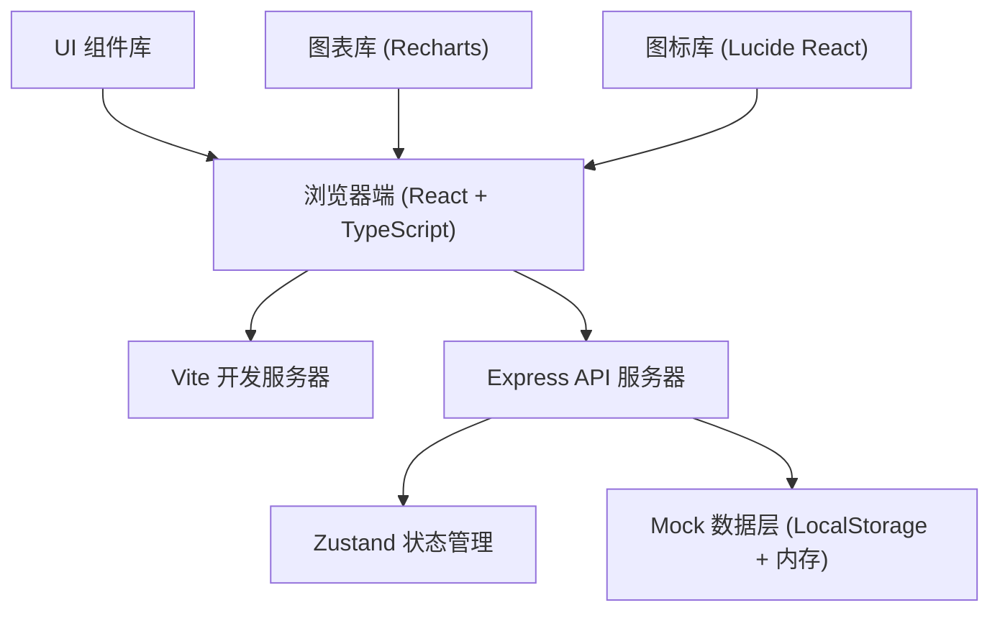
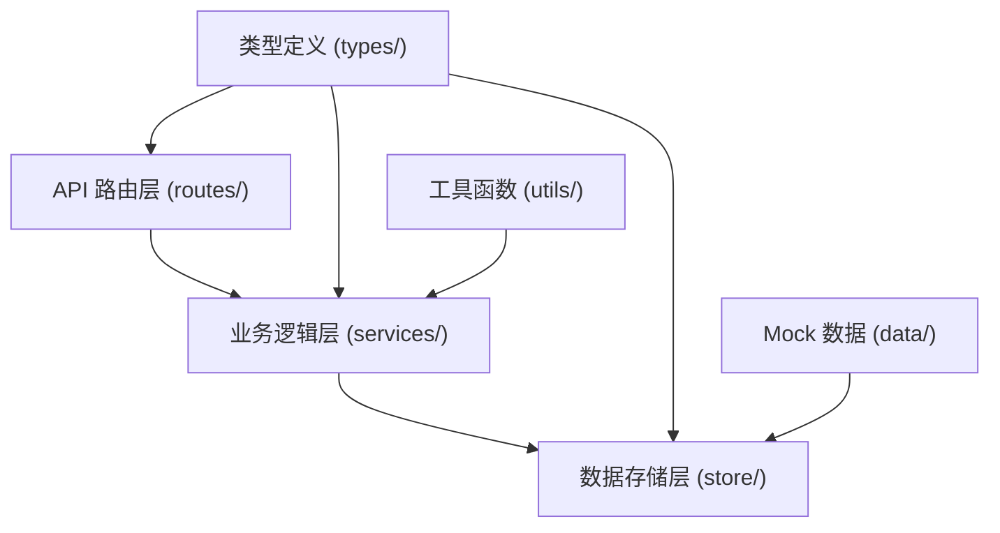
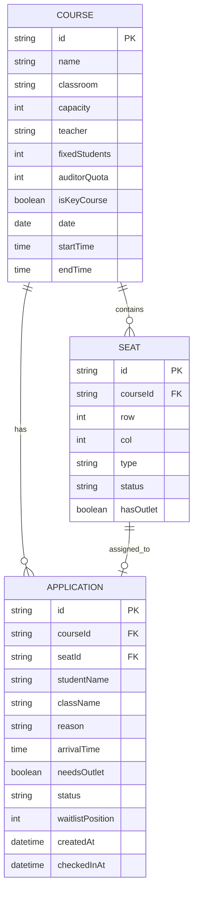

## 1. 架构设计



## 2. 技术描述
- **前端**: React@18 + TypeScript + Vite + React Router DOM + TailwindCSS@3 + Zustand
- **后端**: Express@4 + TypeScript
- **数据存储**: 前端 LocalStorage + 后端内存存储（演示用，无数据库）
- **UI 组件**: 自定义组件 + TailwindCSS
- **图表**: Recharts
- **图标**: Lucide React
- **初始化工具**: vite-init

## 3. 路由定义

| 路由 | 页面 | 说明 |
|------|------|------|
| / | 课程列表页 | 展示所有课程概览 |
| /courses | 课程档案管理 | 课程列表、新增、编辑、座位图编辑 |
| /courses/:id | 课程详情 | 课程信息、座位图、申请列表 |
| /apply | 旁听申请 | 课程选择、申请表单 |
| /apply/status | 申请状态 | 我的申请列表、候补状态 |
| /checkin/:id | 签到管理 | 座位图签到、未到处理、候补释放 |
| /statistics | 统计分析 | 数据仪表盘、图表展示 |

## 4. API 定义

### 类型定义
```typescript
// 座位类型
type SeatType = 'fixed' | 'auditor' | 'aisle' | 'empty';

// 座位状态
type SeatStatus = 'available' | 'reserved' | 'checked_in' | 'blocked';

// 座位
interface Seat {
  id: string;
  row: number;
  col: number;
  type: SeatType;
  status: SeatStatus;
  studentId?: string;
  hasOutlet: boolean;
}

// 课程
interface Course {
  id: string;
  name: string;
  classroom: string;
  capacity: number;
  teacher: string;
  fixedStudents: number;
  auditorQuota: number;
  isKeyCourse: boolean;
  date: string;
  startTime: string;
  endTime: string;
  seats: Seat[][];
  description?: string;
}

// 申请状态
type ApplicationStatus = 'pending_approval' | 'approved' | 'rejected' | 'waitlist' | 'checked_in' | 'no_show';

// 旁听申请
interface Application {
  id: string;
  courseId: string;
  studentName: string;
  className: string;
  reason: string;
  arrivalTime: string;
  needsOutlet: boolean;
  status: ApplicationStatus;
  waitlistPosition?: number;
  seatId?: string;
  createdAt: string;
  checkedInAt?: string;
}

// 统计数据
interface Statistics {
  totalCourses: number;
  totalApplications: number;
  averageAuditorRate: number;
  averageWaitlistCount: number;
  highRiskCourses: number;
  topBorrowClasses: { className: string; count: number }[];
  weeklyTrend: { date: string; auditorCount: number; waitlistCount: number }[];
}
```

### API 接口
```typescript
// 课程管理
GET    /api/courses              // 获取课程列表
GET    /api/courses/:id          // 获取课程详情
POST   /api/courses              // 创建课程
PUT    /api/courses/:id          // 更新课程
DELETE /api/courses/:id          // 删除课程
PUT    /api/courses/:id/seats    // 更新座位图

// 申请管理
GET    /api/applications         // 获取申请列表（可按 courseId/studentName 筛选）
POST   /api/applications         // 提交旁听申请
PUT    /api/applications/:id/approve  // 审批申请
PUT    /api/applications/:id/reject   // 拒绝申请
PUT    /api/applications/:id/checkin  // 签到
PUT    /api/applications/:id/release  // 释放座位（未到）

// 统计
GET    /api/statistics           // 获取统计数据
GET    /api/statistics/course/:id // 获取单课统计
```

## 5. 服务器架构图



## 6. 数据模型

### 6.1 ER 图


### 6.2 目录结构
```
trae0601-4/
├── .trae/documents/           # 项目文档
├── api/                       # 后端代码
│   ├── src/
│   │   ├── routes/           # API 路由
│   │   ├── services/         # 业务逻辑
│   │   ├── store/            # 数据存储
│   │   ├── data/             # Mock 数据
│   │   ├── utils/            # 工具函数
│   │   └── index.ts          # 服务入口
│   └── tsconfig.json
├── src/                       # 前端代码
│   ├── components/           # 公共组件
│   ├── pages/                # 页面组件
│   ├── hooks/                # 自定义 Hooks
│   ├── store/                # Zustand 状态
│   ├── types/                # 类型定义
│   ├── utils/                # 工具函数
│   ├── services/             # API 调用
│   ├── App.tsx
│   ├── main.tsx
│   └── index.css
├── shared/                    # 共享类型
│   └── types.ts
├── package.json
├── tsconfig.json
├── vite.config.ts
└── tailwind.config.js
```
