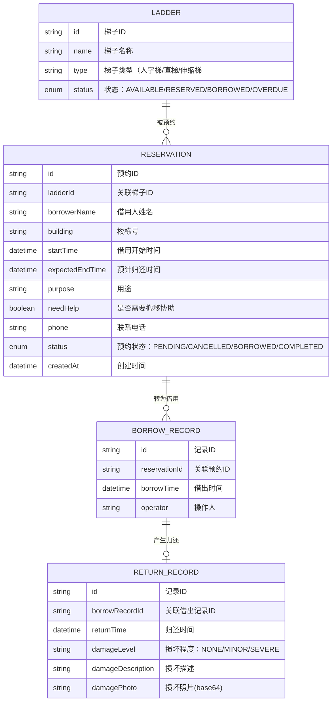

## 1. 架构设计
纯前端架构，使用 localStorage 持久化数据，无需后端服务。

```mermaid
flowchart TD
    A["React 前端应用"] --> B["路由层 (react-router-dom)
    B --> C["页面层 (Pages)"]
    C --> C1["首页看板"]
    C --> C2["预约登记页"]
    C --> C3["统计页"]
    C --> C4["详情弹窗组件"]
    C --> D["状态管理层 (Zustand Store)"]
    D --> E["数据持久化 (localStorage)"]
    D --> F["工具函数层 (Utils)"]
```

## 2. 技术描述
- 前端：React@18 + TypeScript + tailwindcss@3 + Vite
- 初始化工具：vite-init
- 后端：无，纯前端实现
- 数据存储：localStorage（模拟数据持久化）
- 状态管理：zustand
- 路由：react-router-dom
- 图表：自定义 SVG 图表组件
- 图标：lucide-react

## 3. 路由定义
| 路由 | 用途 |
|------|------|
| / | 首页看板（四象限状态展示） |
| /reserve | 预约登记页（新建预约） |
| /statistics | 统计分析页 |

## 4. 数据模型

### 4.1 数据模型定义



### 4.2 状态枚举定义

```typescript
// 梯子状态
enum LadderStatus {
  AVAILABLE = 'available',     // 可借
  RESERVED = 'reserved',       // 已预约
  BORROWED = 'borrowed',     // 借出中
  OVERDUE = 'overdue',        // 逾期未还
}

// 预约状态
enum ReservationStatus {
  PENDING = 'pending',         // 待借出
  CANCELLED = 'cancelled',     // 已取消
  BORROWED = 'borrowed',       // 已借出
  COMPLETED = 'completed',      // 已完成
}

// 损坏程度
enum DamageLevel {
  NONE = 'none',               // 无损坏
  MINOR = 'minor',             // 轻微损坏
  SEVERE = 'severe',          // 严重损坏
}

// 借用用途
const PURPOSES = [
  '换灯泡',
  '挂窗帘',
  '打扫高处',
  '取放高处物品',
  '房屋维修',
  '粉刷墙面',
  '安装家电',
  '其他',
] as const
```

### 4.3 初始模拟数据

预置 3 把共享梯子数据：

| 梯子名称 | 类型 |
|---------|------|
| 1 号梯 | 人字梯（3米） |
| 2 号梯 | 伸缩梯（5米） |
| 3 号梯 | 直梯（4米） |
