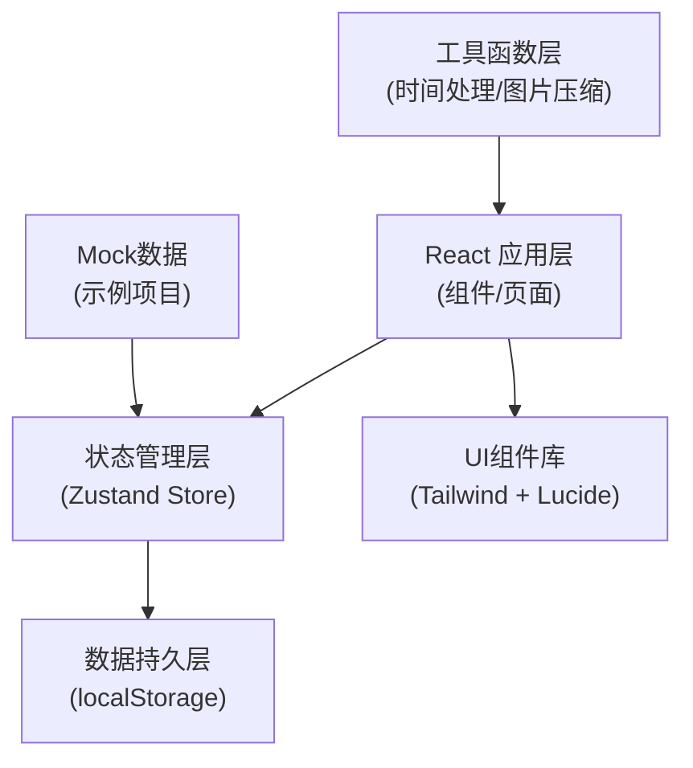
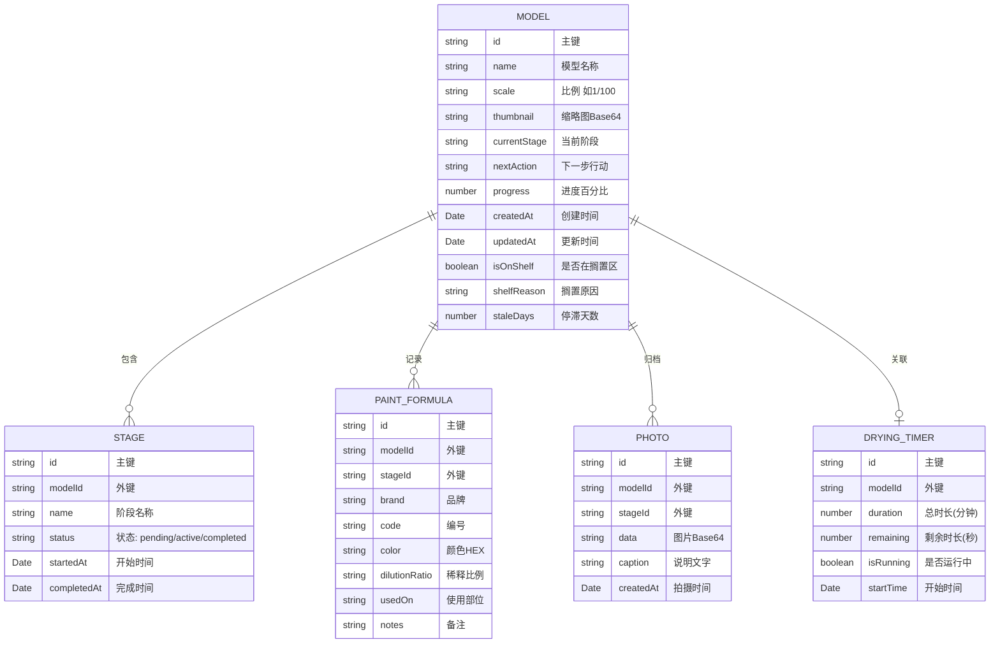

## 1. 架构设计



## 2. 技术描述

- **前端框架**：React@18 + TypeScript + Vite@5
- **样式方案**：TailwindCSS@3 + 自定义CSS变量主题
- **路由管理**：React Router@6
- **状态管理**：Zustand@4（轻量，适合本地数据存储）
- **图标库**：Lucide React
- **数据持久化**：localStorage + 自动导出备份
- **图片处理**：Canvas API 压缩 + Base64 存储

## 3. 目录结构

```
src/
├── components/          # 可复用组件
│   ├── ModelCard.tsx       # 模型卡片
│   ├── StageTimeline.tsx   # 阶段时间轴
│   ├── PaintFormula.tsx    # 颜色配方卡片
│   ├── PhotoGallery.tsx    # 照片画廊
│   ├── DryingTimer.tsx     # 干燥倒计时
│   └── Navbar.tsx          # 导航栏
├── pages/               # 页面组件
│   ├── Dashboard.tsx       # 进度看板主页
│   ├── ModelDetail.tsx     # 模型详情页
│   └── ShelfZone.tsx       # 搁置区
├── store/               # 状态管理
│   └── useModelStore.ts    # 模型数据Store
├── types/               # TypeScript类型
│   └── index.ts            # 类型定义
├── utils/               # 工具函数
│   ├── time.ts             # 时间处理
│   ├── image.ts            # 图片压缩
│   └── storage.ts          # 存储操作
├── data/                # Mock数据
│   └── mockData.ts         # 示例项目数据
├── hooks/               # 自定义Hooks
│   ├── useTimer.ts         # 倒计时Hook
│   └── useStaleCheck.ts    # 搁置检测Hook
├── App.tsx
├── main.tsx
└── index.css
```

## 4. 路由定义

| 路由 | 页面 | 功能 |
|------|------|------|
| `/` | Dashboard | 进度看板主页，展示所有模型卡片 |
| `/model/:id` | ModelDetail | 模型详情页，阶段进度、配方、照片、倒计时 |
| `/shelf` | ShelfZone | 搁置区，长时间停滞项目管理 |

## 5. 数据模型

### 5.1 数据模型定义



### 5.2 TypeScript 类型定义

```typescript
// 涂装阶段枚举
export type PaintStage = 'primer' | 'masking' | 'painting' | 'panel-lining' | 'weathering' | 'completed';

// 阶段状态
export type StageStatus = 'pending' | 'active' | 'completed';

// 搁置原因
export type ShelfReason = 'touch-up' | 'parts-missing' | 'replan' | 'other';

export interface Model {
  id: string;
  name: string;
  scale: string;
  thumbnail: string;
  currentStage: PaintStage;
  nextAction: string;
  progress: number;
  createdAt: string;
  updatedAt: string;
  isOnShelf: boolean;
  shelfReason?: ShelfReason;
  staleDays: number;
}

export interface Stage {
  id: string;
  modelId: string;
  name: PaintStage;
  status: StageStatus;
  startedAt?: string;
  completedAt?: string;
}

export interface PaintFormula {
  id: string;
  modelId: string;
  stageId: string;
  brand: string;
  code: string;
  color: string;
  dilutionRatio: string;
  usedOn: string;
  notes?: string;
}

export interface Photo {
  id: string;
  modelId: string;
  stageId: string;
  data: string;
  caption: string;
  createdAt: string;
}

export interface DryingTimer {
  id: string;
  modelId: string;
  duration: number;
  remaining: number;
  isRunning: boolean;
  startTime?: string;
}

export interface RootState {
  models: Model[];
  stages: Stage[];
  formulas: PaintFormula[];
  photos: Photo[];
  timers: DryingTimer[];
}
```

### 5.3 核心业务逻辑

1. **搁置检测机制**：
   - 应用启动时检查所有模型的 `updatedAt`
   - 若距当前时间 > 7天且未完成，自动标记 `isOnShelf = true`
   - 计算 `staleDays` 并设置默认 `shelfReason`

2. **阶段进度计算**：
   ```
   progress = (已完成阶段数 / 总阶段数) * 100
   总阶段数 = 6 (底漆→遮盖→上色→渗线→旧化→完成)
   ```

3. **倒计时持久化**：
   - 记录 `startTime` 和 `duration`
   - 页面刷新后根据当前时间重新计算 `remaining`
   - 倒计时结束触发浏览器 Notification API

4. **图片压缩存储**：
   - 使用 Canvas 将图片压缩至最大边 800px
   - 转换为 JPEG Base64，质量 0.8
   - 单张图片限制 500KB
```

## 6. 核心组件设计

| 组件名 | 主要属性 | 主要方法 |
|--------|----------|----------|
| `ModelCard` | model, onSelect, onQuickAction | 渲染卡片、快速操作按钮 |
| `StageTimeline` | stages, currentStage, onStageComplete | 时间轴渲染、阶段切换 |
| `PaintFormulaCard` | formula, onEdit, onDelete | 配方显示、颜色预览 |
| `PhotoGallery` | photos, stageFilter | 分组展示、点击放大 |
| `DryingTimer` | timer, onStart, onPause, onReset, onComplete | 倒计时逻辑、进度环 |

## 7. 性能优化点

1. 图片压缩后再存储，避免 localStorage 溢出
2. 使用 React.memo 优化卡片列表渲染
3. 倒计时使用 requestAnimationFrame 实现平滑更新
4. 搁置检测使用 Web Worker 避免阻塞主线程
5. 数据变更时自动节流保存（100ms）
