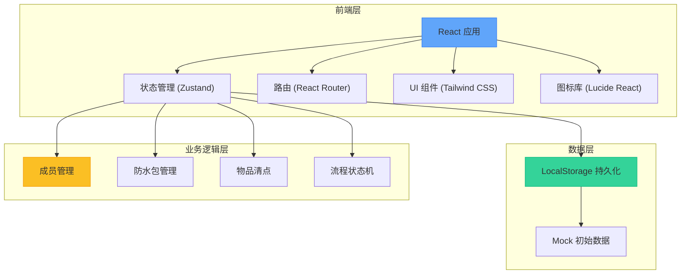
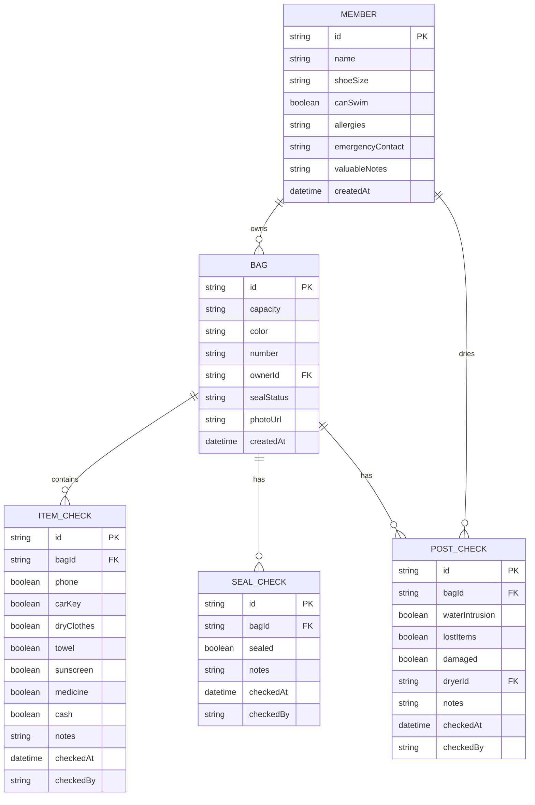

## 1. 架构设计



## 2. 技术描述

- **前端框架**：React@18 + TypeScript
- **构建工具**：Vite@5
- **路由**：react-router-dom@6
- **状态管理**：zustand@4
- **样式方案**：Tailwind CSS@3
- **图标库**：lucide-react@0.400
- **数据持久化**：LocalStorage (无后端，纯前端应用)
- **初始化工具**：vite-init

## 3. 路由定义

| 路由 | 页面 | 目的 |
|-------|------|------|
| `/` | 看板首页 | 展示未确认物品、贵重物品位置、损坏包、待晾晒清单 |
| `/members` | 成员档案 | 成员信息增删改查 |
| `/bags` | 防水包档案 | 防水包信息增删改查 |
| `/checklist` | 出发前清点 | 按包记录物品清单 |
| `/seal-check` | 入水前确认 | 二次确认防水包密封状态 |
| `/post-check` | 返程后检查 | 进水/遗失/破损检查及晾干登记 |

## 4. 数据模型

### 4.1 ER 图



### 4.2 TypeScript 类型定义

```typescript
interface Member {
  id: string;
  name: string;
  shoeSize: string;
  canSwim: boolean;
  allergies: string;
  emergencyContact: string;
  valuableNotes: string;
  createdAt: string;
}

interface Bag {
  id: string;
  capacity: string;
  color: string;
  number: string;
  ownerId: string;
  sealStatus: 'unsealed' | 'sealed' | 'confirmed' | 'damaged';
  photoUrl: string;
  createdAt: string;
}

interface ItemCheck {
  id: string;
  bagId: string;
  phone: boolean;
  carKey: boolean;
  dryClothes: boolean;
  towel: boolean;
  sunscreen: boolean;
  medicine: boolean;
  cash: boolean;
  notes: string;
  checkedAt: string | null;
  checkedBy: string | null;
}

interface SealCheck {
  id: string;
  bagId: string;
  sealed: boolean;
  notes: string;
  checkedAt: string | null;
  checkedBy: string | null;
}

interface PostCheck {
  id: string;
  bagId: string;
  waterIntrusion: boolean;
  lostItems: boolean;
  damaged: boolean;
  dryerId: string | null;
  notes: string;
  checkedAt: string | null;
  checkedBy: string | null;
}
```

### 4.3 初始 Mock 数据

```typescript
const mockMembers: Member[] = [
  {
    id: 'm1',
    name: '张三',
    shoeSize: '42',
    canSwim: true,
    allergies: '无',
    emergencyContact: '李四 13800138001',
    valuableNotes: 'iPhone 15 Pro、车钥匙',
    createdAt: '2024-06-20T10:00:00Z'
  },
  {
    id: 'm2',
    name: '李四',
    shoeSize: '39',
    canSwim: false,
    allergies: '青霉素过敏',
    emergencyContact: '张三 13900139001',
    valuableNotes: '华为 Mate 60',
    createdAt: '2024-06-20T10:01:00Z'
  }
];

const mockBags: Bag[] = [
  {
    id: 'b1',
    capacity: '20L',
    color: '蓝色',
    number: '001',
    ownerId: 'm1',
    sealStatus: 'sealed',
    photoUrl: '',
    createdAt: '2024-06-20T10:00:00Z'
  },
  {
    id: 'b2',
    capacity: '15L',
    color: '橙色',
    number: '002',
    ownerId: 'm2',
    sealStatus: 'unsealed',
    photoUrl: '',
    createdAt: '2024-06-20T10:01:00Z'
  }
];
```

## 5. 状态管理设计

### 5.1 Store 结构

```typescript
interface AppState {
  members: Member[];
  bags: Bag[];
  itemChecks: ItemCheck[];
  sealChecks: SealCheck[];
  postChecks: PostCheck[];
  
  // Member actions
  addMember: (member: Omit<Member, 'id' | 'createdAt'>) => void;
  updateMember: (id: string, member: Partial<Member>) => void;
  deleteMember: (id: string) => void;
  
  // Bag actions
  addBag: (bag: Omit<Bag, 'id' | 'createdAt'>) => void;
  updateBag: (id: string, bag: Partial<Bag>) => void;
  deleteBag: (id: string) => void;
  
  // Check actions
  updateItemCheck: (bagId: string, items: Partial<ItemCheck>) => void;
  confirmItemCheck: (bagId: string, checkedBy: string) => void;
  confirmSealCheck: (bagId: string, sealed: boolean, checkedBy: string, notes?: string) => void;
  submitPostCheck: (bagId: string, check: Partial<PostCheck>, checkedBy: string) => void;
  
  // Derived data
  getUnconfirmedItems: () => Bag[];
  getValuablesLocation: () => Array<{member: Member, bag: Bag, items: string[]}>;
  getDamagedBags: () => Array<{bag: Bag, issue: string}>;
  getDryingList: () => Array<{bag: Bag, dryer: Member | null}>;
}
```

## 6. 项目结构

```
src/
├── components/          # 通用组件
│   ├── Layout.tsx       # 页面布局
│   ├── Sidebar.tsx      # 侧边导航
│   ├── Header.tsx       # 顶部标题
│   ├── StatCard.tsx     # 统计卡片
│   ├── MemberForm.tsx   # 成员表单
│   ├── BagForm.tsx      # 防水包表单
│   └── StatusBadge.tsx  # 状态徽章
├── pages/               # 页面组件
│   ├── Dashboard.tsx    # 看板首页
│   ├── Members.tsx      # 成员档案
│   ├── Bags.tsx         # 防水包档案
│   ├── Checklist.tsx    # 出发前清点
│   ├── SealCheck.tsx    # 入水前确认
│   └── PostCheck.tsx    # 返程后检查
├── store/               # 状态管理
│   └── useStore.ts      # Zustand store
├── types/               # 类型定义
│   └── index.ts         # 所有类型
├── utils/               # 工具函数
│   └── storage.ts       # LocalStorage 操作
├── data/                # Mock 数据
│   └── mockData.ts      # 初始数据
├── App.tsx              # 根组件
├── main.tsx             # 入口文件
└── index.css            # 全局样式
```

## 7. 核心业务规则

1. **物品清点规则**：
   - 每个防水包对应一份物品清单
   - 所有物品必须勾选确认后才能进入下一步
   - 贵重物品（手机、车钥匙、现金）需要特别标记

2. **密封状态流转**：
   - unsealed → 未密封（初始状态）
   - sealed → 已密封（出发前清点后）
   - confirmed → 已二次确认（入水前检查后）
   - damaged → 已损坏（返程后检查发现问题）

3. **数据一致性**：
   - 删除成员前需检查是否有关联的防水包
   - 删除防水包前需检查是否有关联的检查记录
   - 所有操作自动持久化到 LocalStorage
