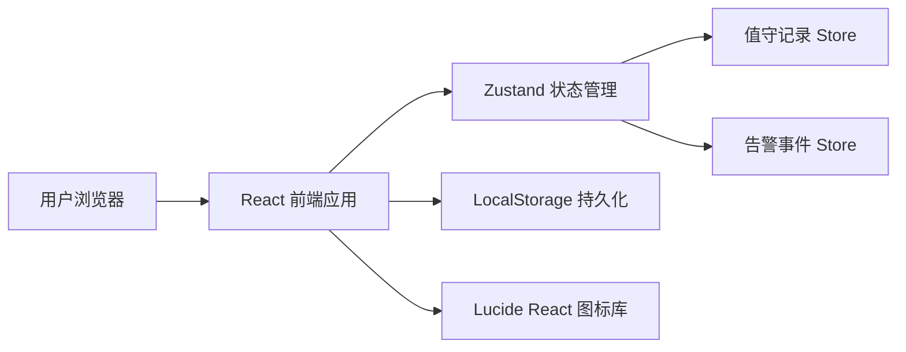

## 1. 架构设计



## 2. 技术描述
- 前端：React@18 + TypeScript + Vite@5
- 样式：TailwindCSS@3
- 状态管理：Zustand@4
- 图标：Lucide React
- 初始化工具：vite-init
- 后端：无（纯前端模拟，使用 LocalStorage 存储）
- 数据库：无（前端 Mock 数据 + LocalStorage）

## 3. 路由定义
| 路由 | 用途 |
|-------|---------|
| / | 值守记录主页（含表单、异常提示、时间线） |

## 4. 数据模型

### 4.1 类型定义

```typescript
// 风向枚举
type WindDirection = 'N' | 'NE' | 'E' | 'SE' | 'S' | 'SW' | 'W' | 'NW';

// 海况等级 (0-9 蒲福氏浪级)
type SeaState = 0 | 1 | 2 | 3 | 4 | 5 | 6 | 7 | 8 | 9;

// 告警级别
type AlertLevel = 'info' | 'warning' | 'critical';

// 告警类型
type AlertType = 'interval_abnormal' | 'power_switch' | 'condensation' | 'maintenance';

// 处理状态
type ProcessStatus = 'pending' | 'processing' | 'resolved';

// 船只反馈
type VesselFeedback = 'positive' | 'negative' | 'none';

// 值守记录
interface DutyRecord {
  id: string;
  timestamp: number;
  visibility: number;          // 能见度（米）
  windDirection: WindDirection;
  windSpeed: number;           // 风速（节）
  seaState: SeaState;
  lightPeriod: number;         // 灯光周期（秒）
  lightPeriodNormal: boolean;  // 灯光周期是否正常
  fogInterval: number;         // 雾号间隔（秒）
  fogIntervalNormal: boolean;  // 雾号间隔是否正常
  vesselFeedback: VesselFeedback;
  vesselCount: number;         // 反馈船只数量
  remarks?: string;
}

// 告警事件
interface AlertEvent {
  id: string;
  timestamp: number;
  type: AlertType;
  level: AlertLevel;
  title: string;
  description: string;
  status: ProcessStatus;
  relatedRecordId?: string;
  handler?: string;
  resolvedAt?: number;
  resolution?: string;
}

// 维护工单
interface MaintenanceOrder {
  id: string;
  createdAt: number;
  equipment: string;
  issue: string;
  priority: 'low' | 'medium' | 'high';
  status: 'open' | 'in_progress' | 'completed';
}

// 汇总统计
interface ShiftSummary {
  recordCount: number;
  alertCount: number;
  criticalAlertCount: number;
  unresolvedAlertCount: number;
  maintenanceOrderCount: number;
  avgVisibility: number;
  minVisibility: number;
}
```

### 4.2 常量定义

```typescript
// 标准灯光周期范围（秒）
const NORMAL_LIGHT_PERIOD = { min: 2, max: 10 };

// 标准雾号间隔范围（秒）
const NORMAL_FOG_INTERVAL = { min: 30, max: 120 };

// 异常能见度阈值（米）
const VISIBILITY_THRESHOLD = 1000;

// 结露湿度阈值（%）
const CONDENSATION_HUMIDITY_THRESHOLD = 85;
```

## 5. 组件结构

```
src/
├── components/
│   ├── DutyForm.tsx           # 值守记录表单
│   ├── AlertPanel.tsx         # 异常提示面板
│   ├── AlertTimeline.tsx      # 告警时间线
│   ├── SummaryCards.tsx       # 数据汇总卡
│   ├── MaintenanceModal.tsx   # 维护工单弹窗
│   └── RecordList.tsx         # 历史记录列表
├── store/
│   └── useDutyStore.ts        # Zustand 状态管理
├── utils/
│   ├── constants.ts           # 常量定义
│   ├── types.ts               # 类型定义
│   ├── alertDetector.ts       # 异常检测逻辑
│   └── helpers.ts             # 辅助函数
├── pages/
│   └── DutyDashboard.tsx      # 主页面
└── App.tsx                    # 应用入口
```

## 6. 核心业务逻辑

### 6.1 异常检测规则
1. **异常间隔检测**：灯光周期或雾号间隔超出标准范围时触发 `interval_abnormal` 告警
2. **备用电源检测**：手动标记切换时触发 `power_switch` 告警
3. **设备结露检测**：环境湿度 > 85% 或能见度 < 500m 持续超过30分钟触发 `condensation` 告警
4. **维护工单触发**：连续3次异常或值守员手动提交时创建 `maintenance` 工单

### 6.2 时间线排序规则
- 按时间戳倒序排列（最新在前）
- 同级告警优先显示未处理的
- 支持按类型和级别筛选
