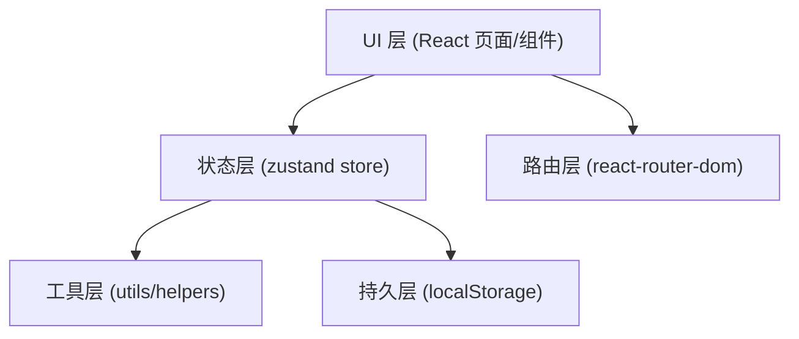

## 1. 架构设计
纯前端 React 单页应用，使用 zustand 进行全局状态管理，localStorage 持久化数据。图表使用纯 SVG/CSS 实现，无需额外图表库。



## 2. 技术描述
- **前端框架**：React@18 + TypeScript@5
- **构建工具**：Vite@5
- **样式方案**：TailwindCSS@3
- **状态管理**：Zustand@4
- **路由**：React Router DOM@6
- **图标**：lucide-react
- **数据持久化**：localStorage（封装带命名空间的存取工具）
- **初始化模板**：react-ts（纯前端，无后端）
- **Mock 数据**：内置 15+ 条故障工单、8 栋楼、30+ 台电梯的模拟数据

## 3. 路由定义
| Route | 页面 | 用途 |
|-------|------|------|
| `/` | Dashboard | 首页故障看板，按状态分组展示 |
| `/report` | ReportFault | 故障上报表单页 |
| `/fault/:id` | FaultDetail | 故障详情+物业处理操作 |
| `/statistics` | Statistics | 统计分析页 |
| `/subscribe` | Subscribe | 楼栋订阅管理页 |

## 4. 类型定义（shared）

```typescript
// 故障状态枚举
type FaultStatus = 'urgent' | 'processing' | 'waiting_parts' | 'recovered' | 'repeated';

// 故障现象类型
type FaultPhenomenon = 
  | 'door_stuck'       // 门卡/打不开
  | 'not_moving'       // 不运行
  | 'strange_noise'    // 异响
  | 'button_fault'     // 按键失灵
  | 'light_out'        // 灯不亮
  | 'air_condition'    // 空调/通风故障
  | 'display_error'    // 显示错误
  | 'other';           // 其他

// 电梯标识
interface ElevatorId {
  building: string;      // 楼栋号 'A1' / '3栋'
  unit: string;          // 单元号
  elevatorNo: string;    // 电梯编号 '1号梯' / 'L1'
  floorCount?: number;   // 总楼层数（判断是否高层）
}

// 状态时间线节点
interface StatusTimeline {
  status: FaultStatus;
  timestamp: number;
  operator?: string;     // 操作人
  remark?: string;       // 备注
}

// 故障工单主模型
interface FaultTicket {
  id: string;
  elevator: ElevatorId;
  phenomenon: FaultPhenomenon;
  description: string;           // 故障现象描述
  hasTrapped: boolean;           // 是否有人被困
  trappedCount?: number;         // 被困人数
  photos: string[];              // 照片 base64 / URL
  occurredAt: number;            // 发生时间
  reportedBy: string;            // 上报人
  reportedAt: number;            // 上报时间
  status: FaultStatus;
  handler?: string;              // 维修师傅
  estimatedRecoverAt?: number;   // 预计恢复时间
  detourTip?: string;            // 绕行提示
  timeline: StatusTimeline[];
  recoveredAt?: number;          // 实际恢复时间
  repeatedCount?: number;        // 该电梯历史重复次数
}

// 楼栋订阅
interface BuildingSubscription {
  buildings: string[];           // 订阅的楼栋号列表
  notifyOnRecovered: boolean;    // 恢复时通知
  notifyOnStatusChange: boolean; // 任意状态变更通知
}

// 用户角色
type UserRole = 'resident' | 'property';

// 统计数据模型（计算得出）
interface StatisticsData {
  topFaultElevators: { elevator: ElevatorId; count: number }[];
  avgRecoveryTime: number;              // 平均恢复分钟
  statusDuration: Record<FaultStatus, number>;  // 各状态耗时
  repeatedFaultTypes: { phenomenon: FaultPhenomenon; count: number }[];
  buildingFaultCounts: { building: string; count: number }[];
  monthlyTrend: { month: string; count: number }[];
}
```

## 5. 状态管理（Zustand Store）

```typescript
// Store 结构
interface AppState {
  // 数据
  tickets: FaultTicket[];
  currentRole: UserRole;
  subscriptions: BuildingSubscription;
  notifications: { id: string; ticketId: string; message: string; read: boolean }[];
  
  // 操作
  addTicket: (data: Omit<FaultTicket, 'id' | 'reportedAt' | 'status' | 'timeline'>) => string;
  updateStatus: (id: string, status: FaultStatus, update: Partial<FaultTicket>) => void;
  toggleRole: () => void;
  toggleBuildingSubscribe: (building: string) => void;
  markNotificationRead: (id: string) => void;
  
  // 查询
  getTicketById: (id: string) => FaultTicket | undefined;
  getFilteredTickets: (status?: FaultStatus) => FaultTicket[];
  computeStatistics: () => StatisticsData;
}
```

## 6. 项目目录结构

```
src/
├── components/          # 可复用组件
│   ├── FaultCard.tsx          # 故障卡片
│   ├── StatusBadge.tsx        # 状态标签
│   ├── StatusTimeline.tsx     # 时间线组件
│   ├── ElevatorSelector.tsx   # 楼栋电梯选择器
│   ├── RoleSwitcher.tsx       # 角色切换
│   ├── NotifyToast.tsx        # 通知提示
│   └── NavBar.tsx             # 顶部导航
├── pages/               # 页面组件
│   ├── Dashboard.tsx          # 首页看板
│   ├── ReportFault.tsx        # 故障上报
│   ├── FaultDetail.tsx        # 故障详情
│   ├── Statistics.tsx         # 统计分析
│   └── Subscribe.tsx          # 订阅管理
├── store/               # zustand 状态
│   └── index.ts
├── shared/              # 共享类型与常量
│   ├── types.ts
│   └── constants.ts          # 楼栋列表、故障现象映射等
├── utils/               # 工具函数
│   ├── storage.ts            # localStorage 封装
│   ├── time.ts               # 时间格式化/相对时间
│   ├── mock.ts               // 初始 mock 数据
│   └── statistics.ts         # 统计计算函数
├── App.tsx
├── main.tsx
└── index.css
```

## 7. 排序规则（首页）
故障列表排序优先级（降序）：
1. **hasTrapped === true**（有人被困 → 最高优先）
2. **floorCount >= 20**（高层停运 → 次高优先）
3. **status === 'urgent'** → 'processing' → 'waiting_parts' → 'recovered'
4. **occurredAt** 时间倒序（最新的先展示）
5. **repeatedCount** 倒序（反复故障靠前）
