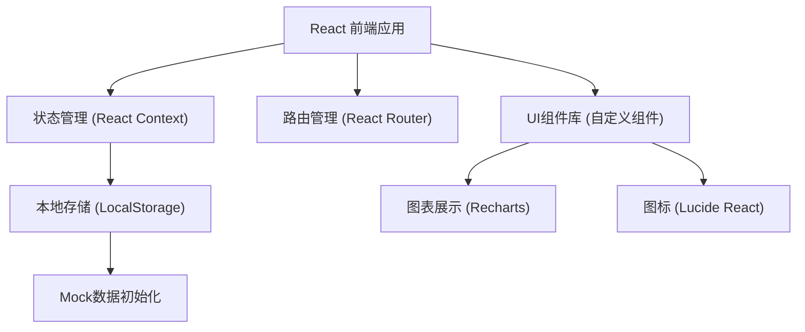
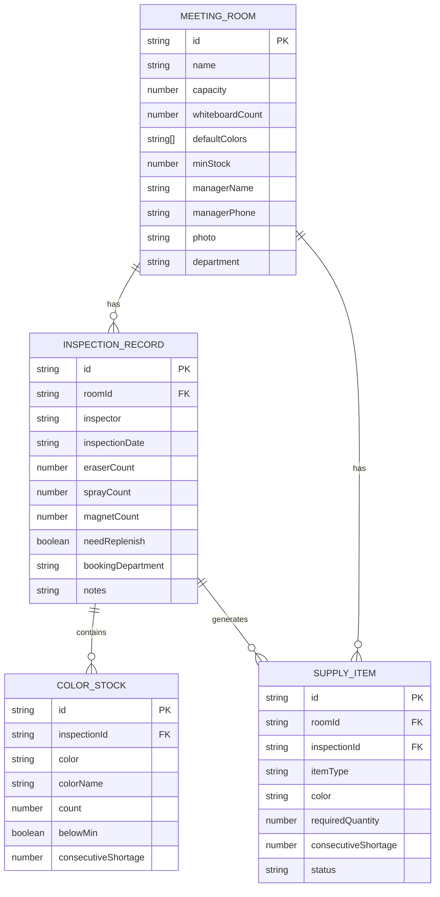

## 1. 架构设计



## 2. 技术描述
- 前端：React@18 + TypeScript + Vite
- 样式：TailwindCSS@3
- 状态管理：React Context + useReducer
- 路由：React Router DOM@6
- 图表：Recharts@2
- 图标：Lucide React
- 数据持久化：LocalStorage（本地存储模拟后端）
- 构建工具：Vite@5

## 3. 路由定义
| Route | Purpose |
|-------|---------|
| / | 仪表盘首页 - 总览数据统计 |
| /rooms | 会议室档案 - 会议室列表和管理 |
| /rooms/new | 新增会议室档案 |
| /rooms/:id/edit | 编辑会议室档案 |
| /inspection | 巡检记录 - 快速录入界面 |
| /inspection/history | 巡检历史记录 |
| /supply | 补给清单 - 预警和补货管理 |
| /statistics | 统计分析 - 消耗排名、部门分析、采购建议 |

## 4. 数据类型定义

```typescript
// 会议室档案
interface MeetingRoom {
  id: string;
  name: string;           // 房间名
  capacity: number;       // 容量
  whiteboardCount: number;// 白板数量
  defaultColors: string[]; // 默认配色 ['black', 'blue', 'red', 'green']
  minStock: number;       // 最低库存（每种颜色）
  managerName: string;    // 负责人
  managerPhone: string;   // 负责人电话
  photo: string;          // 照片URL
  department: string;     // 所属部门
  createdAt: string;
  updatedAt: string;
}

// 颜色库存记录
interface ColorStock {
  color: string;          // 颜色标识
  colorName: string;      // 颜色名称
  count: number;          // 可用支数
  belowMin: boolean;      // 是否低于最低库存
  consecutiveShortage: number; // 连续缺货次数
}

// 巡检记录
interface InspectionRecord {
  id: string;
  roomId: string;
  roomName: string;
  inspector: string;      // 巡检人
  inspectionDate: string; // 巡检日期
  colorStocks: ColorStock[]; // 各颜色库存
  eraserCount: number;    // 橡皮数量
  eraserBelowMin: boolean;
  sprayCount: number;     // 清洁喷雾数量
  sprayBelowMin: boolean;
  magnetCount: number;    // 磁贴数量
  magnetBelowMin: boolean;
  needReplenish: boolean; // 是否需要补货
  notes: string;          // 备注
  bookingDepartment: string; // 预约部门
  createdAt: string;
}

// 补给清单
interface SupplyItem {
  id: string;
  roomId: string;
  roomName: string;
  itemType: 'marker' | 'eraser' | 'spray' | 'magnet';
  color?: string;         // 仅marker有颜色
  colorName?: string;
  requiredQuantity: number; // 需要补货数量
  consecutiveShortage: number; // 连续缺货次数
  status: 'pending' | 'ordered' | 'completed';
  createdAt: string;
  completedAt?: string;
}

// 采购建议
interface PurchaseSuggestion {
  itemType: 'marker' | 'eraser' | 'spray' | 'magnet';
  color?: string;
  colorName?: string;
  totalRequired: number;  // 总需求数量
  bufferStock: number;    // 缓冲库存
  suggestedPurchase: number; // 建议采购数量
  roomsNeeding: string[]; // 需要的会议室列表
}

// 部门统计
interface DepartmentStat {
  department: string;
  bookingCount: number;   // 预约次数
  shortageCount: number;  // 缺货次数
  shortageRate: number;   // 缺货率
  mostMissingItem: string; // 最常缺的耗材
}

// 消耗统计
interface ConsumptionStat {
  roomId: string;
  roomName: string;
  totalInspections: number;
  totalShortages: number;
  shortageRate: number;
  averageConsumptionPerWeek: number; // 每周平均消耗
}
```

## 5. 数据模型 ER图



## 6. 核心业务逻辑

### 6.1 库存预警逻辑
```typescript
function checkStockLevel(count: number, minStock: number): boolean {
  return count < minStock;
}

function calculateConsecutiveShortage(
  currentRoomId: string,
  currentColor: string,
  allRecords: InspectionRecord[]
): number {
  let consecutive = 0;
  const roomRecords = allRecords
    .filter(r => r.roomId === currentRoomId)
    .sort((a, b) => new Date(b.createdAt).getTime() - new Date(a.createdAt).getTime());
  
  for (const record of roomRecords) {
    const colorStock = record.colorStocks.find(cs => cs.color === currentColor);
    if (colorStock && colorStock.belowMin) {
      consecutive++;
    } else {
      break;
    }
  }
  return consecutive;
}
```

### 6.2 采购建议计算逻辑
```typescript
function generatePurchaseSuggestion(
  pendingItems: SupplyItem[],
  consumptionStats: ConsumptionStat[],
  bufferWeeks: number = 2
): PurchaseSuggestion[] {
  // 按物品类型和颜色分组汇总
  // 加上基于历史消耗的缓冲库存
  // 输出最终采购建议
}
```

### 6.3 Mock 数据结构
- 初始化5-6个会议室数据
- 生成最近2周的巡检历史记录（每会议室3-5条）
- 预置部分连续缺货场景用于演示红色标记功能
- 各部门预约记录用于统计分析
