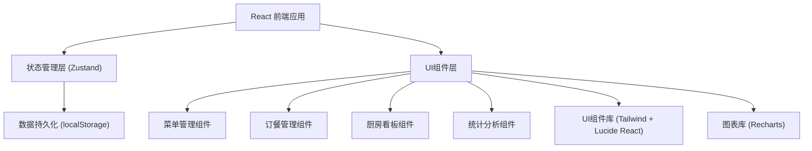
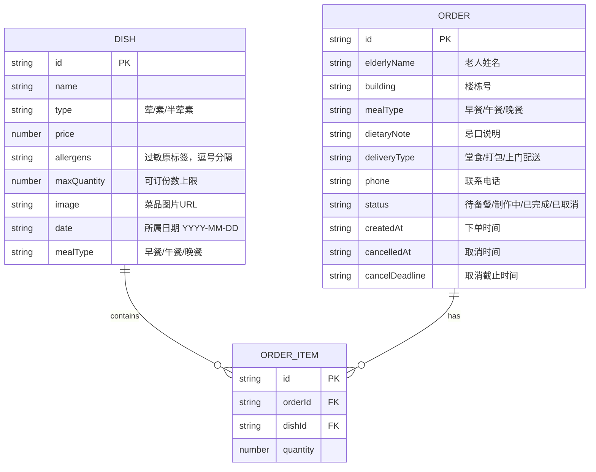

## 1. 架构设计



## 2. 技术说明

- **前端框架**：React@18 + TypeScript@5
- **构建工具**：Vite@5
- **样式方案**：Tailwind CSS@3（原子化CSS）
- **状态管理**：Zustand（轻量级状态管理，支持持久化）
- **路由方案**：React Router DOM@6
- **图表组件**：Recharts（React生态图表库）
- **图标库**：Lucide React
- **后端方案**：无后端，使用 localStorage + Mock 数据实现本地持久化
- **数据存储**：localStorage（浏览器本地存储）

## 3. 路由定义

| 路由 | 页面 | 用途 |
|------|------|------|
| / | 仪表盘/统计总览 | 今日数据概览、快捷入口 |
| /menu | 菜单管理 | 每日菜单维护、菜品CRUD |
| /orders | 订餐管理 | 订单列表、新建/取消订单 |
| /kitchen | 厨房看板 | 三栏出餐看板、状态流转 |
| /stats | 数据统计 | 详细统计分析、图表展示 |

## 4. 数据模型

### 4.1 实体关系图



### 4.2 TypeScript 类型定义

```typescript
// 菜品类型
interface Dish {
  id: string;
  name: string;
  type: 'meat' | 'vegetarian' | 'mixed'; // 荤/素/半荤素
  price: number;
  allergens: string[]; // 过敏原标签列表
  maxQuantity: number; // 可订份数上限
  image: string; // 菜品图片URL
  date: string; // 所属日期 YYYY-MM-DD
  mealType: 'breakfast' | 'lunch' | 'dinner';
}

// 订单类型
type OrderStatus = 'pending' | 'cooking' | 'completed' | 'cancelled';
type DeliveryType = 'dine_in' | 'takeaway' | 'delivery';
type MealType = 'breakfast' | 'lunch' | 'dinner';

interface Order {
  id: string;
  elderlyName: string;
  building: string;
  mealType: MealType;
  dietaryNote: string;
  deliveryType: DeliveryType;
  phone: string;
  status: OrderStatus;
  items: OrderItem[];
  createdAt: string;
  cancelledAt?: string;
  cancelDeadline: string;
}

interface OrderItem {
  dishId: string;
  dishName: string;
  quantity: number;
}
```

### 4.3 初始Mock数据

- 预置3天的菜单数据（每天早中晚各3-5个菜品）
- 预置当日15-20个示例订单，覆盖三种配送方式
- 预置最近7天的历史订单用于统计展示
