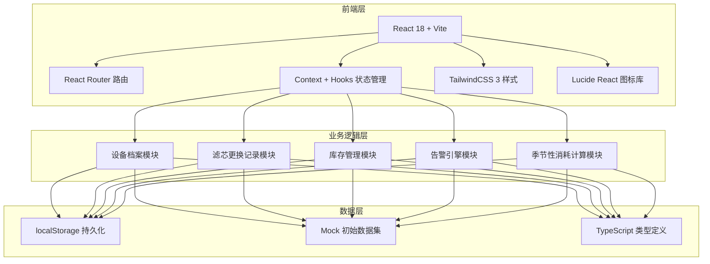
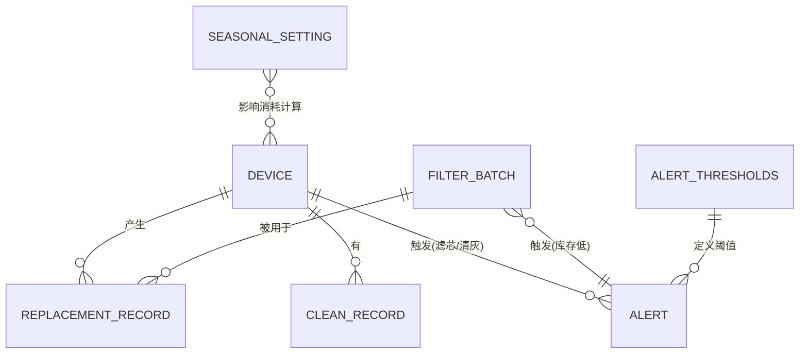

## 1. 架构设计



## 2. 技术描述

- **前端框架**：React 18.3 + TypeScript 5.4
- **构建工具**：Vite 5.2（HMR 热更新，极速冷启动）
- **路由方案**：React Router DOM 6.23（SPA 多页面导航）
- **样式方案**：TailwindCSS 3.4（原子化 CSS + 自定义主题色扩展）
- **图标库**：Lucide React（轻量 SVG 线性图标，符合设计规范）
- **状态管理**：React Context + useReducer（全局共享设备/库存/告警状态）
- **数据持久化**：localStorage（JSON 序列化，自动读写）
- **日期处理**：原生 Date API + dayjs（轻量日期计算工具包）
- **后端**：无后端，纯前端 Mock 数据驱动
- **数据库**：localStorage 模拟，首次加载注入 Mock 数据

## 3. 路由定义

| 路由 | 页面 | 核心模块 |
|------|------|----------|
| `/` | 首页仪表盘 | 空气状态卡片、更换倒计时、库存缺口、异常时间线 |
| `/devices` | 设备档案页 | 设备卡片列表、详情抽屉、新增/编辑表单 |
| `/replacements` | 更换记录页 | 更换向导表单、历史记录表、筛选器 |
| `/inventory` | 库存管理页 | 库存看板、入库/出库操作、批次详情 |
| `/settings` | 告警设置页 | 季节提醒配置、告警阈值配置、开关切换 |

## 4. API 定义（Mock 接口层）

```typescript
// 实体类型定义

interface Device {
  id: string;
  room: string;              // 房间名称
  model: string;             // 型号
  area: number;              // 适用面积 ㎡
  filterSpec: string;        // 滤芯规格
  purchaseDate: string;      // 购买日期 YYYY-MM-DD
  photo: string;             // 设备照片 URL
  lastCleanDate: string;     // 上次清灰日期
  expectedFilterDays: number;// 滤芯标准寿命（天）
  currentFilterStartDate: string; // 当前滤芯安装日期
  pm25: number;              // 当前 PM2.5
  airQuality: 'excellent' | 'good' | 'moderate' | 'poor' | 'severe';
  odorLevel: 0 | 1 | 2 | 3;  // 异味等级 0-3
}

interface ReplacementRecord {
  id: string;
  deviceId: string;
  deviceName: string;
  oldFilterDays: number;     // 旧滤芯使用天数
  newFilterBatch: string;    // 新滤芯批次号
  newFilterSpec: string;     // 新滤芯规格
  installer: string;         // 安装人
  remainingStock: number;    // 更换后剩余库存
  date: string;              // 更换日期 YYYY-MM-DD
  note?: string;             // 备注
}

interface FilterBatch {
  id: string;
  batchNo: string;           // 批次号
  spec: string;              // 滤芯规格
  quantity: number;          // 当前数量
  purchaseDate: string;      // 入库日期
  supplier?: string;         // 供应商
}

interface Alert {
  id: string;
  type: 'filter_expiring' | 'stock_low' | 'clean_needed';
  level: 'warning' | 'danger';
  deviceId?: string;         // 关联设备（滤芯/清灰告警）
  filterSpec?: string;       // 关联规格（库存告警）
  message: string;
  triggeredAt: string;
  resolved: boolean;
}

interface CleanRecord {
  id: string;
  deviceId: string;
  date: string;
  operator: string;
  note?: string;
}

interface SeasonalSetting {
  type: 'pet_shedding' | 'pollen';
  enabled: boolean;
  startMonth: number;        // 1-12
  endMonth: number;          // 1-12
  consumptionFactor: number; // 消耗加速倍率 1.0-2.0
}

interface AlertThresholds {
  filterExpiringDays: number;   // 滤芯临期天数
  safeStockPerSpec: number;     // 每规格安全库存
  cleanReminderDays: number;    // 清灰提醒间隔
  pm25AccelerateThreshold: number; // PM2.5 加速阈值
  odorAccelerateLevel: number;  // 异味加速阈值
}

// Mock Service 方法签名
interface DataStore {
  // 设备 CRUD
  getDevices(): Device[];
  getDevice(id: string): Device | undefined;
  addDevice(d: Omit<Device, 'id'>): Device;
  updateDevice(id: string, patch: Partial<Device>): Device;
  deleteDevice(id: string): void;
  markCleaned(deviceId: string, operator: string): CleanRecord;

  // 更换记录
  getReplacementRecords(): ReplacementRecord[];
  addReplacement(r: Omit<ReplacementRecord, 'id'>): ReplacementRecord;

  // 库存
  getFilterBatches(): FilterBatch[];
  addStockBatch(b: Omit<FilterBatch, 'id'>): FilterBatch;
  deductStock(spec: string, batchNo: string, qty: number): FilterBatch | null;

  // 告警
  getAlerts(): Alert[];
  resolveAlert(id: string): void;
  recomputeAlerts(): Alert[];  // 遍历设备+库存，生成告警列表

  // 设置
  getSeasonalSettings(): SeasonalSetting[];
  updateSeasonalSettings(settings: SeasonalSetting[]): void;
  getAlertThresholds(): AlertThresholds;
  updateAlertThresholds(t: Partial<AlertThresholds>): AlertThresholds;

  // 工具方法
  getRemainingFilterDays(deviceId: string): number;
  getFilterPercent(deviceId: string): number;
  getTotalStockBySpec(spec: string): number;
  isInSeason(type: 'pet_shedding' | 'pollen'): boolean;
  getConsumptionMultiplier(deviceId: string): number;
}
```

## 5. 服务器架构

无后端服务器，纯前端架构。数据通过 localStorage 持久化，初始化时注入 Mock 数据集。

## 6. 数据模型

### 6.1 实体关系图



### 6.2 Mock 初始数据

```typescript
// 初始设备 3 台（客厅、卧室、儿童房）
const mockDevices: Device[] = [
  {
    id: 'dev-001',
    room: '客厅',
    model: '米家空气净化器 4 Pro',
    area: 60,
    filterSpec: '米家 Pro-H 滤芯',
    purchaseDate: '2024-03-15',
    photo: 'https://trae-api-cn.mchost.guru/api/ide/v1/text_to_image?prompt=modern%20air%20purifier%20in%20living%20room%20corner%20white%20minimalist&image_size=square',
    lastCleanDate: '2026-04-10',
    expectedFilterDays: 180,
    currentFilterStartDate: '2026-02-01',
    pm25: 35,
    airQuality: 'good',
    odorLevel: 0,
  },
  {
    id: 'dev-002',
    room: '主卧室',
    model: 'Blueair 280i',
    area: 28,
    filterSpec: 'Blueair SmokeStop 复合型',
    purchaseDate: '2023-11-20',
    photo: 'https://trae-api-cn.mchost.guru/api/ide/v1/text_to_image?prompt=scandinavian%20style%20blueair%20air%20purifier%20in%20bedroom&image_size=square',
    lastCleanDate: '2026-05-01',
    expectedFilterDays: 240,
    currentFilterStartDate: '2026-01-15',
    pm25: 12,
    airQuality: 'excellent',
    odorLevel: 0,
  },
  {
    id: 'dev-003',
    room: '儿童房',
    model: '352 X86C',
    area: 35,
    filterSpec: '352 X86 除醛加强版',
    purchaseDate: '2024-07-08',
    photo: 'https://trae-api-cn.mchost.guru/api/ide/v1/text_to_image?prompt=colorful%20kids%20room%20with%20cute%20air%20purifier&image_size=square',
    lastCleanDate: '2026-03-20',
    expectedFilterDays: 210,
    currentFilterStartDate: '2026-05-20',
    pm25: 22,
    airQuality: 'excellent',
    odorLevel: 1,
  },
];

// 初始滤芯库存（3 个规格，若干批次）
const mockBatches: FilterBatch[] = [
  { id: 'bat-001', batchNo: 'MH-2026-0105', spec: '米家 Pro-H 滤芯', quantity: 1, purchaseDate: '2026-01-05', supplier: '京东自营' },
  { id: 'bat-002', batchNo: 'MH-2026-0312', spec: '米家 Pro-H 滤芯', quantity: 2, purchaseDate: '2026-03-12', supplier: '小米商城' },
  { id: 'bat-003', batchNo: 'BL-2025-1120', spec: 'Blueair SmokeStop 复合型', quantity: 0, purchaseDate: '2025-11-20', supplier: '天猫旗舰店' },
  { id: 'bat-004', batchNo: '352-2026-0228', spec: '352 X86 除醛加强版', quantity: 3, purchaseDate: '2026-02-28', supplier: '官方商城' },
];

// 初始季节设置
const mockSeasonal: SeasonalSetting[] = [
  { type: 'pet_shedding', enabled: true, startMonth: 3, endMonth: 5, consumptionFactor: 1.5 },
  { type: 'pollen', enabled: true, startMonth: 3, endMonth: 6, consumptionFactor: 1.3 },
];

// 初始告警阈值
const mockThresholds: AlertThresholds = {
  filterExpiringDays: 15,
  safeStockPerSpec: 2,
  cleanReminderDays: 60,
  pm25AccelerateThreshold: 75,
  odorAccelerateLevel: 2,
};

// 初始更换记录
const mockReplacements: ReplacementRecord[] = [
  {
    id: 'rep-001',
    deviceId: 'dev-001',
    deviceName: '客厅-米家 4 Pro',
    oldFilterDays: 172,
    newFilterBatch: 'MH-2026-0105',
    newFilterSpec: '米家 Pro-H 滤芯',
    installer: '爸爸',
    remainingStock: 3,
    date: '2026-02-01',
    note: '春节前更换',
  },
  {
    id: 'rep-002',
    deviceId: 'dev-002',
    deviceName: '主卧室-Blueair 280i',
    oldFilterDays: 235,
    newFilterBatch: 'BL-2025-1120',
    newFilterSpec: 'Blueair SmokeStop 复合型',
    installer: '妈妈',
    remainingStock: 1,
    date: '2026-01-15',
  },
];

// 初始清灰记录
const mockCleanRecords: CleanRecord[] = [
  { id: 'cln-001', deviceId: 'dev-001', date: '2026-04-10', operator: '爸爸', note: '擦拭进风口+清理传感器' },
  { id: 'cln-002', deviceId: 'dev-003', date: '2026-03-20', operator: '妈妈' },
];
```

### 6.3 告警计算逻辑伪代码

```
函数 recomputeAlerts():
  清空未解决告警
  阈值 = getAlertThresholds()

  对于每个设备 device:
    剩余天数 = getRemainingFilterDays(device.id)
    若 剩余天数 ≤ 阈值.filterExpiringDays:
      新增告警(type='filter_expiring', deviceId=device.id, level=剩余天数≤7 ? 'danger' : 'warning')

    距清灰天数 = TODAY - device.lastCleanDate
    若 距清灰天数 > 阈值.cleanReminderDays:
      新增告警(type='clean_needed', deviceId=device.id, level='warning')

  统计每种滤芯规格 spec 的总库存 totalStock:
    若 totalStock < 阈值.safeStockPerSpec:
      新增告警(type='stock_low', filterSpec=spec, level=totalStock===0 ? 'danger' : 'warning')

  返回告警列表
```

### 6.4 消耗倍率计算逻辑

```
函数 getConsumptionMultiplier(deviceId):
  device = getDevice(deviceId)
  倍率 = 1.0

  // 季节因素
  settings = getSeasonalSettings()
  若 settings.pet_shedding.enabled 且 在宠物季:
    倍率 *= settings.pet_shedding.consumptionFactor
  若 settings.pollen.enabled 且 在花粉季:
    倍率 *= settings.pollen.consumptionFactor

  // PM2.5 因素
  若 device.pm25 > 阈值.pm25AccelerateThreshold:
    倍率 *= 1.4

  // 异味因素
  若 device.odorLevel ≥ 阈值.odorAccelerateLevel:
    倍率 *= 1.3

  返回 min(倍率, 2.5)
```
