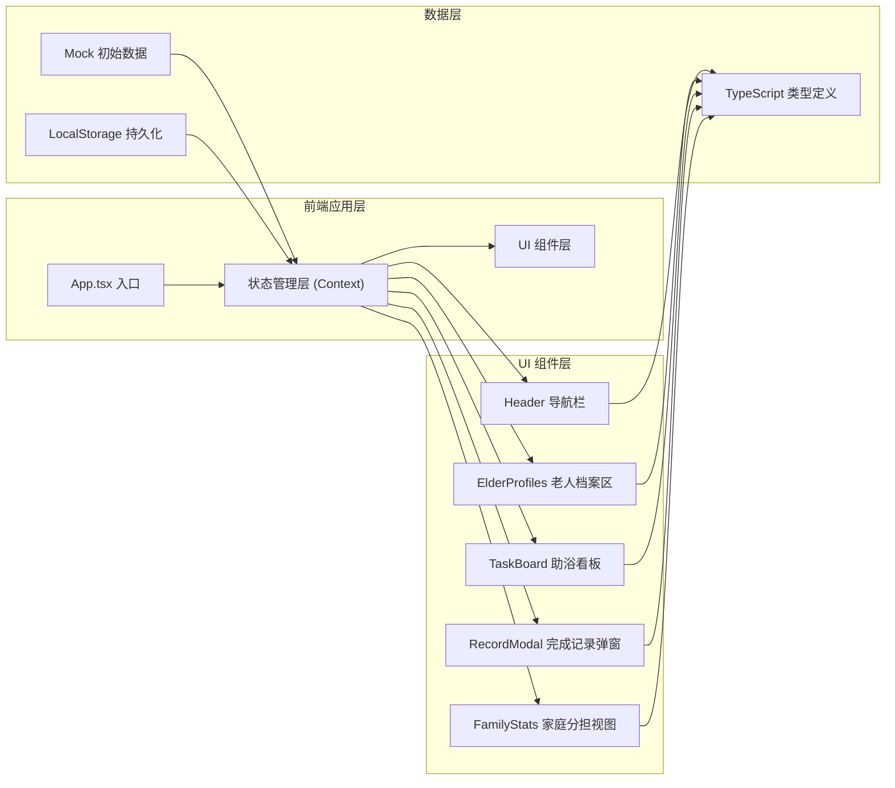
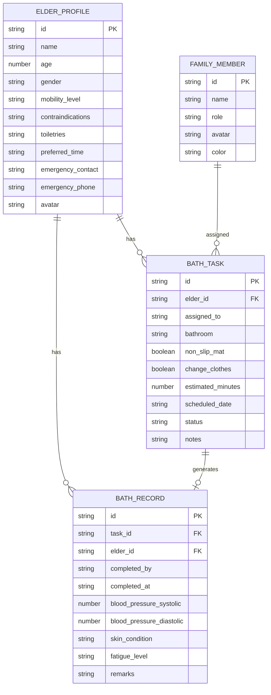

## 1. 架构设计



## 2. 技术描述

- **前端框架**：React@18 + TypeScript
- **构建工具**：Vite@5
- **样式方案**：Tailwind CSS@3
- **状态管理**：React Context + useReducer（单页轻量方案）
- **数据持久化**：localStorage（浏览器本地存储，无需后端）
- **图标方案**：Lucide React（轻量 SVG 图标库）
- **初始化方式**：使用 `npm create vite@latest` 创建 React + TypeScript 模板

## 3. 路由定义

| 路由 | 目的 |
|-----|------|
| `/` | 综合看板首页（单页应用，所有模块聚合于此） |

本系统为单页面应用（SPA），所有功能模块通过组件状态切换展示，不引入额外路由。

## 4. 数据模型

### 4.1 数据模型定义（ER 图）



### 4.2 TypeScript 类型定义

```typescript
// 老人档案
interface ElderProfile {
  id: string;
  name: string;
  age: number;
  gender: 'male' | 'female';
  mobilityLevel: 'independent' | 'assist_needed' | 'wheelchair' | 'bedridden';
  contraindications: string[];
  toiletries: string[];
  preferredTime: string;
  emergencyContact: string;
  emergencyPhone: string;
  avatar: string;
  lastBathDate?: string;
}

// 助浴任务状态
type TaskStatus = 'today' | 'delayed' | 'observation' | 'completed';

// 助浴任务
interface BathTask {
  id: string;
  elderId: string;
  assignedTo: string;
  bathroom: string;
  nonSlipMat: boolean;
  changeClothes: boolean;
  estimatedMinutes: number;
  scheduledDate: string;
  status: TaskStatus;
  observationReason?: string;
  delayReason?: string;
  createdAt: string;
}

// 助浴完成记录
interface BathRecord {
  id: string;
  taskId: string;
  elderId: string;
  completedBy: string;
  completedAt: string;
  bloodPressureSystolic: number;
  bloodPressureDiastolic: number;
  skinCondition: 'normal' | 'dry' | 'rash' | 'bruise' | 'wound';
  fatigueLevel: 1 | 2 | 3 | 4 | 5;
  remarks: string;
  waterTemperature?: number;
  actualDuration?: number;
}

// 家庭成员
interface FamilyMember {
  id: string;
  name: string;
  role: string;
  avatar: string;
  color: string;
}
```

### 4.3 初始 Mock 数据说明

预置以下演示数据，确保系统首屏即有完整内容：
- **老人档案**：2-3 位老人，覆盖不同行动能力等级
- **家庭成员**：3-4 位成员（子女、配偶等）
- **助浴任务**：今日待办 2 条、延期 1 条、异常观察 1 条
- **历史记录**：6-8 条完成记录，用于统计分析

数据存储策略：首访注入 Mock → 用户操作写入 localStorage → 后续读取 localStorage
