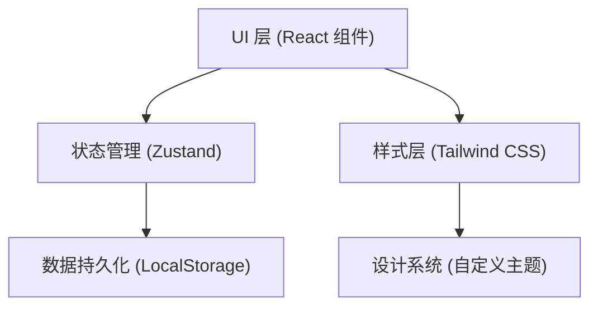
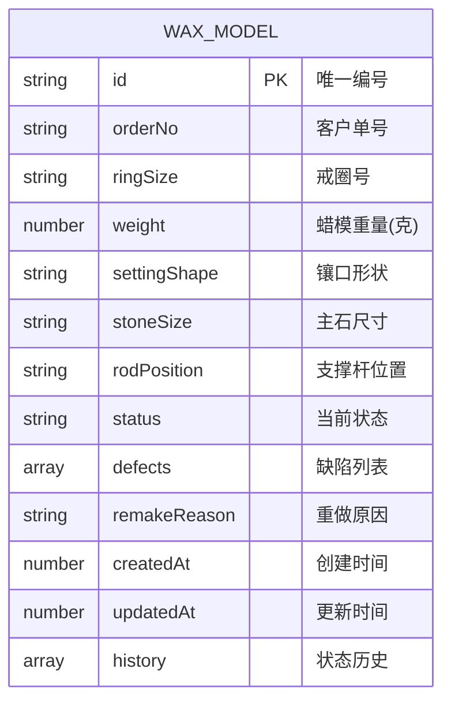

## 1. 架构设计

纯前端应用，数据持久化采用 LocalStorage，无需后端服务。



## 2. 技术描述
- 前端框架：React@18 + TypeScript
- 构建工具：Vite@5
- 样式方案：Tailwind CSS@3（自定义珠宝工作室主题）
- 状态管理：Zustand@4
- 图标库：lucide-react
- 数据存储：LocalStorage（mock 数据 + 用户操作持久化）

## 3. 路由定义
| 路由 | 用途 |
|------|------|
| / | 蜡模管理主页（录入 + 看板） |

由于是单页应用，仅需一个路由，通过组件内状态切换不同视图。

## 4. 数据模型

### 4.1 TypeScript 类型定义

```typescript
// 蜡模状态枚举
type WaxStatus = 'waxing' | 'inspecting' | 'treeing' | 'casting';

// 缺陷类型
type DefectType = 'crack' | 'deform' | 'unclear';

// 镶口形状
type SettingShape = 'round' | 'oval' | 'pear' | 'emerald' | 'marquise' | 'heart' | 'princess' | 'cushion';

// 支撑杆位置
type RodPosition = 'top' | 'bottom' | 'left' | 'right' | 'top_left' | 'top_right' | 'bottom_left' | 'bottom_right';

// 蜡模数据结构
interface WaxModel {
  id: string;                    // 唯一编号（系统生成）
  orderNo: string;               // 客户单号
  ringSize: string;              // 戒圈号
  weight: number;                // 蜡模重量（克）
  settingShape: SettingShape;    // 镶口形状
  stoneSize: string;             // 主石尺寸（如 6.5mm / 1ct）
  rodPosition: RodPosition;      // 支撑杆位置
  status: WaxStatus;             // 当前状态
  defects: DefectType[];         // 已标记缺陷
  remakeReason?: string;         // 重做原因
  createdAt: number;             // 创建时间
  updatedAt: number;             // 更新时间
  history: StatusHistory[];      // 状态流转历史
}

// 状态历史
interface StatusHistory {
  status: WaxStatus;
  timestamp: number;
  note?: string;
}
```

### 4.2 数据模型 ER 图



## 5. 状态管理设计（Zustand Store）

### Store Actions:
- `addWaxModel(data)` → 新增蜡模，自动生成编号，初始状态为 waxing
- `updateStatus(id, newStatus, note?)` → 更新蜡模状态，记录历史
- `markDefects(id, defects, remakeReason?)` → 标记缺陷和重做原因
- `searchWaxModels(keyword)` → 按客户单号/戒圈号搜索
- `filterByDefect(hasDefect)` → 按是否有缺陷筛选

## 6. 组件结构

```
src/
├── App.tsx                    # 根组件，整体布局
├── components/
│   ├── Header.tsx             # 顶部导航（标题、统计、新增按钮、搜索）
│   ├── WaxForm.tsx            # 蜡模录入表单弹窗
│   ├── KanbanBoard.tsx        # 看板容器（四列）
│   ├── StatusColumn.tsx       # 单状态列
│   ├── WaxCard.tsx            # 蜡模卡片（核心展示组件）
│   ├── DefectModal.tsx        # 缺陷标记弹窗
│   └── StatBadge.tsx          # 状态计数胶囊
├── store/
│   └── useWaxStore.ts         # Zustand 状态管理
├── types/
│   └── index.ts               # 类型定义
├── utils/
│   ├── constants.ts           # 常量（状态映射、镶口形状枚举等）
│   └── helpers.ts             # 工具函数（编号生成、时间格式化）
└── index.css                  # Tailwind 入口 + 自定义样式
```
