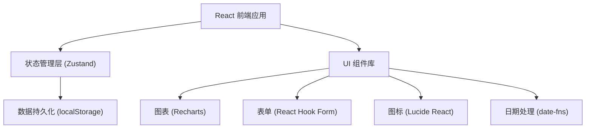
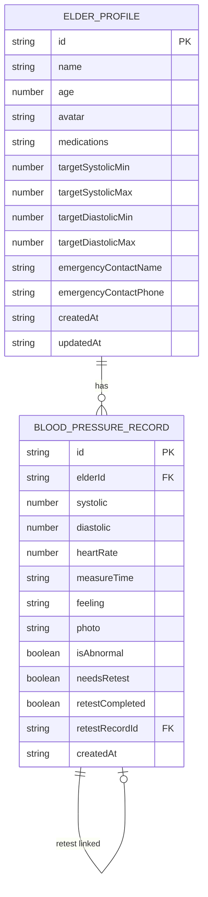

## 1. 架构设计



## 2. 技术描述
- **前端框架**：React@18 + TypeScript
- **构建工具**：Vite@5
- **样式方案**：TailwindCSS@3
- **路由管理**：React Router DOM@6
- **状态管理**：Zustand（轻量状态管理，内置 localStorage 持久化中间件）
- **数据存储**：localStorage（纯前端应用，无需后端）
- **图表库**：Recharts（React 生态图表库，支持柱状图、饼图、热力图）
- **表单处理**：React Hook Form + Zod（类型安全的表单校验）
- **日期处理**：date-fns
- **图标库**：Lucide React
- **代码规范**：ESLint + Prettier

## 3. 路由定义
| Route | Purpose |
|-------|---------|
| `/` | 仪表盘首页 - 概览、待复测提醒、快速入口 |
| `/profiles` | 老人档案列表 |
| `/profiles/new` | 新增老人档案 |
| `/profiles/:id/edit` | 编辑老人档案 |
| `/records` | 血压记录时间线 |
| `/records/new` | 新增血压记录 |
| `/records/:id/retest` | 录入复测数据 |
| `/trends` | 趋势分析页 |

## 4. 数据模型

### 4.1 数据模型 ER 图



### 4.2 TypeScript 类型定义

```typescript
interface ElderProfile {
  id: string;
  name: string;
  age: number;
  avatar: string;
  medications: string[];
  targetRange: {
    systolicMin: number;
    systolicMax: number;
    diastolicMin: number;
    diastolicMax: number;
  };
  emergencyContact: {
    name: string;
    phone: string;
  };
  createdAt: string;
  updatedAt: string;
}

interface BloodPressureRecord {
  id: string;
  elderId: string;
  systolic: number;
  diastolic: number;
  heartRate: number;
  measureTime: string;
  feeling: string;
  photo?: string;
  isAbnormal: boolean;
  needsRetest: boolean;
  retestCompleted: boolean;
  retestRecordId?: string;
  originalRecordId?: string;
  createdAt: string;
}
```

## 5. 核心业务逻辑

### 5.1 异常判断规则
- 高压 ≥ 目标范围上限 或 低压 ≥ 目标范围上限 → 标记为异常
- 异常记录自动生成复测需求（needsRetest = true）

### 5.2 复测超时判断
- 记录创建时间 + 30分钟 < 当前时间 且 retestCompleted = false → 标红警示

### 5.3 记录绑定规则
- 复测记录通过 originalRecordId 关联原记录
- 原记录通过 retestRecordId 关联复测记录
- 时间线展示时，复测记录嵌套在原记录下方显示
