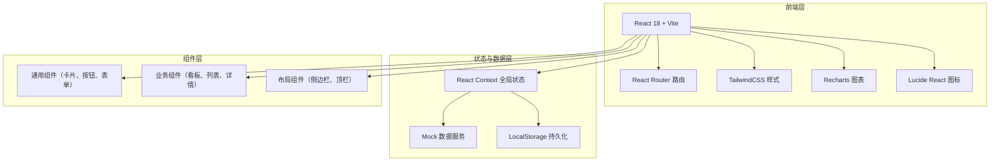
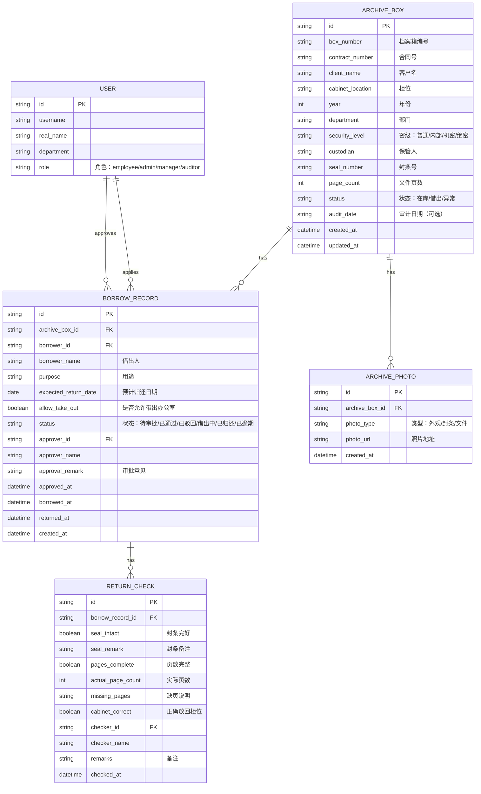

## 1. 架构设计



## 2. 技术描述

- **前端框架**：React@18 + TypeScript@5 + Vite@6
- **初始化工具**：Vite create vite@latest
- **后端服务**：无（纯前端，使用 Mock 数据 + LocalStorage）
- **路由管理**：React Router@6
- **样式方案**：TailwindCSS@3
- **图表库**：Recharts@2
- **图标库**：Lucide React@0.400
- **状态管理**：React Context + useReducer
- **日期处理**：date-fns@3

## 3. 路由定义

| 路由 | 用途 |
|------|------|
| /dashboard | 看板首页，展示统计卡片与提醒列表 |
| /archives | 档案箱列表，支持多条件搜索筛选 |
| /archives/:id | 档案箱详情页，含基本信息、照片、借阅历史 |
| /archives/new | 新增档案箱表单 |
| /borrow/apply | 借阅申请列表与新建 |
| /borrow/approve | 借阅审批列表（管理员/主管视图） |
| /borrow/return | 归还检查登记页 |

## 4. 数据模型

### 4.1 ER 图



### 4.2 数据类型定义（TypeScript）

```typescript
type SecurityLevel = '普通' | '内部' | '机密' | '绝密';
type BoxStatus = '在库' | '借出' | '异常';
type BorrowStatus = '待审批' | '已通过' | '已驳回' | '借出中' | '已归还' | '已逾期';
type UserRole = 'employee' | 'admin' | 'manager' | 'auditor';

interface ArchiveBox {
  id: string;
  boxNumber: string;
  contractNumber?: string;
  clientName?: string;
  cabinetLocation: string;
  year: number;
  department: string;
  securityLevel: SecurityLevel;
  custodian: string;
  sealNumber: string;
  pageCount: number;
  status: BoxStatus;
  auditDate?: string;
  currentBorrowId?: string;
  photos: ArchivePhoto[];
  createdAt: string;
  updatedAt: string;
}

interface BorrowRecord {
  id: string;
  archiveBoxId: string;
  boxNumber: string;
  borrowerId: string;
  borrowerName: string;
  borrowerDepartment: string;
  purpose: string;
  expectedReturnDate: string;
  allowTakeOut: boolean;
  status: BorrowStatus;
  needsManagerApproval: boolean;
  managerApproved?: boolean;
  approverId?: string;
  approverName?: string;
  approvalRemark?: string;
  approvedAt?: string;
  borrowedAt?: string;
  returnedAt?: string;
  returnCheck?: ReturnCheck;
  createdAt: string;
}

interface ReturnCheck {
  id: string;
  borrowRecordId: string;
  sealIntact: boolean;
  sealRemark?: string;
  pagesComplete: boolean;
  actualPageCount: number;
  missingPages?: string;
  cabinetCorrect: boolean;
  checkerId: string;
  checkerName: string;
  remarks?: string;
  checkedAt: string;
}

interface ArchivePhoto {
  id: string;
  archiveBoxId: string;
  photoType: '外观' | '封条' | '文件';
  photoUrl: string;
  createdAt: string;
}
```

## 5. 目录结构

```
src/
├── components/
│   ├── layout/          # Sidebar, Topbar, Layout
│   ├── ui/              # Button, Card, Modal, Badge, Form inputs
│   ├── dashboard/       # StatCard, OverdueList, SealAlertList, AuditReminder, DeptChart
│   ├── archives/        # ArchiveCard, SearchBar, ArchiveForm, PhotoGallery, BorrowTimeline
│   └── borrow/          # BorrowForm, ApproveCard, ReturnCheckForm
├── pages/
│   ├── Dashboard.tsx
│   ├── ArchiveList.tsx
│   ├── ArchiveDetail.tsx
│   ├── ArchiveNew.tsx
│   ├── BorrowApply.tsx
│   ├── BorrowApprove.tsx
│   └── BorrowReturn.tsx
├── context/
│   └── AppContext.tsx   # 全局状态（档案箱、借阅记录、当前用户）
├── data/
│   └── mockData.ts      # Mock 初始数据
├── types/
│   └── index.ts         # TypeScript 类型定义
├── utils/
│   ├── date.ts          # 日期工具函数
│   └── status.ts        # 状态判断与样式映射
├── App.tsx
├── main.tsx
└── index.css
```

